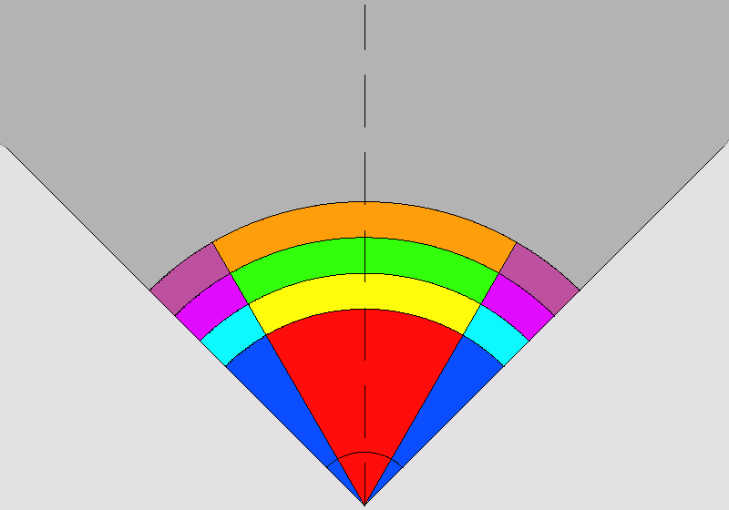

# Areas

## Area 1 (red)

Any obstacles in the red area has to be full cleared.

## Area 2 (yellow)

Any obstacles in the yellow area has to be reinforced as near the green area.

## Area 3 (green)

Any obstacles in the green area has to be full reinforced.

## Area 4 (orange)

Any obstacles in the green area has to be partial reinforced as near the green area.

## Area 5 (blue)

Any obstacles in the blue area has to be partialy cleared as near the red area

## Area 6 (light blue)

Any obstacles in the light blue area has to be partialy reinforced as near the yellow area and near the magenta area.

## Area 7 (magenta)

Any obstacles in the magenta area has to be partialy reinforced as near the green area.

## Area 8 (dark magenta)

Any obstacles in the dark magenta area has to be partialy reinforced as near the orange area and near the magenta area.

## Area 9 (gray)

Any obstacles in the gray area has to be not updated (not eligible).

## Area 10 (light gray)

Any obstacles in the light gray area has to be not updated (not eligible).
