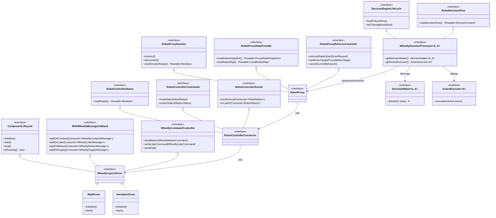

Class disagram

```mermaid
classDiagram
    %% Layer 1: Connectivity
    class ComponentLifecycle {
        <<interface>>
        +initialize()
        +start()
        +stop()
        +isRunning() bool
    }
    class WithWheellyMessageCallback {
        <<interface>>
        +addOnContacts(Consumer~WheellyContactsMessage~)
        +addOnLidar(Consumer~WheellyLidarMessage~)
        +addOnMotion(Consumer~WheellyMotionMessage~)
        +addOnSupply(Consumer~WheellySupplyMessage~)
    }
    class WheellyCommandController {
        <<interface>>
        +sendMotion(WheellyMotionCommand)
        +sendLidarCommand(WheellyLidarCommand)
        +sendHalt()
    }
    class WheellyLayer1Driver {
        <<interface>>
    }
    
    ComponentLifecycle <|-- WheellyLayer1Driver
    WithWheellyMessageCallback <|-- WheellyLayer1Driver
    WheellyCommandController <|-- WheellyLayer1Driver

    class MqttDriver {
        +initialize()
        +start()
    }
    class SimulatorDriver {
        +initialize()
        +start()
    }
    WheellyLayer1Driver <|.. MqttDriver
    WheellyLayer1Driver <|.. SimulatorDriver

    %% Layer 2: Control
    class RobotControllerStatus {
        <<interface>>
        +readReady() Flowable~Boolean~
    }
    class RobotControllerCommands {
        <<interface>>
        +headStatus(HeadStatus)
        +motionStatus(MotionStatus)
    }
    class RobotControllerEvents {
        <<interface>>
        +onInference(Consumer~RobotStatus~)
        +onLatch(Consumer~RobotStatus~)
    }
    class RobotControllerConnector {
        <<interface>>
    }
    
    RobotControllerStatus <|-- RobotControllerConnector
    RobotControllerCommands <|-- RobotControllerConnector
    RobotControllerEvents <|-- RobotControllerConnector

    RobotControllerConnector --> WheellyLayer1Driver : usa

    %% Layer 3: Proxy
    class RobotProxySession {
        <<interface>>
        +connect()
        +disconnect()
        +readSessionReady() Flowable~Boolean~
    }
    class RobotProxyStateProvider {
        <<interface>>
        +readRobotSnapshot() Flowable~ProxyRobotSnapshot~
        +readRadarMap() Flowable~LocalRadarMap~
    }
    class RobotProxyBehaviorController {
        <<interface>>
        +executeRadarScan(ScanRequest)
        +setMotionTarget(ProxyMotionTarget)
        +cancelCurrentBehavior()
    }
    class RobotProxy {
        <<interface>>
    }

    RobotProxySession <|-- RobotProxy
    RobotProxyStateProvider <|-- RobotProxy
    RobotProxyBehaviorController <|-- RobotProxy

    RobotProxy --> RobotControllerConnector : usa

    %% Layer 4: Decision / Perception
    class DecisionEngineLifecycle {
        <<interface>>
        +loadPolicy(String)
        +setTrainingMode(bool)
    }
    class DecisionMaker~S, A~ {
        <<interface>>
        +decide(S state) A
    }
    class ActionExecutor~A~ {
        <<interface>>
        +executeAction(A action)
    }
    class RobotDecisionFlow {
        <<interface>>
        +readDecisionFlow() Flowable~DecisionContext~
    }
    class WheellyDecisionProcessor~S, A~ {
        <<interface>>
        +getDecisionMaker() DecisionMaker~S, A~
        +getActionExecutor() ActionExecutor~A~
    }

    DecisionEngineLifecycle <|-- WheellyDecisionProcessor
    RobotDecisionFlow <|-- WheellyDecisionProcessor

    WheellyDecisionProcessor --> RobotProxy : campiona/comanda
    WheellyDecisionProcessor --> DecisionMaker : interroga
    WheellyDecisionProcessor --> ActionExecutor : delega
```