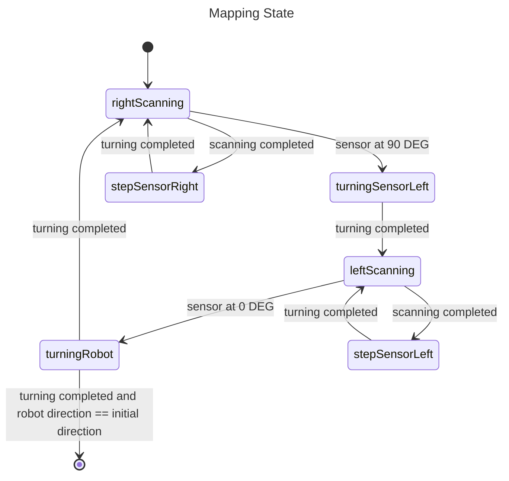

# Mapping State

```mermaid
---
title: Mapping State
---
stateDiagram-v2

[*]-->rightScanning
rightScanning-->turningSensorLeft: sensor at 90 DEG
rightScanning-->stepSensorRight: scanning completed

stepSensorRight--> rightScanning: turning completed

turningSensorLeft--> leftScanning: turning completed

leftScanning-->turningRobot: sensor at 0 DEG
leftScanning-->stepSensorLeft: scanning completed

stepSensorLeft-->leftScanning: turning completed

turningRobot-->rightScanning: turning completed
turningRobot-->[*]: turning completed and robot direction == initial direction

```