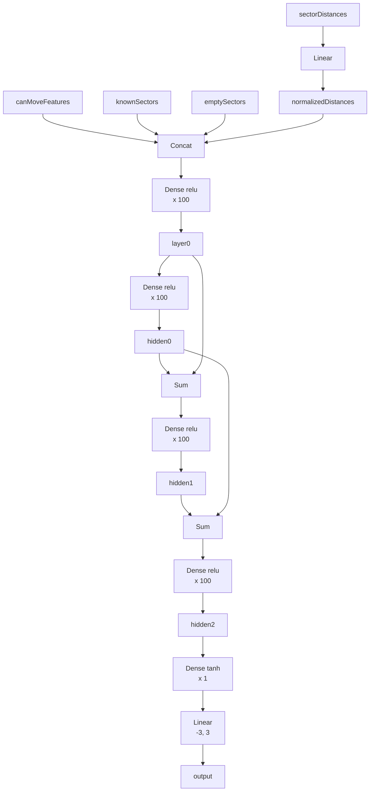
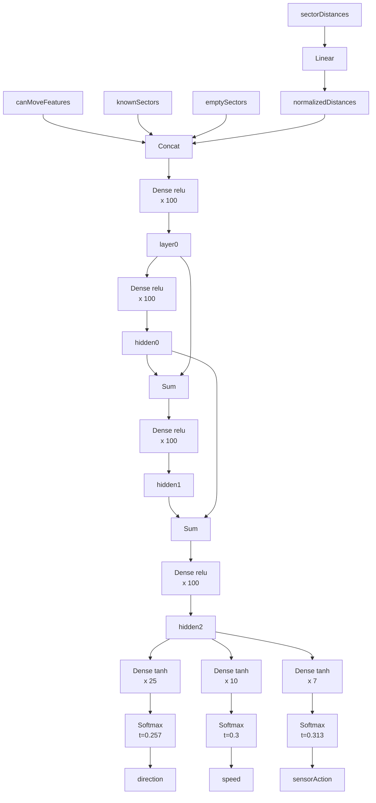

## Critic

```mermaid
graph TB

L1[Linear]
L2[Concat]
L3[Dense relu\nx 100]
L4[Dense relu\nx 100]
L5[Sum]
L6[Dense relu\nx 100]
L7[Sum]
L8[Dense relu\nx 100]
L9[Dense tanh\nx 1]
L10[Linear\n -3, 3]

sectorDistances --> L1 --> normalizedDistances

canMoveFeatures --> L2
knownSectors --> L2 
emptySectors --> L2
normalizedDistances --> L2 --> L3 --> layer0

layer0 --> L4 --> hidden0

hidden0 --> L5 --> L6 --> hidden1
layer0 --> L5

hidden1 --> L7 --> L8 --> hidden2
hidden0 --> L7

hidden2 --> L9 --> L10 --> output

```

## Policy

```mermaid
graph TB

L1[Linear]
L2[Concat]
L3[Dense relu\nx 100]
L4[Dense relu\nx 100]
L5[Sum]
L6[Dense relu\nx 100]
L7[Sum]
L8[Dense relu\nx 100]
L9[Dense tanh\nx 25]
L10[Softmax\nt=0.257]
L11[Dense tanh\nx 10]
L12[Softmax\nt=0.3]
L13[Dense tanh\nx 7]
L14[Softmax\nt=0.313]

sectorDistances --> L1 --> normalizedDistances

canMoveFeatures --> L2
knownSectors --> L2 
emptySectors --> L2
normalizedDistances --> L2 --> L3 --> layer0

layer0 --> L4 --> hidden0

hidden0 --> L5 --> L6 --> hidden1
layer0 --> L5

hidden1 --> L7 --> L8 --> hidden2
hidden0 --> L7

hidden2 --> L9 --> L10 --> direction
hidden2 --> L11 --> L12 --> speed
hidden2 --> L13 --> L14 --> sensorAction

```