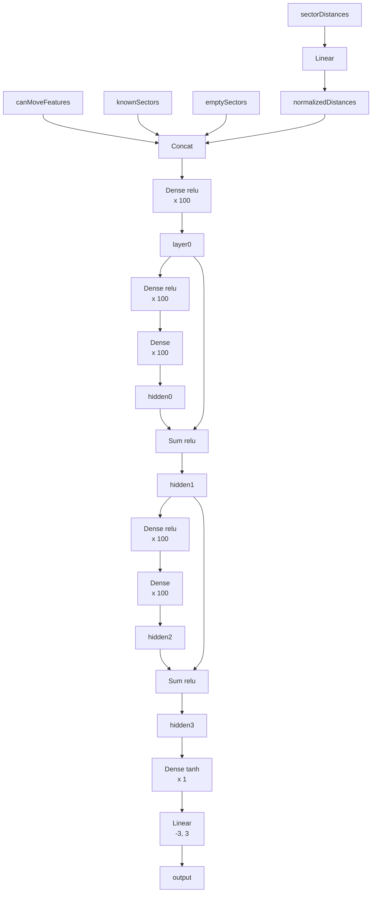
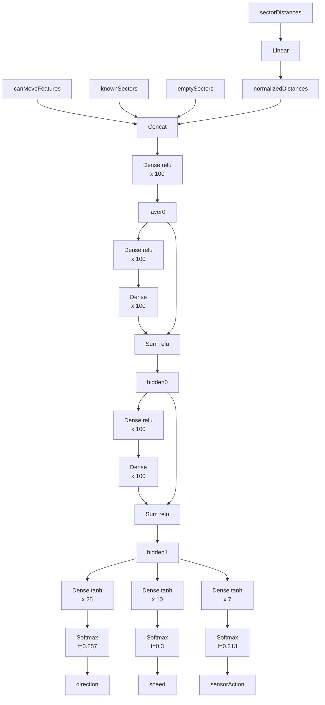

## Critic

```mermaid
graph TB

L1[Linear]
L2[Concat]
L3[Dense relu\nx 100]

L4[Dense relu\nx 100]
L5[Dense\nx 100]
L6[Sum relu]

L7[Dense relu\nx 100]
L8[Dense\nx 100]
L9[Sum relu]

L10[Dense tanh\nx 1]
L11[Linear\n-3, 3]

sectorDistances --> L1 --> normalizedDistances

canMoveFeatures --> L2
knownSectors --> L2 
emptySectors --> L2
normalizedDistances --> L2 --> L3 --> layer0

layer0 --> L4 --> L5 --> hidden0
hidden0 --> L6 --> hidden1
layer0 --> L6

hidden1 --> L7 --> L8 --> hidden2
hidden2 --> L9 --> hidden3
hidden1 --> L9

hidden3 --> L10 --> L11 --> output

```

## Policy

```mermaid
graph TB


L1[Linear]
L2[Concat]
L3[Dense relu\nx 100]

L4[Dense relu\nx 100]
L5[Dense\nx 100]
L6[Sum relu]

L7[Dense relu\nx 100]
L8[Dense\nx 100]
L9[Sum relu]

L10[Dense tanh\nx 25]
L11[Softmax\nt=0.257]
L12[Dense tanh\nx 10]
L13[Softmax\nt=0.3]
L14[Dense tanh\nx 7]
L15[Softmax\nt=0.313]

sectorDistances --> L1 --> normalizedDistances

canMoveFeatures --> L2
knownSectors --> L2 
emptySectors --> L2
normalizedDistances --> L2 --> L3 --> layer0

layer0 --> L4 --> L5 --> L6 --> hidden0
layer0 --> L6

hidden0 --> L7 --> L8 --> L9 --> hidden1
hidden0 --> L9

hidden1 --> L10 --> L11 --> direction
hidden1 --> L12 --> L13 --> speed
hidden1 --> L14 --> L15 --> sensorAction

```