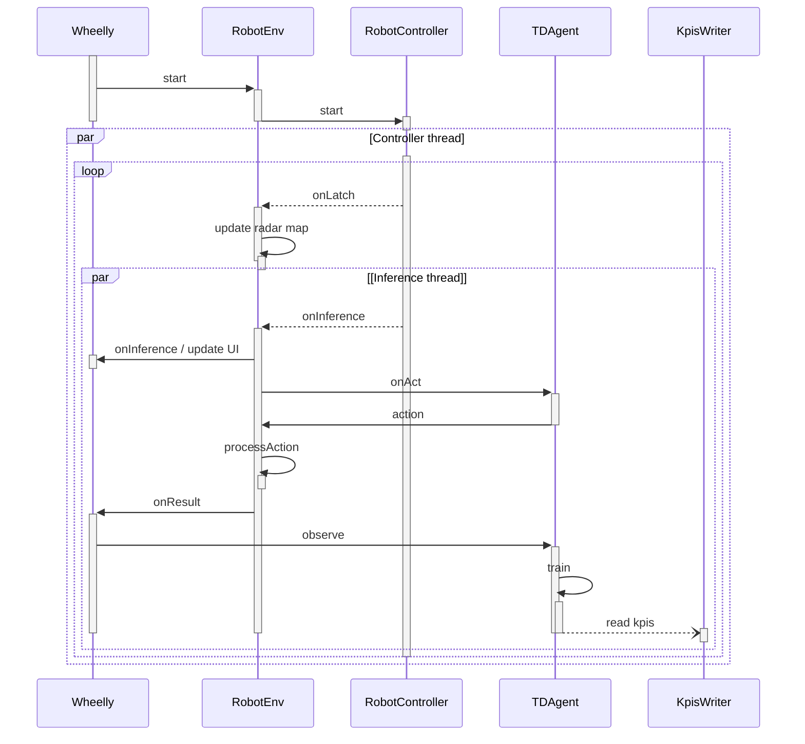
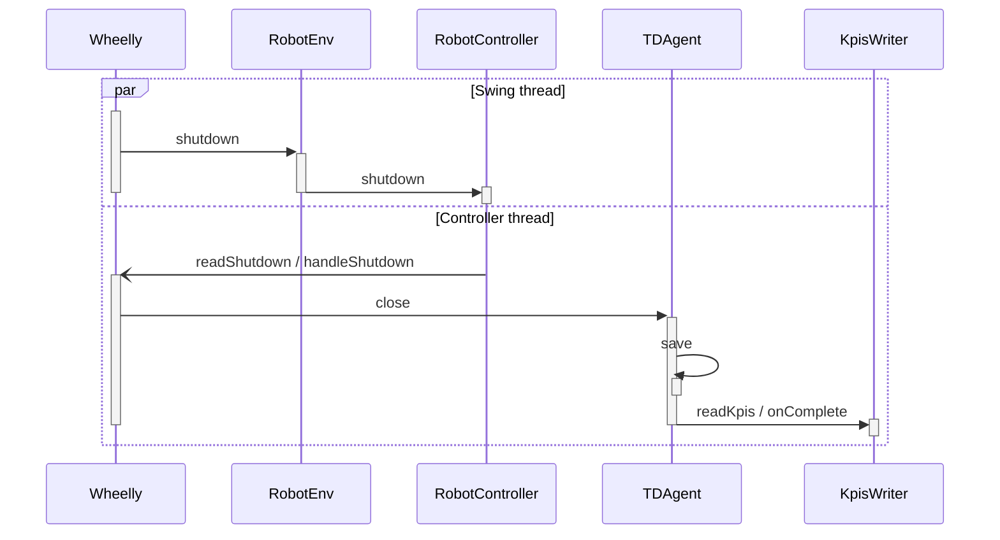

# Wheelly sequences

## Start and run

```mermaid
sequenceDiagram
    activate Wheelly
        Wheelly->>+RobotEnv: start
            RobotEnv->> +RobotController: start
            deactivate RobotController
        deactivate RobotEnv
    deactivate Wheelly

par Controller thread
    activate RobotController
    loop
    RobotController-->> +RobotEnv: onLatch
        RobotEnv->>+RobotEnv: update radar map
        deactivate RobotEnv
    deactivate RobotEnv

    par [Inference thread]
        RobotController-->>+RobotEnv: onInference
            RobotEnv->>+Wheelly: onInference / update UI
            deactivate Wheelly
    
            RobotEnv->>+TDAgent: onAct
            TDAgent->>-RobotEnv: action
    
            RobotEnv->>+RobotEnv: processAction
            deactivate RobotEnv

            RobotEnv->>+Wheelly: onResult
                Wheelly->>+TDAgent: observe
                    TDAgent->>+TDAgent: train
                        TDAgent--)+KpisWriter: read kpis
                        deactivate KpisWriter
                    deactivate TDAgent
               deactivate TDAgent
            deactivate Wheelly
        deactivate RobotEnv
    end
    end
    deactivate RobotController
end
```

## Shutdown sequence

```mermaid
sequenceDiagram
par Swing thread
    activate Wheelly
    Wheelly->>+RobotEnv: shutdown
        RobotEnv->>+RobotController: shutdown
        deactivate RobotController
    deactivate RobotEnv
    deactivate Wheelly
and Controller thread
    RobotController-)+Wheelly: readShutdown / handleShutdown
        Wheelly->>+TDAgent: close
            TDAgent->>+TDAgent: save
            deactivate TDAgent            
            TDAgent->>+KpisWriter: readKpis / onComplete
            deactivate KpisWriter
        deactivate TDAgent
    deactivate Wheelly
end
```