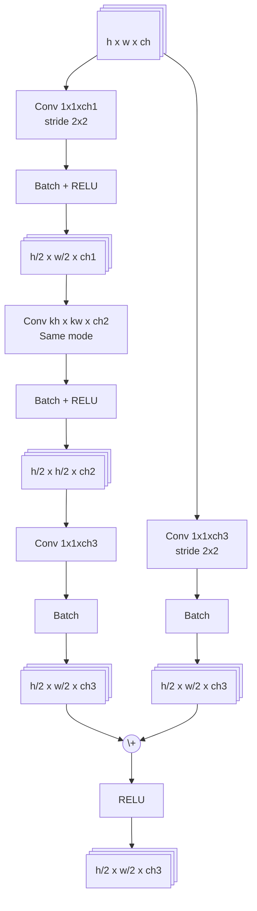
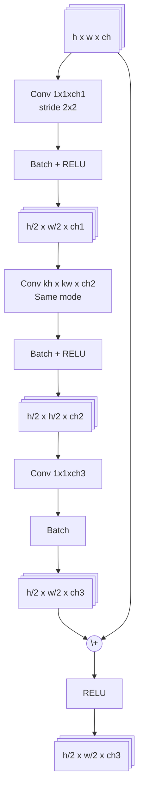

# ResnetW

## Perfomances

| Model    | Sections   | Training time | # layers | # params |   Size |
|----------|------------|--------------:|---------:|---------:|-------:|
| resnet13 | 1 3 3 3 3  |         190 s |       41 |    2.0 M | 14.9 M |
| resnet22 | 1 6 6 6 3  |         297 s |       68 |    3.5 M | 25.7 M |
| resnet28 | 1 6 12 6 3 |         384 s |       86 |      4 M | 29.8 M |
| resnet31 | 1 9 9 9 3  |         422 s |       95 |      5 M | 36.5 M |
| resnet34 | 1 9 12 9 3 |         464 s |      104 |   5.25 M | 38.6 M |

## Convolution Resnet Block

## Identity Resnet block

## Full ResnetW

```mermaid
graph TD

input@{shape: procs, label: "Map<br>125 x 125 x 4"}
zeroPad[ZeroPad<br>3x3]
zeroPadData@{shape: procs, label: "131 x 131 x 4"}
input-->zeroPad-->zeroPadData

conv1[Conv 7x7x64<br>stride 2x2]
batchRelu1[Batch + RELU]
conv1Data@{shape: procs, label: "63 x 63 x 64"}
zeroPadData-->conv1-->batchRelu1-->conv1Data

maxpool1[Max pool<br>3x3<br>stride 2x2]
maxpool1Data@{shape: procs, label: "31 x 31 x 64"}
conv1Data-->maxpool1-->maxpool1Data

resnet11[ResNet11<br>Conv Block 3x3<br>stride 2x2<br>filters 64,64,256]
resnet11Data@{shape: procs, label: "15 x 15 x 256"}
maxpool1Data-->resnet11-->resnet11Data

resnet12[ResNet12<br>Identity Block 3x3<br>filters 64,64,256]
resnet12Data@{shape: procs, label: "15 x 15 x 256"}
resnet11Data-->resnet12-->resnet12Data

resnet13[ResNet13<br>Identity Block 3x3<br>filters 64,64,256]
resnet13Data@{shape: procs, label: "15 x 15 x 256"}
resnet12Data-->resnet13-->resnet13Data

resnet21[ResNet21<br>Conv Block 3x3<br>stride 2x2<br>filters 128,128,512]
resnet21Data@{shape: procs, label: "7 x 7 x 512"}
resnet13Data-->resnet21-->resnet21Data

resnet22[ResNet22<br>Identity Block 3x3<br>filters 128,128,512]
resnet22Data@{shape: procs, label: "7 x 7 x 512"}
resnet21Data-->resnet22-->resnet22Data

resnet23[ResNet23<br>Identity Block 3x3<br>filters 128,128,512]
resnet23Data@{shape: procs, label: "7 x 7 x 512"}
resnet22Data-->resnet23-->resnet23Data

resnet31[ResNet31<br>Conv Block 3x3<br>stride 2x2<br>filters 256,256,1024]
resnet31Data@{shape: procs, label: "3 x 3 x 1024"}
resnet23Data-->resnet31-->resnet31Data

resnet32[ResNet32<br>Identity Block 3x3<br>filters 256,256,1024]
resnet32Data@{shape: procs, label: "3 x 3 x 1024"}
resnet31Data-->resnet32-->resnet32Data

resnet33[ResNet33<br>Identity Block 3x3<br>filters 256,256,1024]
resnet33Data@{shape: procs, label: "3 x 3 x 1024"}
resnet32Data-->resnet33-->resnet33Data

avgpool[Max Pool<br>3x3]
avgpoolData@{shape: procs, label: "1 x 1 x 1024"}
resnet33Data-->avgpool-->avgpoolData

critic[Dense<br>1024 x 1]
criticData[critic<br>size=1]
avgpoolData-->critic --> criticData

move[Dense<br>SoftMax<br>1024 x n]
moveData[move<br>size=n]
avgpoolData-->move --> moveData

sensor[Dense<br>Softmax<br>1024 x m]
sensorData[sensor<br>size=m]
avgpoolData-->sensor --> sensorData
```

