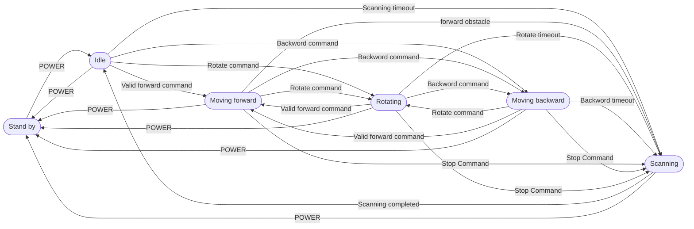

```mermaid
graph LR
    Standby([Stand by])
    Idle([Idle])
    Forward([Moving forward])
    Rotating([Rotating])
    Scanning([Scanning])
    Backward([Moving backward])

    Standby -->|POWER| Idle

    Idle -->|Scanning timeout| Scanning

    Idle -->|Valid forward command| Forward
    Forward -->|forward obstacle| Scanning
    Scanning -->|Scanning completed| Idle

    Idle -->|Rotate command| Rotating
    Rotating -->|Rotate timeout| Scanning

    Idle -->|Backword command| Backward
    Backward -->|Backword timeout| Scanning

    Forward -->|Stop Command| Scanning
    Backward -->|Stop Command| Scanning
    Rotating -->|Stop Command| Scanning

    Forward -->|Rotate command| Rotating
    Backward -->|Rotate command| Rotating

    Backward -->|Valid forward command| Forward
    Rotating -->|Valid forward command| Forward

    Forward -->|Backword command| Backward
    Rotating -->|Backword command| Backward

    Idle -->|POWER| Standby
    Forward -->|POWER| Standby
    Backward -->|POWER| Standby
    Scanning -->|POWER| Standby
    Rotating -->|POWER| Standby
```
