# Report

30 October 2022, 15:50

[TOC]

Data folder: `D:\wheelly\agent-100e-3\`

## Rewards

| KPI    |             |
|--------|------------:|
| Mean   |       0.105 |
| RMS    |       0.483 |
| Min    |          -1 |
| Median |           0 |
| Max    |           1 |
| Trend  |      Linear |
| From   |     0.00322 |
| To     |       0.208 |

|     -0.909 |     -0.727 |     -0.545 |     -0.364 |     -0.182 |          0 |      0.182 |      0.364 |      0.545 |      0.727 |      0.909 |
|-----------:|-----------:|-----------:|-----------:|-----------:|-----------:|-----------:|-----------:|-----------:|-----------:|-----------:|
|       2552 |          0 |          0 |          0 |          0 |      11347 |       2377 |       1816 |       1528 |       3746 |        634 |

### Rewards notes

[Notes]

### Rewards chart

### Rewards histogram

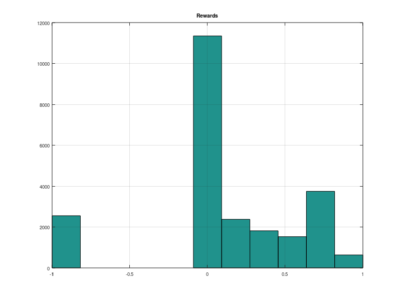
## Delta

| KPI    |             |
|--------|------------:|
| Mean   |   -0.000383 |
| RMS    |       0.451 |
| Min    |        -1.6 |
| Median |       0.019 |
| Max    |        1.11 |
| Trend  |      Linear |
| From   |     0.00606 |
| To     |    -0.00682 |

|      -1.47 |      -1.23 |     -0.981 |     -0.734 |     -0.488 |     -0.241 |    0.00516 |      0.252 |      0.498 |      0.744 |      0.991 |
|-----------:|-----------:|-----------:|-----------:|-----------:|-----------:|-----------:|-----------:|-----------:|-----------:|-----------:|
|        128 |        700 |       1649 |         84 |        259 |       2814 |       9863 |       4051 |       3266 |       1122 |         64 |

### Delta notes

[Notes]

### Delta chart

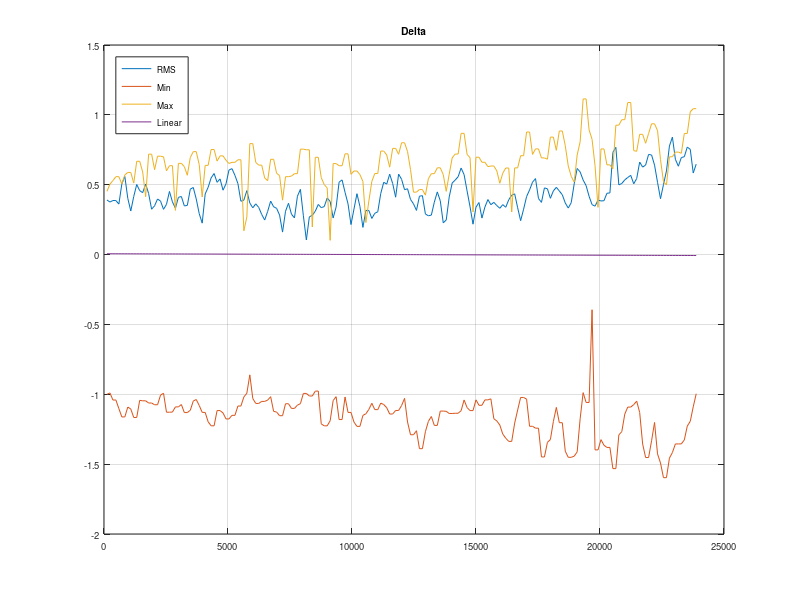

### Delta histogram

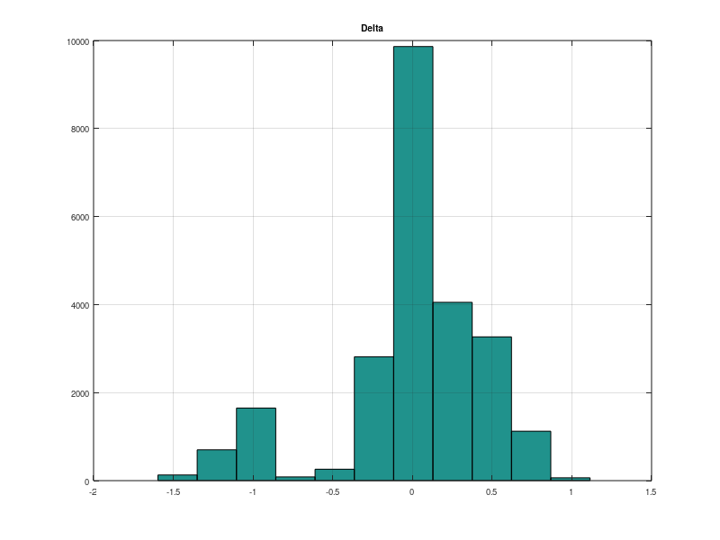
## Discount 0.999 rewards

| KPI    |             |
|--------|------------:|
| Mean   |       0.105 |
| RMS    |       0.131 |
| Min    |     -0.0187 |
| Median |      0.0774 |
| Max    |       0.341 |
| Trend  |      Linear |
| From   |     0.00402 |
| To     |       0.206 |

|   -0.00235 |     0.0304 |     0.0631 |     0.0958 |      0.128 |      0.161 |      0.194 |      0.227 |      0.259 |      0.292 |      0.325 |
|-----------:|-----------:|-----------:|-----------:|-----------:|-----------:|-----------:|-----------:|-----------:|-----------:|-----------:|
|       1167 |       4092 |       7026 |       3185 |       2347 |       1790 |       1212 |       1057 |       1102 |        743 |        279 |

### Discount 0.999 rewards notes

[Notes]

### Discount 0.999 rewards chart

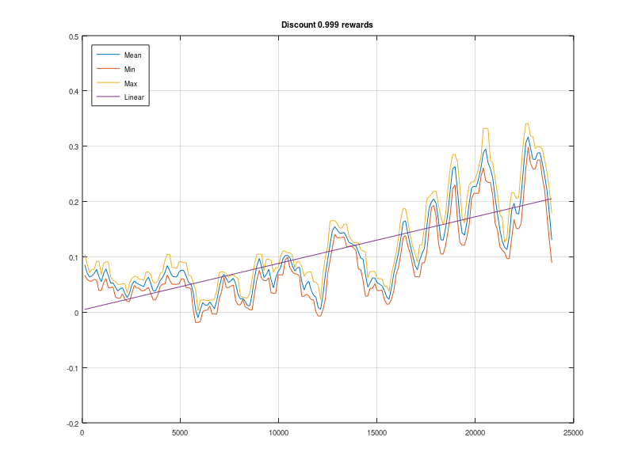

### Discount 0.999 rewards histogram

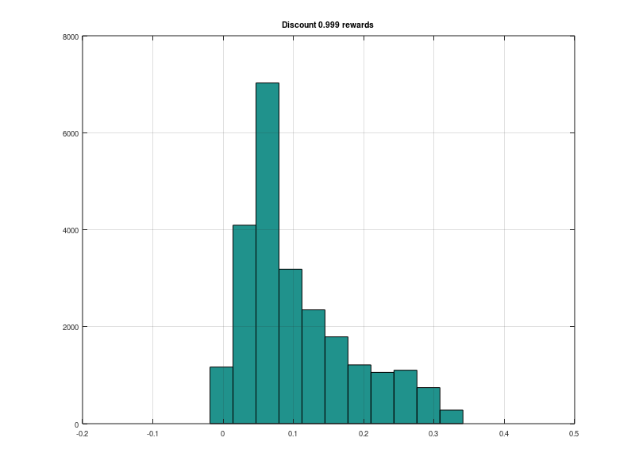
## Halt max prob.

| KPI    |             |
|--------|------------:|
| Mean   |       0.862 |
| RMS    |       0.863 |
| Min    |         0.5 |
| Median |       0.872 |
| Max    |       0.888 |
| Trend  |      Linear |
| From   |       0.837 |
| To     |       0.887 |

|      0.518 |      0.553 |      0.588 |      0.623 |      0.659 |      0.694 |      0.729 |      0.764 |        0.8 |      0.835 |       0.87 |
|-----------:|-----------:|-----------:|-----------:|-----------:|-----------:|-----------:|-----------:|-----------:|-----------:|-----------:|
|        137 |         65 |         36 |         18 |         45 |         79 |        147 |        140 |        576 |       2072 |      20685 |

### Halt max prob. notes

[Notes]

### Halt max prob. chart

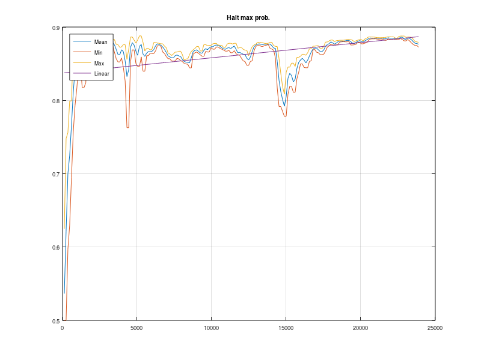

### Halt max prob. histogram

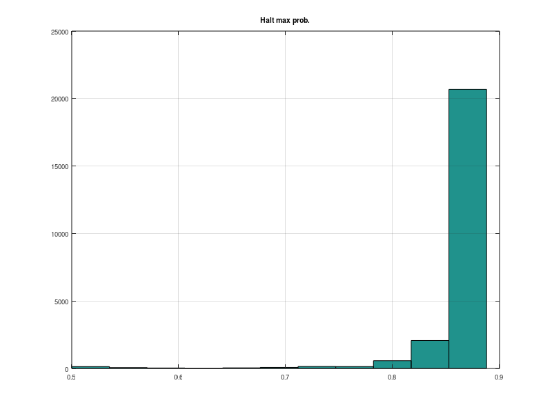
## Direction max prob.

| KPI    |             |
|--------|------------:|
| Mean   |       0.132 |
| RMS    |       0.133 |
| Min    |        0.04 |
| Median |       0.128 |
| Max    |       0.232 |
| Trend  |      Linear |
| From   |       0.147 |
| To     |       0.116 |

|     0.0487 |     0.0662 |     0.0836 |      0.101 |      0.118 |      0.136 |      0.153 |      0.171 |      0.188 |      0.206 |      0.223 |
|-----------:|-----------:|-----------:|-----------:|-----------:|-----------:|-----------:|-----------:|-----------:|-----------:|-----------:|
|         22 |         67 |         11 |        412 |      10989 |       9064 |       1824 |        265 |        684 |        417 |        245 |

### Direction max prob. notes

[Notes]

### Direction max prob. chart

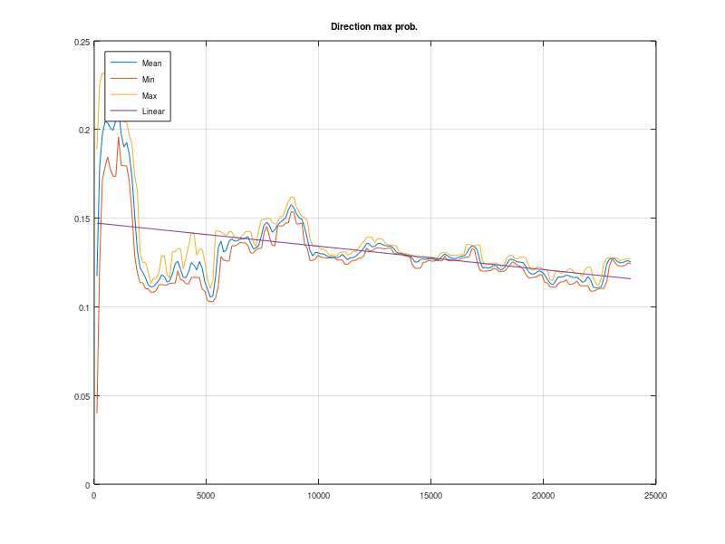

### Direction max prob. histogram

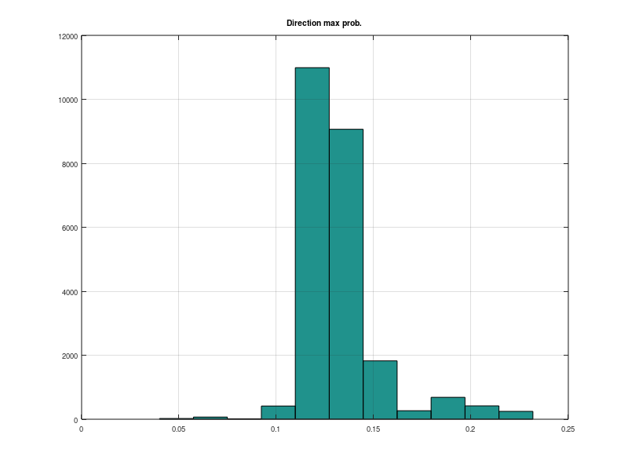
## Speed max prob.

| KPI    |             |
|--------|------------:|
| Mean   |       0.248 |
| RMS    |        0.25 |
| Min    |       0.111 |
| Median |       0.244 |
| Max    |       0.383 |
| Trend  |      Linear |
| From   |       0.285 |
| To     |       0.211 |

|      0.123 |      0.148 |      0.173 |      0.198 |      0.222 |      0.247 |      0.272 |      0.297 |      0.321 |      0.346 |      0.371 |
|-----------:|-----------:|-----------:|-----------:|-----------:|-----------:|-----------:|-----------:|-----------:|-----------:|-----------:|
|         12 |          7 |         18 |       3979 |       6384 |       6143 |       3266 |       2569 |       1385 |        137 |        100 |

### Speed max prob. notes

[Notes]

### Speed max prob. chart

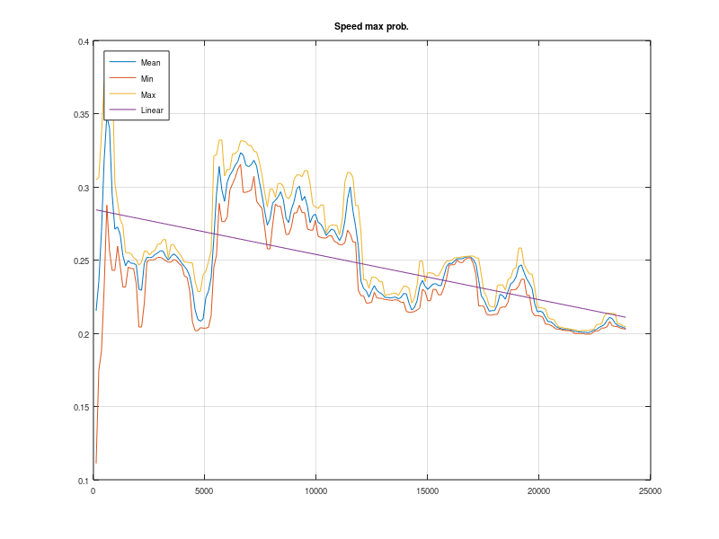

### Speed max prob. histogram

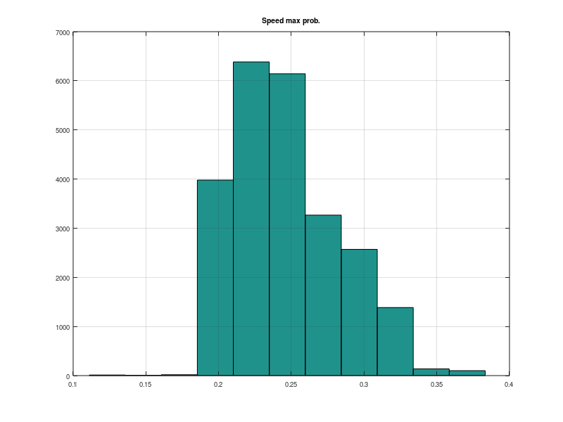
## Sensor direction max prob.

| KPI    |             |
|--------|------------:|
| Mean   |       0.712 |
| RMS    |       0.736 |
| Min    |       0.143 |
| Median |       0.849 |
| Max    |       0.885 |
| Trend  |      Linear |
| From   |       0.699 |
| To     |       0.725 |

|      0.177 |      0.244 |      0.312 |      0.379 |      0.447 |      0.514 |      0.581 |      0.649 |      0.716 |      0.784 |      0.851 |
|-----------:|-----------:|-----------:|-----------:|-----------:|-----------:|-----------:|-----------:|-----------:|-----------:|-----------:|
|         32 |         85 |         88 |         45 |       4559 |       4223 |        444 |        368 |        219 |        562 |      13375 |

### Sensor direction max prob. notes

[Notes]

### Sensor direction max prob. chart

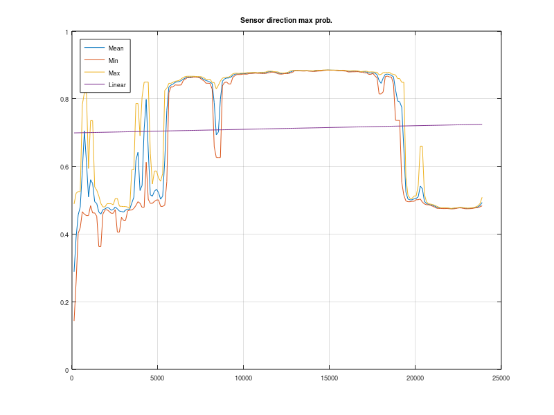

### Sensor direction max prob. histogram

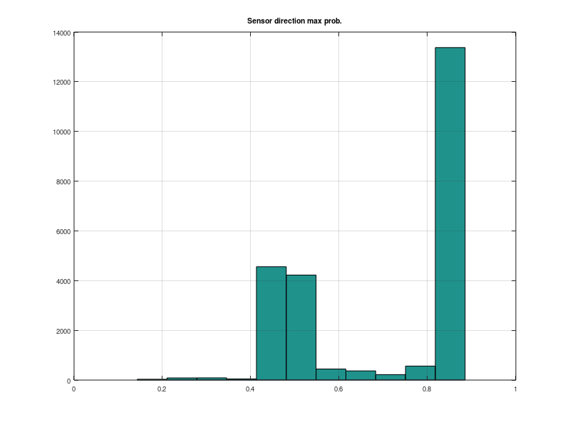
## Delta halt prob.

| KPI    |             |
|--------|------------:|
| Mean   |    0.000393 |
| RMS    |     0.00186 |
| Min    |           0 |
| Median |    7.05e-05 |
| Max    |      0.0586 |
| Trend  |      Linear |
| From   |    0.000974 |
| To     |   -0.000187 |

|    0.00266 |    0.00799 |     0.0133 |     0.0187 |      0.024 |     0.0293 |     0.0346 |       0.04 |     0.0453 |     0.0506 |      0.056 |
|-----------:|-----------:|-----------:|-----------:|-----------:|-----------:|-----------:|-----------:|-----------:|-----------:|-----------:|
|      23733 |        167 |         46 |         20 |          9 |          5 |          6 |          3 |          4 |          2 |          5 |

### Delta halt prob. notes

[Notes]

### Delta halt prob. chart

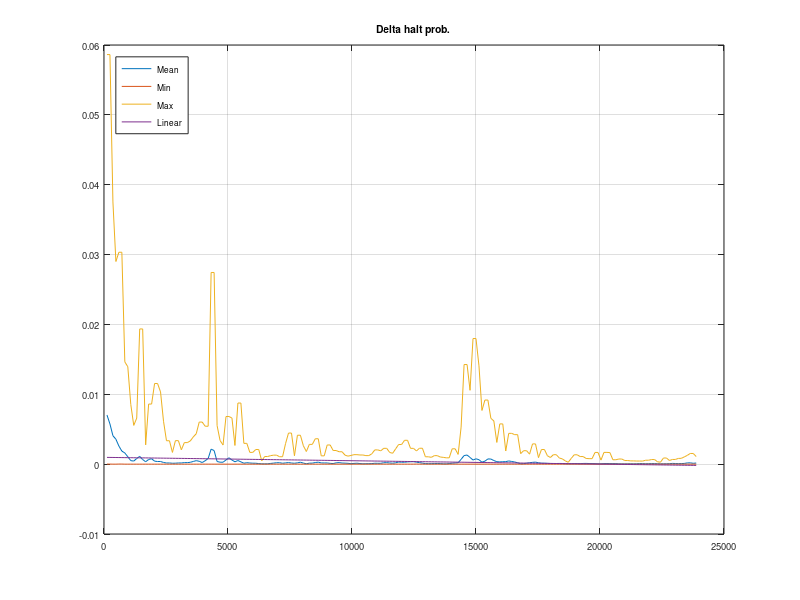

### Delta halt prob. histogram

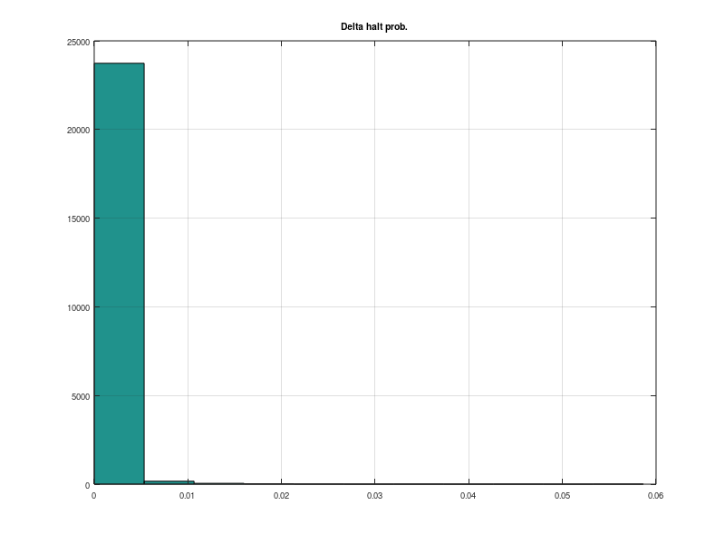
## Delta direction prob.

| KPI    |             |
|--------|------------:|
| Mean   |     0.00108 |
| RMS    |     0.00285 |
| Min    |       6e-08 |
| Median |    0.000312 |
| Max    |        0.05 |
| Trend  |      Linear |
| From   |      0.0022 |
| To     |   -4.01e-05 |

|    0.00227 |    0.00682 |     0.0114 |     0.0159 |     0.0205 |      0.025 |     0.0296 |     0.0341 |     0.0387 |     0.0432 |     0.0477 |
|-----------:|-----------:|-----------:|-----------:|-----------:|-----------:|-----------:|-----------:|-----------:|-----------:|-----------:|
|      22771 |        748 |        269 |         95 |         44 |         37 |         17 |          7 |          5 |          5 |          2 |

### Delta direction prob. notes

[Notes]

### Delta direction prob. chart

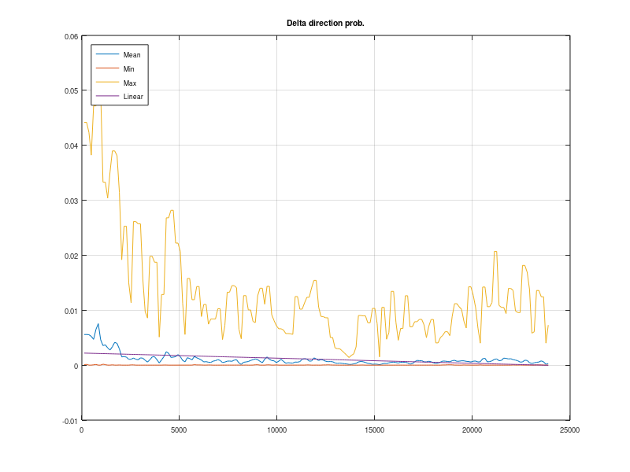

### Delta direction prob. histogram

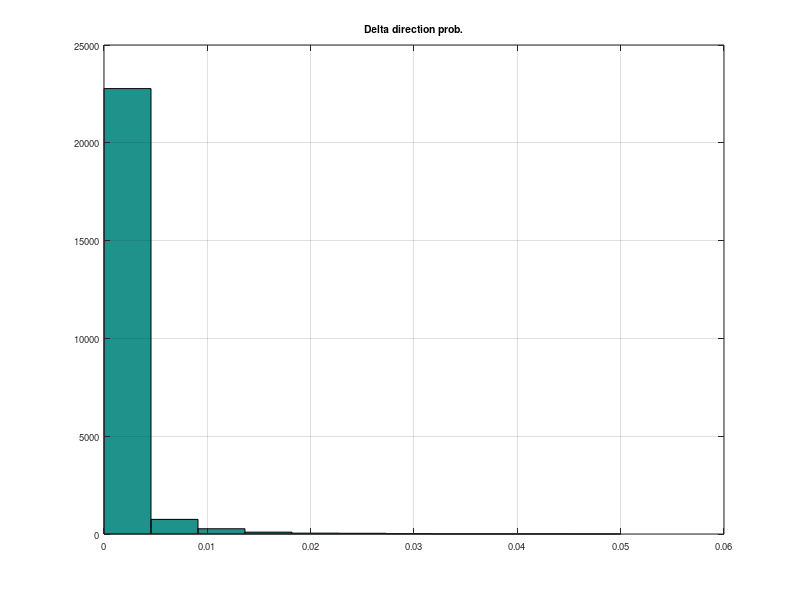
## Delta speed prob.

| KPI    |             |
|--------|------------:|
| Mean   |     0.00129 |
| RMS    |     0.00363 |
| Min    |       9e-08 |
| Median |     0.00037 |
| Max    |       0.073 |
| Trend  |      Linear |
| From   |     0.00263 |
| To     |   -5.01e-05 |

|    0.00332 |    0.00996 |     0.0166 |     0.0232 |     0.0299 |     0.0365 |     0.0432 |     0.0498 |     0.0564 |     0.0631 |     0.0697 |
|-----------:|-----------:|-----------:|-----------:|-----------:|-----------:|-----------:|-----------:|-----------:|-----------:|-----------:|
|      23184 |        513 |        152 |         62 |         25 |         31 |         14 |          9 |          2 |          4 |          4 |

### Delta speed prob. notes

[Notes]

### Delta speed prob. chart

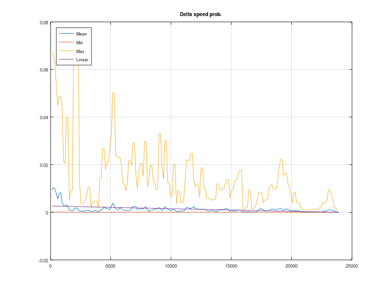

### Delta speed prob. histogram

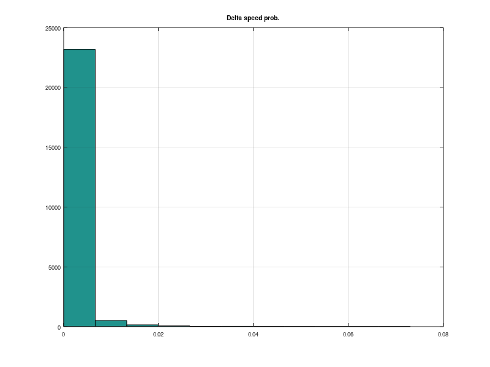
## Delta sensor direction prob.

| KPI    |             |
|--------|------------:|
| Mean   |    0.000843 |
| RMS    |     0.00348 |
| Min    |           0 |
| Median |    4.85e-05 |
| Max    |      0.0819 |
| Trend  |      Linear |
| From   |     0.00213 |
| To     |   -0.000444 |

|    0.00372 |     0.0112 |     0.0186 |     0.0261 |     0.0335 |      0.041 |     0.0484 |     0.0559 |     0.0633 |     0.0708 |     0.0782 |
|-----------:|-----------:|-----------:|-----------:|-----------:|-----------:|-----------:|-----------:|-----------:|-----------:|-----------:|
|      23349 |        394 |        128 |         57 |         33 |         15 |         13 |          3 |          3 |          1 |          4 |

### Delta sensor direction prob. notes

[Notes]

### Delta sensor direction prob. chart

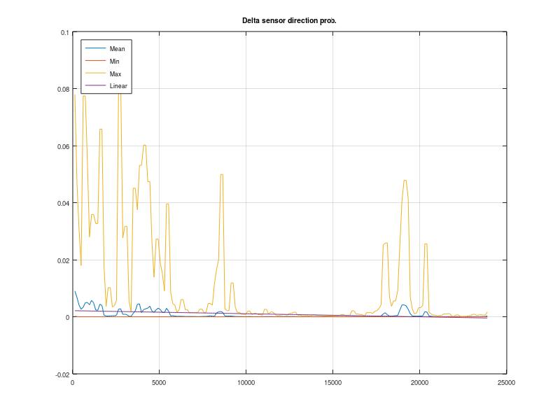

### Delta sensor direction prob. histogram

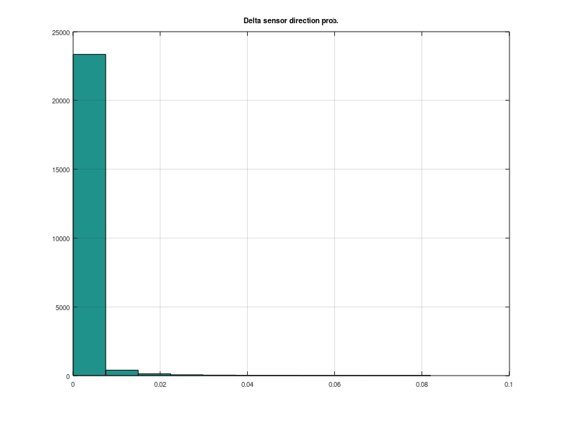
## Advantage residual estimation (critic)

| KPI    |             |
|--------|------------:|
| Mean   |       0.905 |
| RMS    |       0.955 |
| Min    |      -0.914 |
| Median |        0.98 |
| Max    |       0.994 |
| Trend  |      Linear |
| From   |       0.698 |
| To     |        1.11 |

|     -0.828 |     -0.654 |     -0.481 |     -0.307 |     -0.134 |     0.0397 |      0.213 |      0.387 |       0.56 |      0.734 |      0.907 |
|-----------:|-----------:|-----------:|-----------:|-----------:|-----------:|-----------:|-----------:|-----------:|-----------:|-----------:|
|        345 |        238 |         98 |         55 |         72 |         68 |         49 |         70 |        158 |        474 |      22373 |

### Advantage residual estimation (critic) notes

[Notes]

### Advantage residual estimation (critic) chart

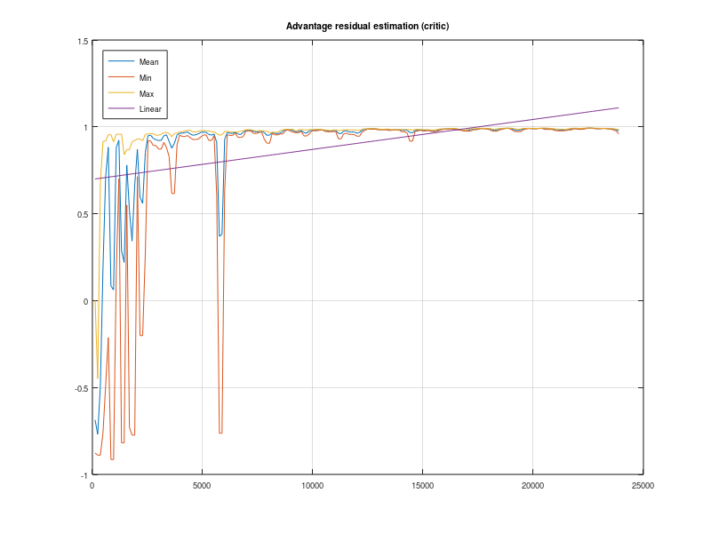

### Advantage residual estimation (critic) histogram

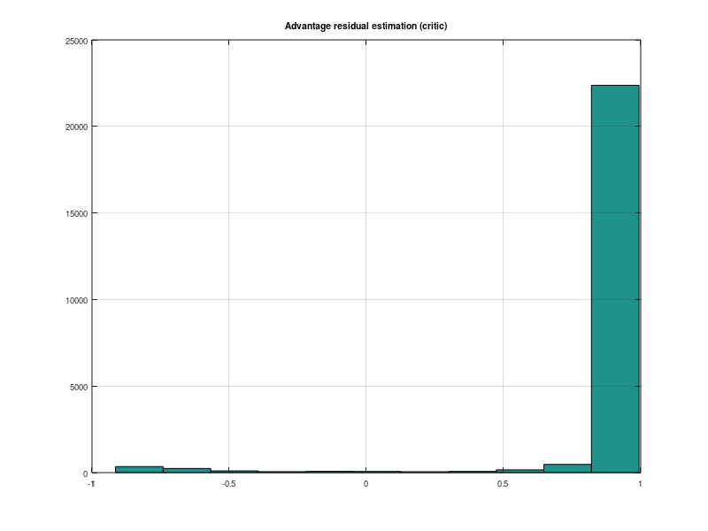
## Halt gradient

| KPI    |             |
|--------|------------:|
| Mean   |        2.01 |
| RMS    |        2.96 |
| Min    |        1.13 |
| Median |        1.15 |
| Max    |        8.92 |
| Trend  |      Linear |
| From   |        2.03 |
| To     |        1.99 |

|       1.48 |       2.19 |        2.9 |       3.61 |       4.31 |       5.02 |       5.73 |       6.44 |       7.15 |       7.86 |       8.57 |
|-----------:|-----------:|-----------:|-----------:|-----------:|-----------:|-----------:|-----------:|-----------:|-----------:|-----------:|
|      20583 |        199 |         22 |         53 |         52 |         87 |        136 |        188 |        790 |       1138 |        752 |

### Halt gradient notes

[Notes]

### Halt gradient chart

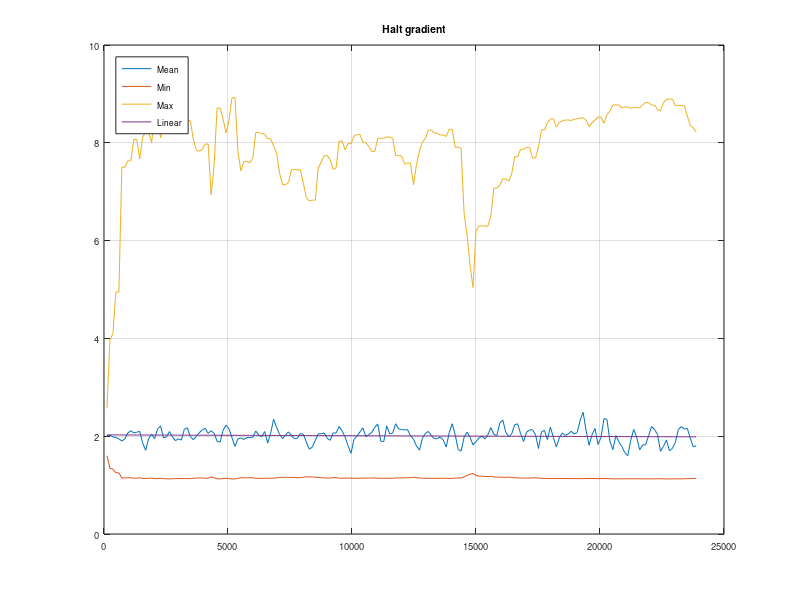

### Halt gradient histogram

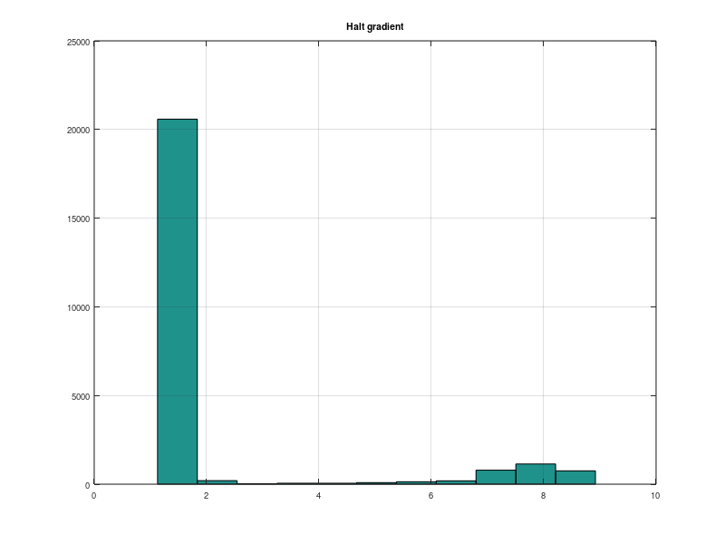
## Direction gradient

| KPI    |             |
|--------|------------:|
| Mean   |          25 |
| RMS    |         106 |
| Min    |        4.33 |
| Median |        8.55 |
| Max    |    1.55e+03 |
| Trend  |      Linear |
| From   |        25.1 |
| To     |        24.9 |

|       74.6 |        215 |        356 |        496 |        637 |        777 |        918 |   1.06e+03 |    1.2e+03 |   1.34e+03 |   1.48e+03 |
|-----------:|-----------:|-----------:|-----------:|-----------:|-----------:|-----------:|-----------:|-----------:|-----------:|-----------:|
|      23384 |        122 |        103 |         90 |         84 |         81 |         80 |         29 |         16 |          7 |          4 |

### Direction gradient notes

[Notes]

### Direction gradient chart

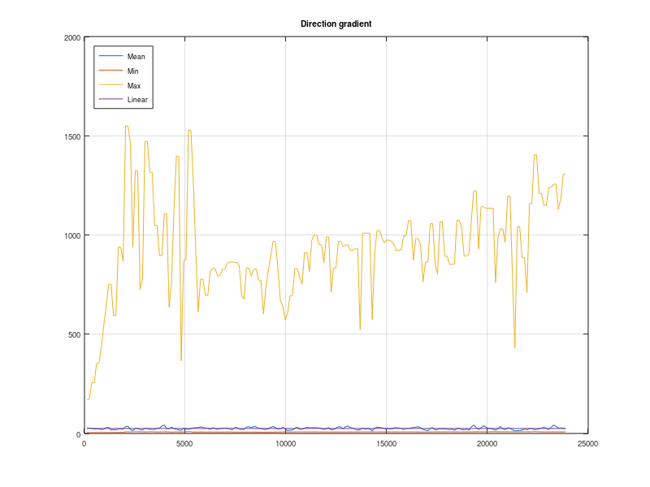

### Direction gradient histogram

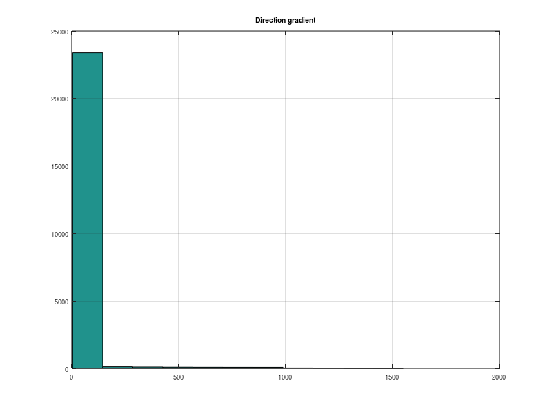
## Speed gradient

| KPI    |             |
|--------|------------:|
| Mean   |        9.01 |
| RMS    |        28.7 |
| Min    |        2.65 |
| Median |        4.45 |
| Max    |         302 |
| Trend  |      Linear |
| From   |           9 |
| To     |        9.01 |

|       16.3 |       43.5 |       70.7 |         98 |        125 |        152 |        180 |        207 |        234 |        261 |        289 |
|-----------:|-----------:|-----------:|-----------:|-----------:|-----------:|-----------:|-----------:|-----------:|-----------:|-----------:|
|      23265 |         92 |         70 |        116 |        139 |         71 |         34 |         39 |         97 |         46 |         31 |

### Speed gradient notes

[Notes]

### Speed gradient chart

### Speed gradient histogram

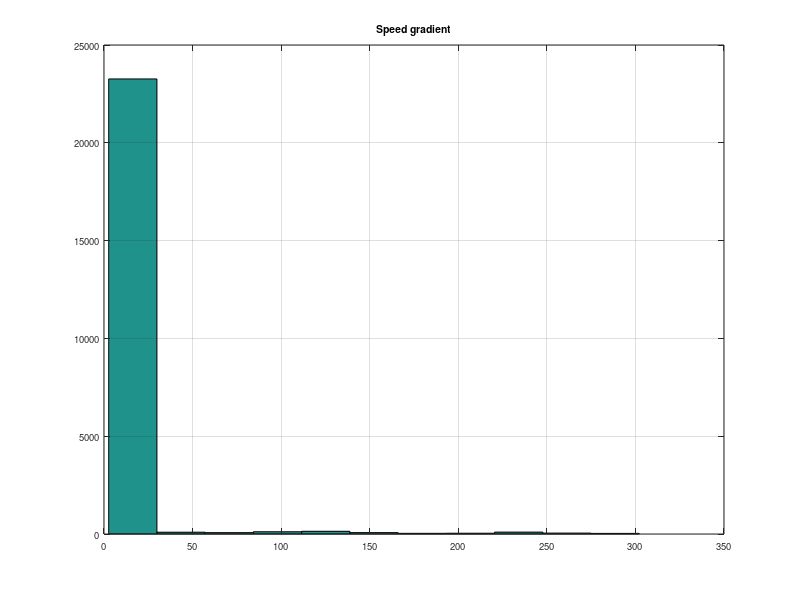
## Sensor direction gradient

| KPI    |             |
|--------|------------:|
| Mean   |        6.95 |
| RMS    |        18.5 |
| Min    |        1.13 |
| Median |        1.31 |
| Max    |         108 |
| Trend  |      Linear |
| From   |         6.7 |
| To     |         7.2 |

|       6.01 |       15.8 |       25.5 |       35.3 |         45 |       54.8 |       64.6 |       74.3 |       84.1 |       93.8 |        104 |
|-----------:|-----------:|-----------:|-----------:|-----------:|-----------:|-----------:|-----------:|-----------:|-----------:|-----------:|
|      21528 |        123 |        163 |        305 |        567 |        857 |         63 |         60 |         56 |         95 |        183 |

### Sensor direction gradient notes

[Notes]

### Sensor direction gradient chart

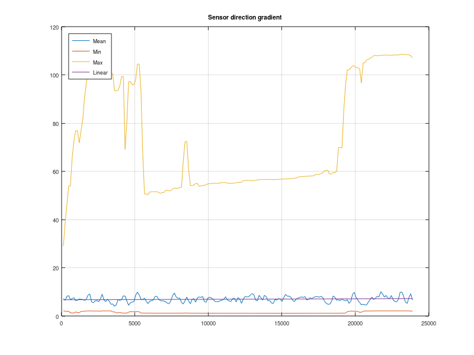

### Sensor direction gradient histogram

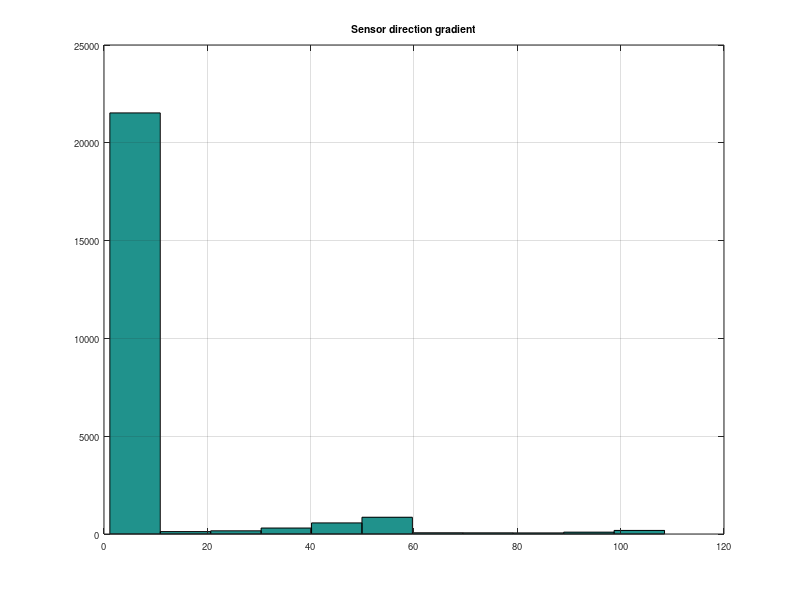
