# Report

30 October 2022, 17:43

[TOC]

Data folder: `C:\Users\marco\Desktop\wheellyj\data\agent-10e-3\`

## Rewards

| KPI    |             |
|--------|------------:|
| Mean   |      -0.123 |
| RMS    |       0.616 |
| Min    |          -1 |
| Median |           0 |
| Max    |           1 |
| Trend  |      Linear |
| From   |      -0.287 |
| To     |      0.0424 |

|     -0.909 |     -0.727 |     -0.545 |     -0.364 |     -0.182 |          0 |      0.182 |      0.364 |      0.545 |      0.727 |      0.909 |
|-----------:|-----------:|-----------:|-----------:|-----------:|-----------:|-----------:|-----------:|-----------:|-----------:|-----------:|
|       6627 |          0 |          0 |          0 |          0 |      10452 |       1676 |       1505 |        728 |       1687 |       1325 |

### Rewards notes

[Notes]

### Rewards chart

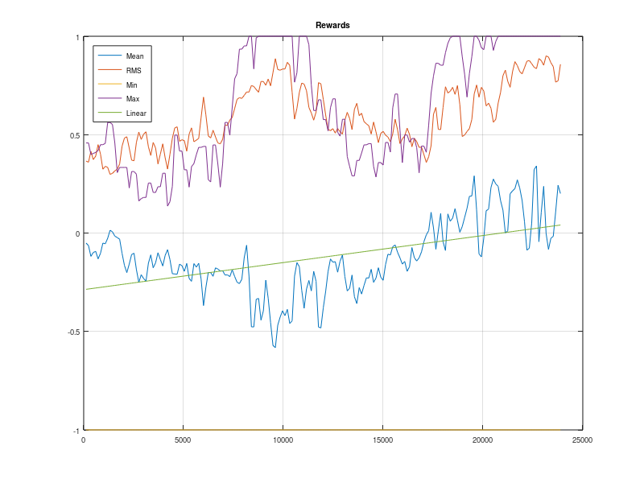

### Rewards histogram

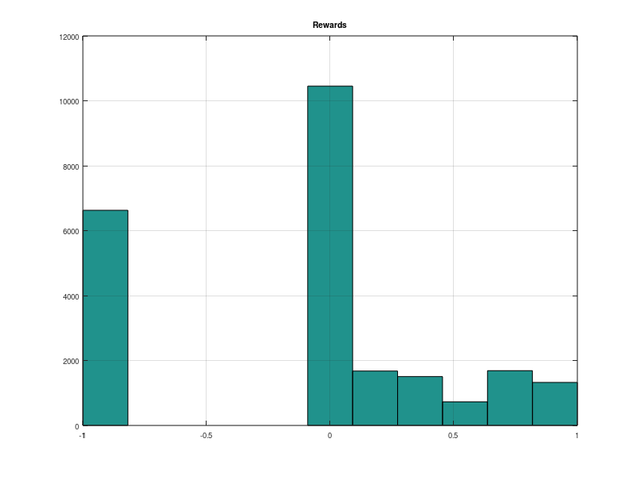
## Delta

| KPI    |             |
|--------|------------:|
| Mean   |     0.00146 |
| RMS    |       0.579 |
| Min    |       -1.32 |
| Median |       0.166 |
| Max    |        1.54 |
| Trend  |      Linear |
| From   |    -0.00912 |
| To     |       0.012 |

|      -1.19 |     -0.931 |     -0.671 |      -0.41 |      -0.15 |      0.111 |      0.371 |      0.632 |      0.892 |       1.15 |       1.41 |
|-----------:|-----------:|-----------:|-----------:|-----------:|-----------:|-----------:|-----------:|-----------:|-----------:|-----------:|
|       1008 |       2560 |       2766 |        300 |       1056 |       7653 |       4787 |       2253 |       1276 |        247 |         94 |

### Delta notes

[Notes]

### Delta chart

### Delta histogram

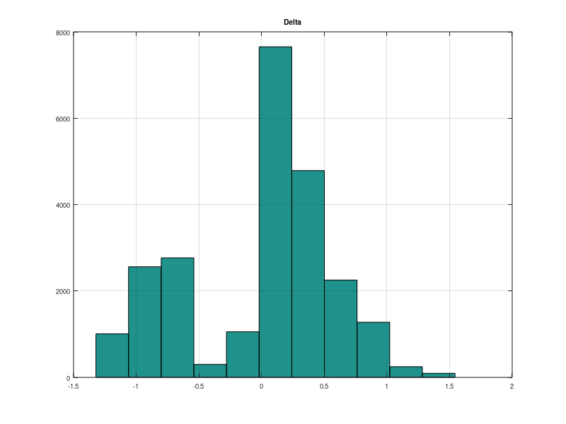
## Discount 0.999 rewards

| KPI    |             |
|--------|------------:|
| Mean   |      -0.132 |
| RMS    |       0.199 |
| Min    |      -0.416 |
| Median |      -0.155 |
| Max    |       0.191 |
| Trend  |      Linear |
| From   |      -0.266 |
| To     |     0.00107 |

|     -0.389 |     -0.334 |     -0.279 |     -0.223 |     -0.168 |     -0.113 |    -0.0578 |   -0.00262 |     0.0526 |      0.108 |      0.163 |
|-----------:|-----------:|-----------:|-----------:|-----------:|-----------:|-----------:|-----------:|-----------:|-----------:|-----------:|
|       1152 |       1787 |       2302 |       3980 |       4404 |       2893 |       1809 |        813 |       1272 |       2625 |        963 |

### Discount 0.999 rewards notes

[Notes]

### Discount 0.999 rewards chart

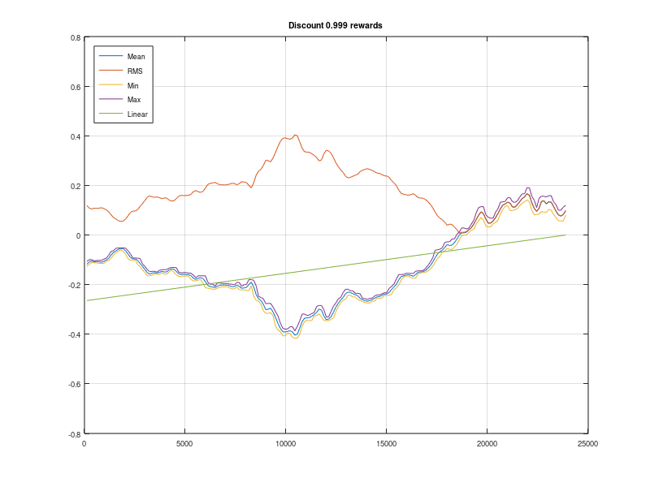

### Discount 0.999 rewards histogram

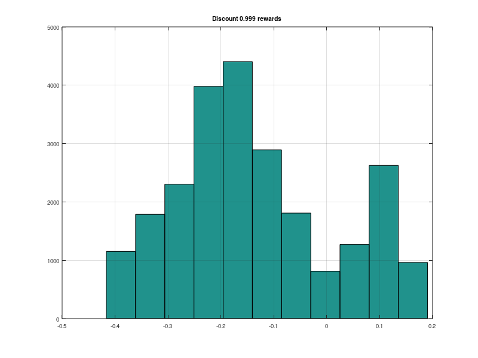
## Halt max prob.

| KPI    |             |
|--------|------------:|
| Mean   |       0.605 |
| RMS    |        0.61 |
| Min    |         0.5 |
| Median |       0.587 |
| Max    |       0.773 |
| Trend  |      Linear |
| From   |       0.522 |
| To     |       0.688 |

|      0.512 |      0.537 |      0.562 |      0.587 |      0.612 |      0.636 |      0.661 |      0.686 |      0.711 |      0.736 |       0.76 |
|-----------:|-----------:|-----------:|-----------:|-----------:|-----------:|-----------:|-----------:|-----------:|-----------:|-----------:|
|       5335 |       3729 |       2036 |       1452 |       1127 |       2169 |       1374 |       2713 |       1835 |       1581 |        649 |

### Halt max prob. notes

[Notes]

### Halt max prob. chart

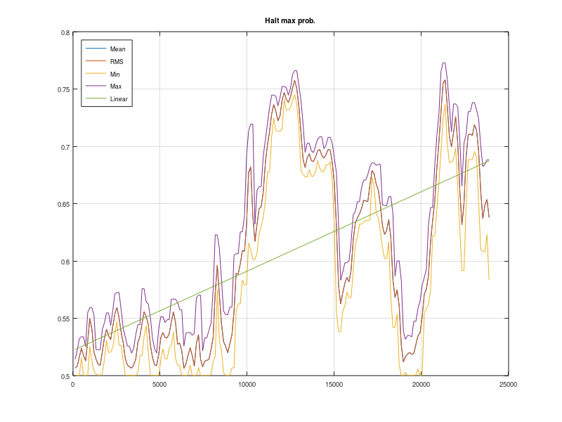

### Halt max prob. histogram

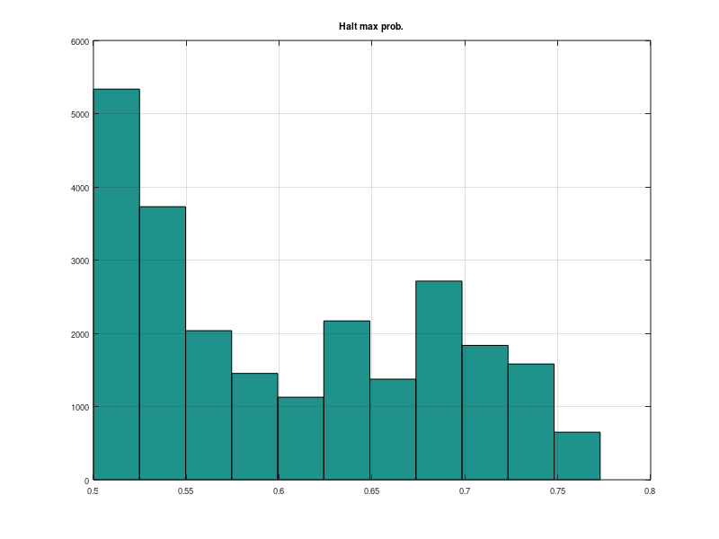
## Direction max prob.

| KPI    |             |
|--------|------------:|
| Mean   |        0.15 |
| RMS    |       0.159 |
| Min    |        0.04 |
| Median |       0.165 |
| Max    |       0.247 |
| Trend  |      Linear |
| From   |      0.0662 |
| To     |       0.233 |

|     0.0494 |     0.0682 |      0.087 |      0.106 |      0.125 |      0.143 |      0.162 |      0.181 |        0.2 |      0.219 |      0.237 |
|-----------:|-----------:|-----------:|-----------:|-----------:|-----------:|-----------:|-----------:|-----------:|-----------:|-----------:|
|       1206 |       3306 |       1370 |        628 |       1425 |       1239 |       5148 |       4482 |       2276 |       1889 |       1031 |

### Direction max prob. notes

[Notes]

### Direction max prob. chart

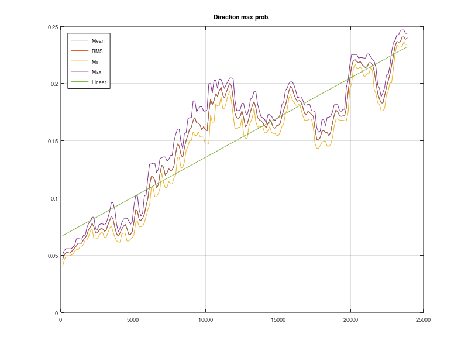

### Direction max prob. histogram

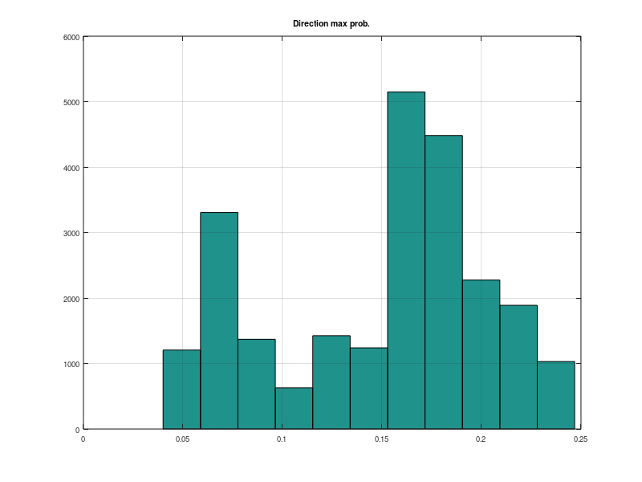
## Speed max prob.

| KPI    |             |
|--------|------------:|
| Mean   |       0.285 |
| RMS    |       0.294 |
| Min    |       0.111 |
| Median |       0.279 |
| Max    |       0.458 |
| Trend  |      Linear |
| From   |       0.182 |
| To     |       0.387 |

|      0.127 |      0.158 |       0.19 |      0.221 |      0.253 |      0.285 |      0.316 |      0.348 |      0.379 |      0.411 |      0.442 |
|-----------:|-----------:|-----------:|-----------:|-----------:|-----------:|-----------:|-----------:|-----------:|-----------:|-----------:|
|        922 |        632 |       1840 |       3069 |       4191 |       3773 |       2562 |       2280 |       3392 |        763 |        576 |

### Speed max prob. notes

[Notes]

### Speed max prob. chart

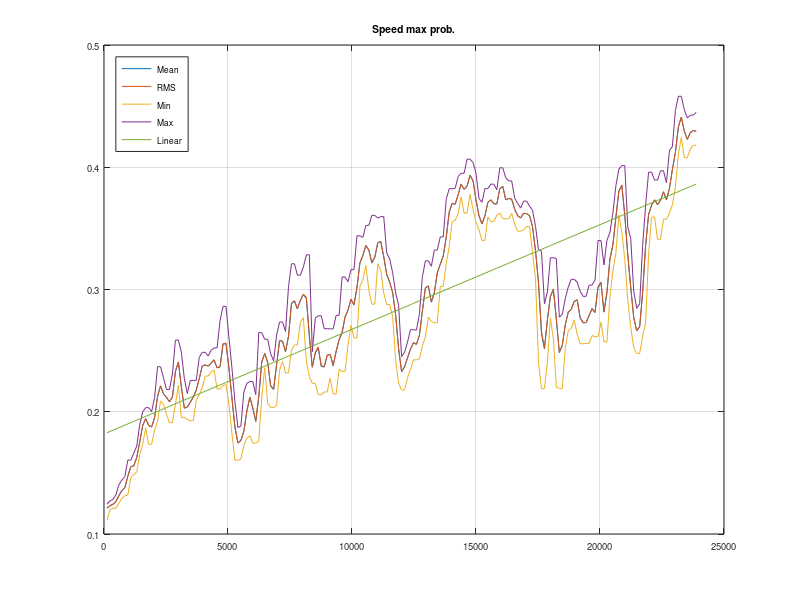

### Speed max prob. histogram

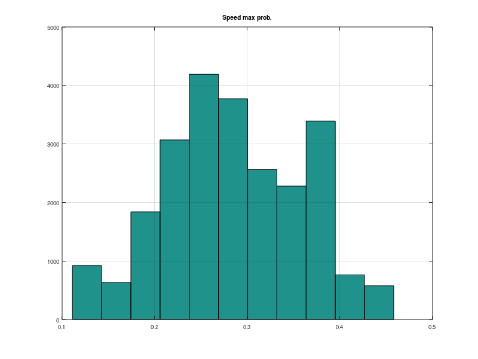
## Sensor direction max prob.

| KPI    |             |
|--------|------------:|
| Mean   |       0.426 |
| RMS    |        0.44 |
| Min    |       0.143 |
| Median |       0.421 |
| Max    |       0.722 |
| Trend  |      Linear |
| From   |       0.251 |
| To     |       0.601 |

|      0.169 |      0.222 |      0.275 |      0.327 |       0.38 |      0.433 |      0.485 |      0.538 |      0.591 |      0.643 |      0.696 |
|-----------:|-----------:|-----------:|-----------:|-----------:|-----------:|-----------:|-----------:|-----------:|-----------:|-----------:|
|       1029 |        364 |       1529 |       2538 |       4253 |       5626 |       4088 |       2529 |        469 |        896 |        679 |

### Sensor direction max prob. notes

[Notes]

### Sensor direction max prob. chart

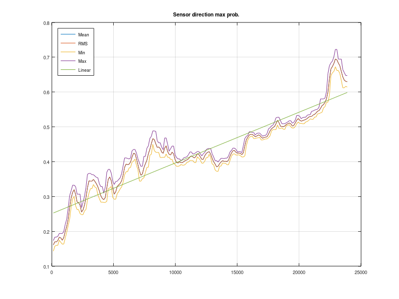

### Sensor direction max prob. histogram

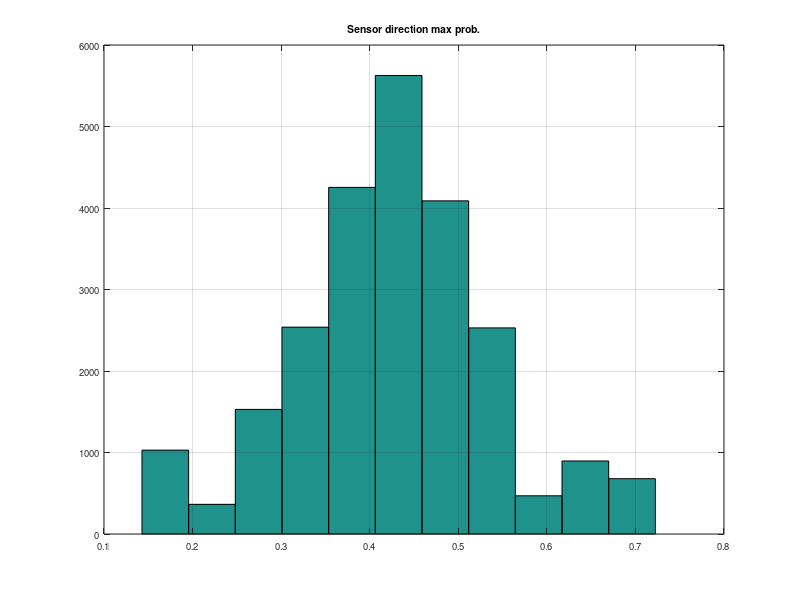
## Delta halt prob.

| KPI    |             |
|--------|------------:|
| Mean   |     0.00112 |
| RMS    |     0.00162 |
| Min    |           0 |
| Median |    0.000717 |
| Max    |     0.00814 |
| Trend  |      Linear |
| From   |     0.00092 |
| To     |     0.00133 |

|    0.00037 |    0.00111 |    0.00185 |    0.00259 |    0.00333 |    0.00407 |    0.00481 |    0.00555 |    0.00629 |    0.00703 |    0.00777 |
|-----------:|-----------:|-----------:|-----------:|-----------:|-----------:|-----------:|-----------:|-----------:|-----------:|-----------:|
|      12235 |       5322 |       2774 |       1553 |        948 |        635 |        300 |        143 |         64 |         21 |          5 |

### Delta halt prob. notes

[Notes]

### Delta halt prob. chart

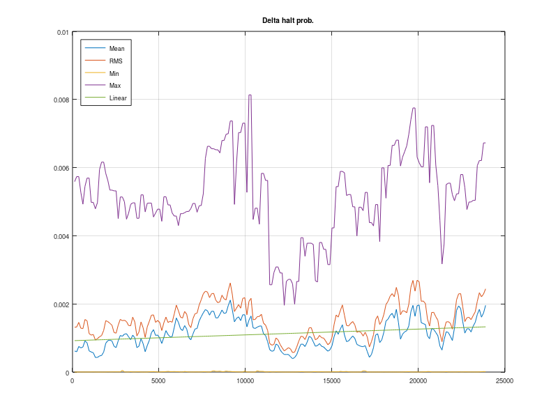

### Delta halt prob. histogram

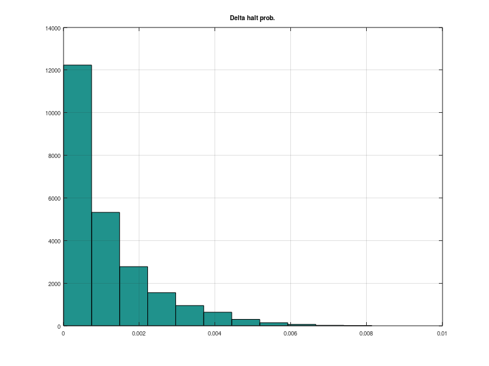
## Delta direction prob.

| KPI    |             |
|--------|------------:|
| Mean   |     0.00112 |
| RMS    |     0.00144 |
| Min    |    5.13e-07 |
| Median |    0.000844 |
| Max    |     0.00811 |
| Trend  |      Linear |
| From   |     0.00108 |
| To     |     0.00115 |

|   0.000369 |    0.00111 |    0.00184 |    0.00258 |    0.00332 |    0.00405 |    0.00479 |    0.00553 |    0.00626 |      0.007 |    0.00774 |
|-----------:|-----------:|-----------:|-----------:|-----------:|-----------:|-----------:|-----------:|-----------:|-----------:|-----------:|
|      10749 |       6407 |       3611 |       2162 |        727 |        214 |         86 |         22 |         16 |          4 |          2 |

### Delta direction prob. notes

[Notes]

### Delta direction prob. chart

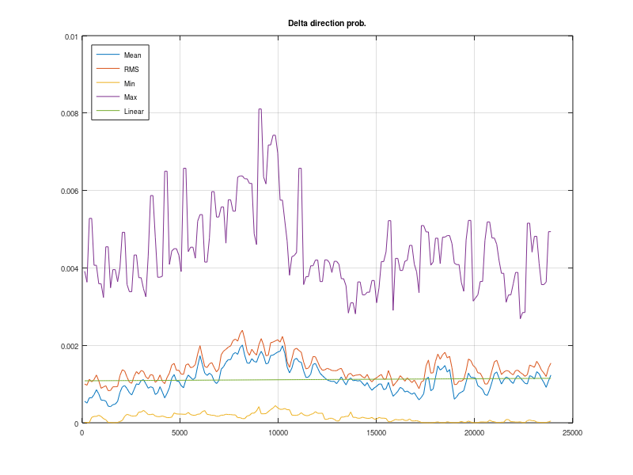

### Delta direction prob. histogram

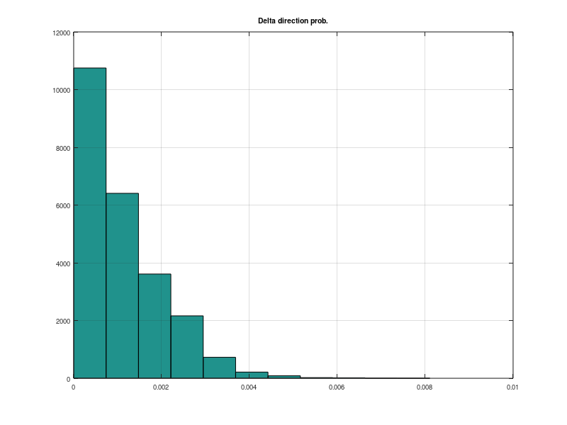
## Delta speed prob.

| KPI    |             |
|--------|------------:|
| Mean   |      0.0018 |
| RMS    |     0.00233 |
| Min    |    1.29e-06 |
| Median |     0.00139 |
| Max    |       0.014 |
| Trend  |      Linear |
| From   |     0.00149 |
| To     |     0.00212 |

|   0.000638 |    0.00191 |    0.00318 |    0.00446 |    0.00573 |      0.007 |    0.00828 |    0.00955 |     0.0108 |     0.0121 |     0.0134 |
|-----------:|-----------:|-----------:|-----------:|-----------:|-----------:|-----------:|-----------:|-----------:|-----------:|-----------:|
|      11269 |       6315 |       4061 |       1564 |        514 |        200 |         56 |         15 |          3 |          2 |          1 |

### Delta speed prob. notes

[Notes]

### Delta speed prob. chart

### Delta speed prob. histogram

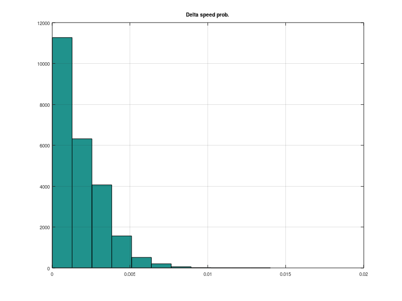
## Delta sensor direction prob.

| KPI    |             |
|--------|------------:|
| Mean   |     0.00103 |
| RMS    |     0.00146 |
| Min    |     1.8e-07 |
| Median |    0.000711 |
| Max    |     0.00906 |
| Trend  |      Linear |
| From   |     0.00136 |
| To     |    0.000701 |

|   0.000412 |    0.00124 |    0.00206 |    0.00288 |    0.00371 |    0.00453 |    0.00536 |    0.00618 |      0.007 |    0.00783 |    0.00865 |
|-----------:|-----------:|-----------:|-----------:|-----------:|-----------:|-----------:|-----------:|-----------:|-----------:|-----------:|
|      13408 |       6029 |       2520 |       1022 |        522 |        253 |        127 |         73 |         29 |         10 |          7 |

### Delta sensor direction prob. notes

[Notes]

### Delta sensor direction prob. chart

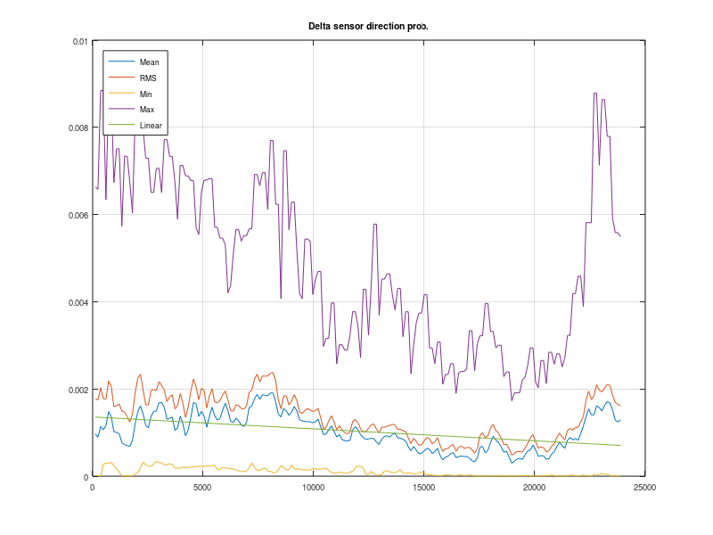

### Delta sensor direction prob. histogram

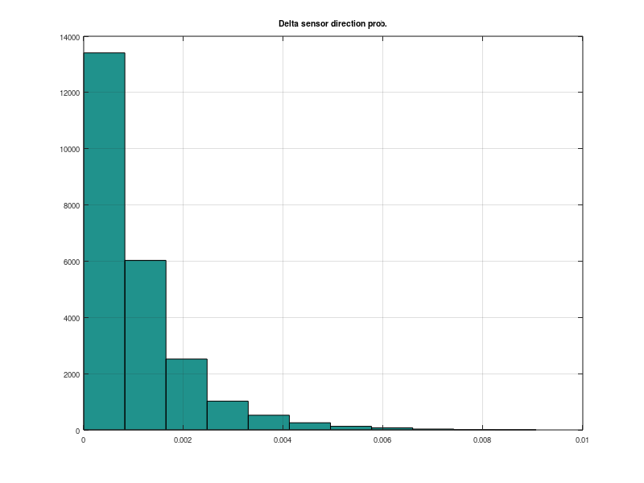
## Advantage residual estimation (critic)

| KPI    |             |
|--------|------------:|
| Mean   |       -0.63 |
| RMS    |       0.659 |
| Min    |      -0.881 |
| Median |      -0.682 |
| Max    |      0.0744 |
| Trend  |      Linear |
| From   |      -0.541 |
| To     |      -0.719 |

|     -0.837 |     -0.751 |     -0.664 |     -0.577 |      -0.49 |     -0.403 |     -0.316 |      -0.23 |     -0.143 |    -0.0559 |     0.0309 |
|-----------:|-----------:|-----------:|-----------:|-----------:|-----------:|-----------:|-----------:|-----------:|-----------:|-----------:|
|       4739 |       5929 |       4328 |       3249 |       1948 |       1296 |        883 |        373 |        625 |        477 |        153 |

### Advantage residual estimation (critic) notes

[Notes]

### Advantage residual estimation (critic) chart

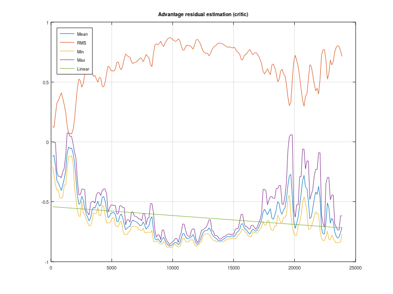

### Advantage residual estimation (critic) histogram

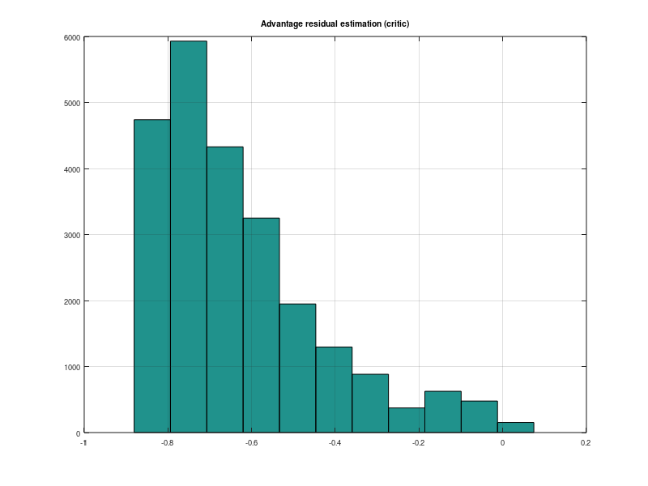
## Halt gradient

| KPI    |             |
|--------|------------:|
| Mean   |           2 |
| RMS    |        2.08 |
| Min    |         1.3 |
| Median |        1.91 |
| Max    |         4.4 |
| Trend  |      Linear |
| From   |        1.99 |
| To     |        2.01 |

|       1.44 |       1.72 |          2 |       2.28 |       2.57 |       2.85 |       3.13 |       3.41 |        3.7 |       3.98 |       4.26 |
|-----------:|-----------:|-----------:|-----------:|-----------:|-----------:|-----------:|-----------:|-----------:|-----------:|-----------:|
|       6555 |       4095 |       7169 |       2295 |        821 |        952 |        856 |        600 |        331 |        263 |         63 |

### Halt gradient notes

[Notes]

### Halt gradient chart

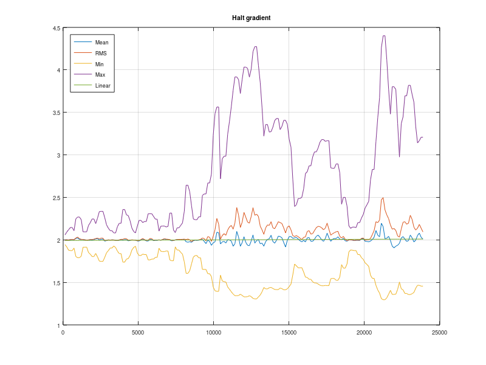

### Halt gradient histogram

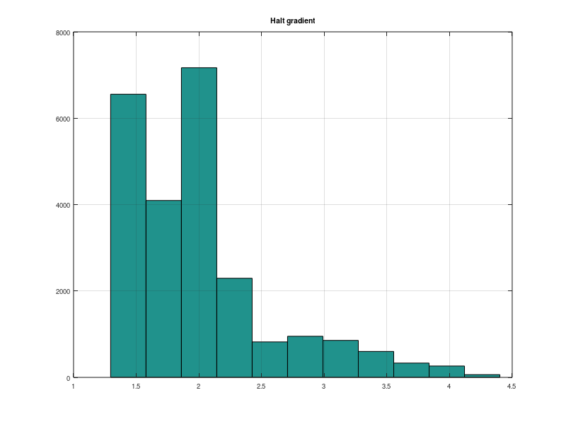
## Direction gradient

| KPI    |             |
|--------|------------:|
| Mean   |        25.2 |
| RMS    |        38.3 |
| Min    |        4.06 |
| Median |        15.9 |
| Max    |         282 |
| Trend  |      Linear |
| From   |        24.9 |
| To     |        25.6 |

|       16.7 |       41.9 |       67.2 |       92.4 |        118 |        143 |        168 |        193 |        219 |        244 |        269 |
|-----------:|-----------:|-----------:|-----------:|-----------:|-----------:|-----------:|-----------:|-----------:|-----------:|-----------:|
|      18163 |       3227 |       1166 |        672 |        408 |        183 |        106 |         37 |         22 |         12 |          4 |

### Direction gradient notes

[Notes]

### Direction gradient chart

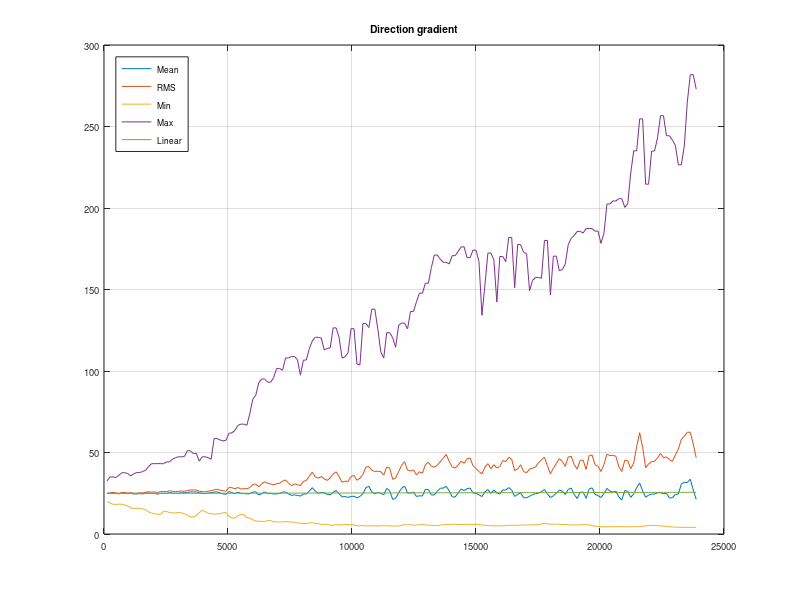

### Direction gradient histogram

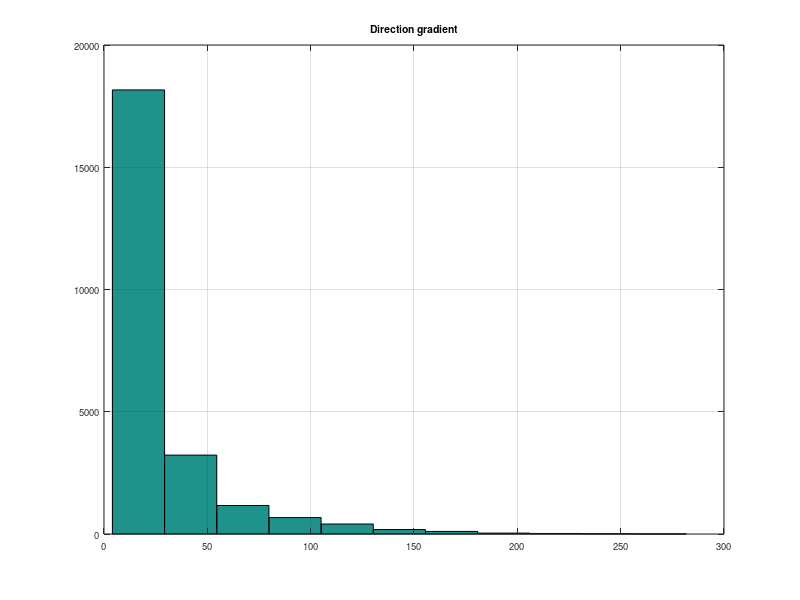
## Speed gradient

| KPI    |             |
|--------|------------:|
| Mean   |        8.98 |
| RMS    |        10.8 |
| Min    |        2.18 |
| Median |        8.09 |
| Max    |        44.3 |
| Trend  |      Linear |
| From   |        9.02 |
| To     |        8.94 |

|        4.1 |       7.92 |       11.7 |       15.6 |       19.4 |       23.2 |       27.1 |       30.9 |       34.7 |       38.5 |       42.4 |
|-----------:|-----------:|-----------:|-----------:|-----------:|-----------:|-----------:|-----------:|-----------:|-----------:|-----------:|
|       8677 |       7125 |       4665 |       1469 |        764 |        499 |        481 |        177 |        108 |         25 |         10 |

### Speed gradient notes

[Notes]

### Speed gradient chart

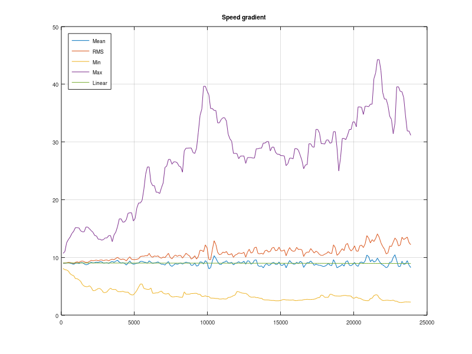

### Speed gradient histogram

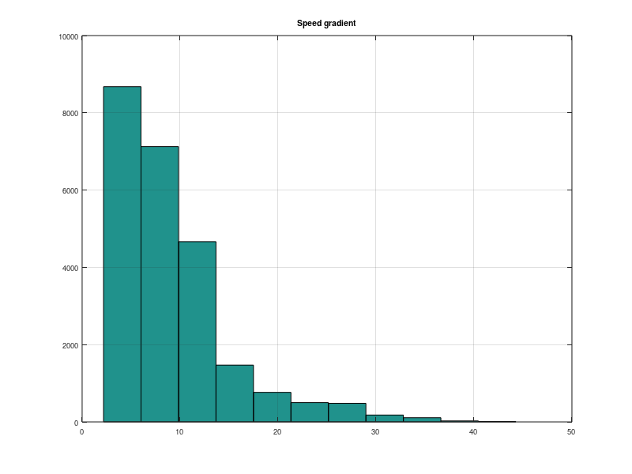
## Sensor direction gradient

| KPI    |             |
|--------|------------:|
| Mean   |        6.97 |
| RMS    |        12.3 |
| Min    |        1.39 |
| Median |        2.85 |
| Max    |        60.8 |
| Trend  |      Linear |
| From   |        6.91 |
| To     |        7.04 |

|       4.09 |       9.49 |       14.9 |       20.3 |       25.7 |       31.1 |       36.5 |       41.9 |       47.3 |       52.7 |       58.1 |
|-----------:|-----------:|-----------:|-----------:|-----------:|-----------:|-----------:|-----------:|-----------:|-----------:|-----------:|
|      18389 |       2519 |        917 |        276 |        259 |        411 |        446 |        344 |        146 |        187 |        106 |

### Sensor direction gradient notes

[Notes]

### Sensor direction gradient chart

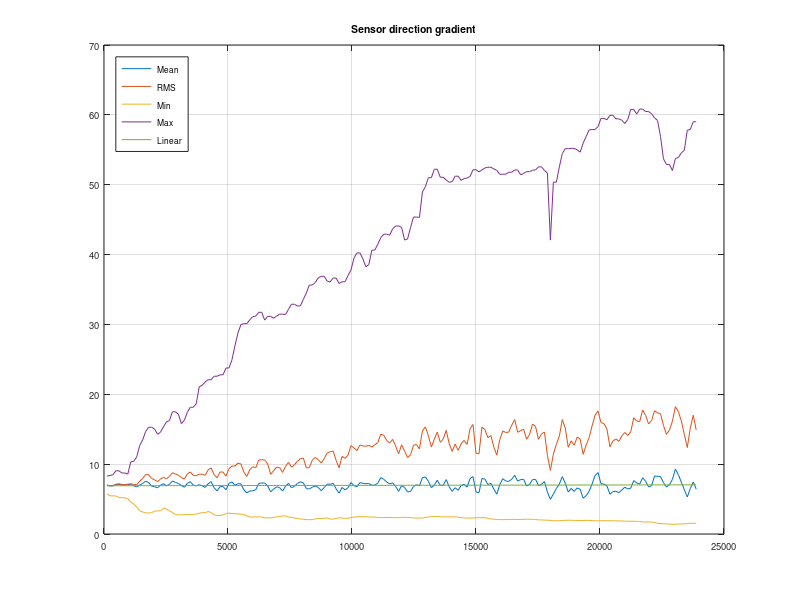

### Sensor direction gradient histogram

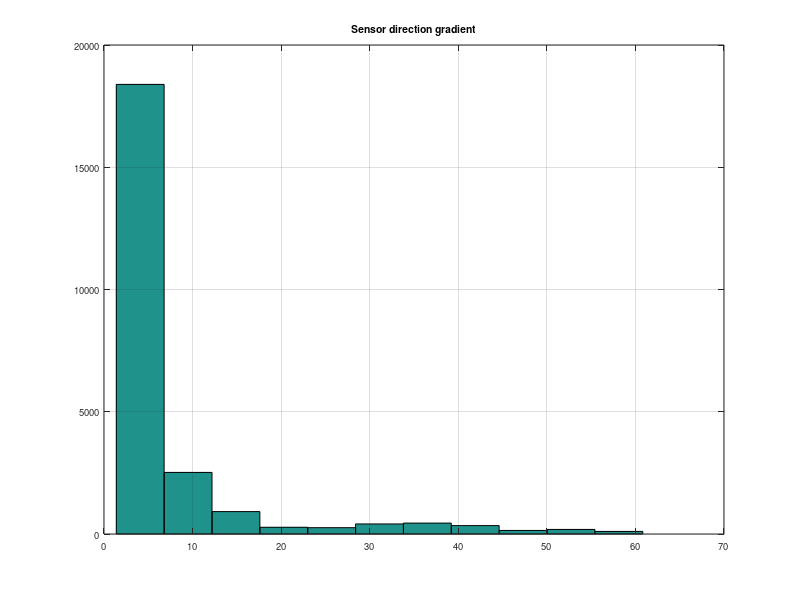
