# Report

30 October 2022, 15:40

[TOC]

Data folder: `../data/`

rco\Desktop\wheellyj\data\agent-300e-3\`

## Rewards

| KPI    |             |
|--------|------------:|
| Mean   |      -0.607 |
| RMS    |        0.83 |
| Min    |          -1 |
| Median |          -1 |
| Max    |           1 |
| Trend  |      Linear |
| From   |    -0.00188 |
| To     |       -1.21 |

|     -0.909 |     -0.727 |     -0.545 |     -0.364 |     -0.182 |          0 |      0.182 |      0.364 |      0.545 |      0.727 |      0.909 |
|-----------:|-----------:|-----------:|-----------:|-----------:|-----------:|-----------:|-----------:|-----------:|-----------:|-----------:|
|      15841 |          0 |          0 |          0 |          0 |       5305 |        670 |        833 |        867 |        370 |        114 |

### Rewards notes

[Notes]

### Rewards chart

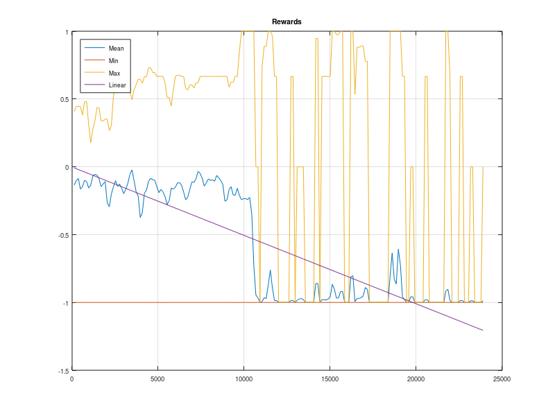

### Rewards histogram

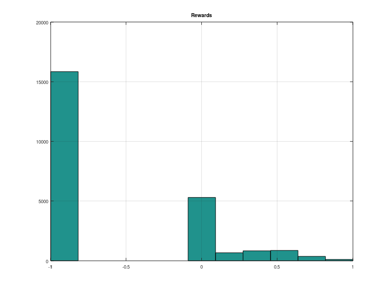
## Delta

| KPI    |             |
|--------|------------:|
| Mean   |    -0.00821 |
| RMS    |       0.399 |
| Min    |          -1 |
| Median |    -0.00495 |
| Max    |           2 |
| Trend  |      Linear |
| From   |     -0.0135 |
| To     |    -0.00291 |

|     -0.864 |     -0.591 |     -0.318 |    -0.0455 |      0.227 |        0.5 |      0.773 |       1.05 |       1.32 |       1.59 |       1.86 |
|-----------:|-----------:|-----------:|-----------:|-----------:|-----------:|-----------:|-----------:|-----------:|-----------:|-----------:|
|       2654 |        165 |        644 |      13097 |       5003 |       1096 |        934 |         91 |        126 |        155 |         35 |

### Delta notes

[Notes]

### Delta chart

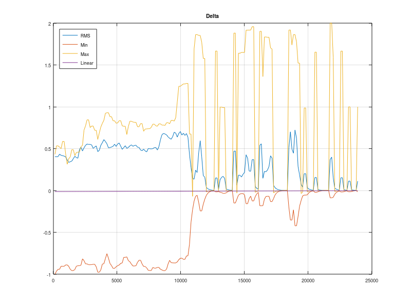

### Delta histogram

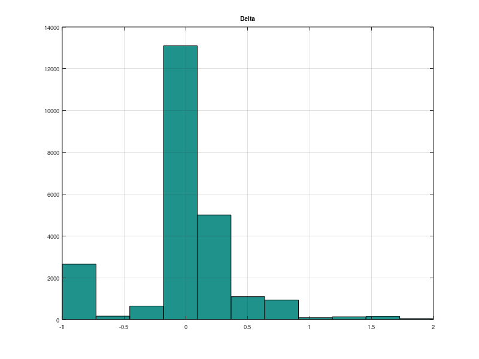
## Discount 0.999 rewards

| KPI    |             |
|--------|------------:|
| Mean   |      -0.591 |
| RMS    |       0.698 |
| Min    |      -0.994 |
| Median |      -0.772 |
| Max    |     -0.0962 |
| Trend  |      Linear |
| From   |     -0.0378 |
| To     |       -1.14 |

|     -0.953 |     -0.871 |      -0.79 |     -0.708 |     -0.627 |     -0.545 |     -0.463 |     -0.382 |       -0.3 |     -0.219 |     -0.137 |
|-----------:|-----------:|-----------:|-----------:|-----------:|-----------:|-----------:|-----------:|-----------:|-----------:|-----------:|
|      10142 |       1564 |        392 |        354 |        388 |        386 |        376 |        435 |        619 |       3314 |       6030 |

### Discount 0.999 rewards notes

[Notes]

### Discount 0.999 rewards chart

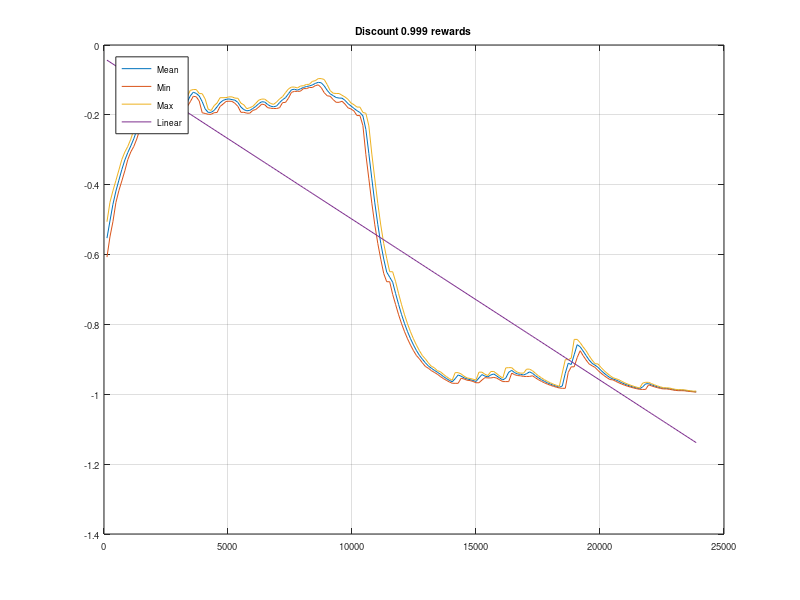

### Discount 0.999 rewards histogram

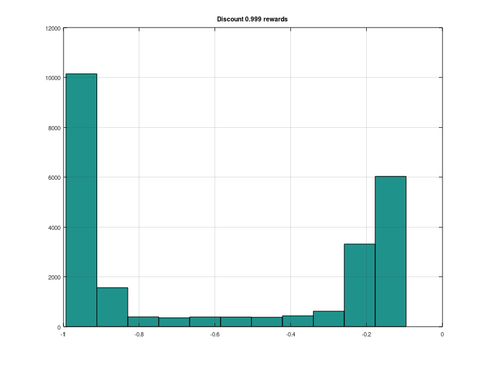
## Halt max prob.

| KPI    |             |
|--------|------------:|
| Mean   |       0.888 |
| RMS    |       0.889 |
| Min    |         0.5 |
| Median |       0.895 |
| Max    |       0.896 |
| Trend  |      Linear |
| From   |       0.873 |
| To     |       0.904 |

|      0.518 |      0.554 |       0.59 |      0.626 |      0.662 |      0.698 |      0.734 |       0.77 |      0.806 |      0.842 |      0.878 |
|-----------:|-----------:|-----------:|-----------:|-----------:|-----------:|-----------:|-----------:|-----------:|-----------:|-----------:|
|         17 |         30 |         17 |         16 |          8 |         37 |         49 |         87 |        162 |        390 |      23187 |

### Halt max prob. notes

[Notes]

### Halt max prob. chart

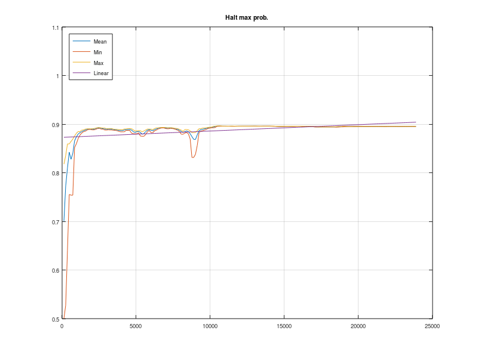

### Halt max prob. histogram

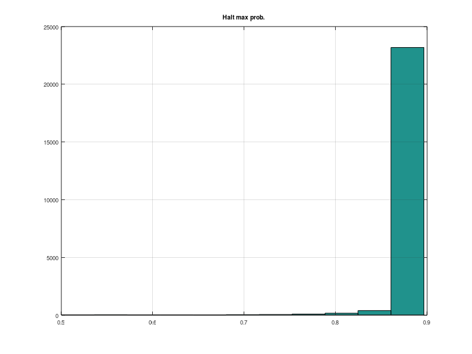
## Direction max prob.

| KPI    |             |
|--------|------------:|
| Mean   |       0.126 |
| RMS    |       0.126 |
| Min    |        0.04 |
| Median |       0.126 |
| Max    |       0.197 |
| Trend  |      Linear |
| From   |        0.13 |
| To     |       0.122 |

|     0.0471 |     0.0614 |     0.0757 |       0.09 |      0.104 |      0.119 |      0.133 |      0.147 |      0.161 |      0.176 |       0.19 |
|-----------:|-----------:|-----------:|-----------:|-----------:|-----------:|-----------:|-----------:|-----------:|-----------:|-----------:|
|          2 |         15 |         13 |          1 |         95 |      13747 |       8352 |       1246 |        260 |        175 |         94 |

### Direction max prob. notes

[Notes]

### Direction max prob. chart

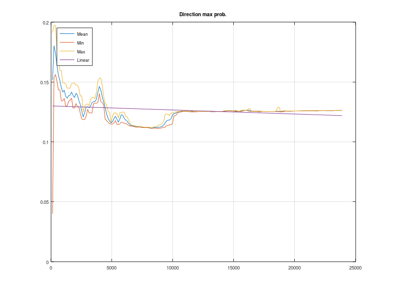

### Direction max prob. histogram

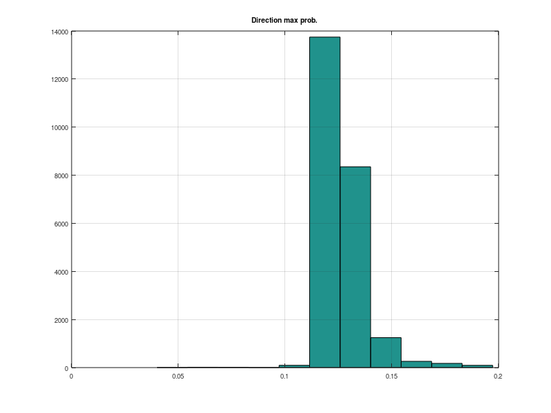
## Speed max prob.

| KPI    |             |
|--------|------------:|
| Mean   |       0.173 |
| RMS    |       0.177 |
| Min    |       0.111 |
| Median |       0.168 |
| Max    |       0.422 |
| Trend  | Exponential |
| From   |       0.221 |
| To     |        0.13 |

|      0.125 |      0.153 |      0.182 |       0.21 |      0.238 |      0.266 |      0.295 |      0.323 |      0.351 |      0.379 |      0.407 |
|-----------:|-----------:|-----------:|-----------:|-----------:|-----------:|-----------:|-----------:|-----------:|-----------:|-----------:|
|          2 |      12053 |       7657 |       2006 |        703 |       1024 |        220 |         55 |        150 |        103 |         27 |

### Speed max prob. notes

[Notes]

### Speed max prob. chart

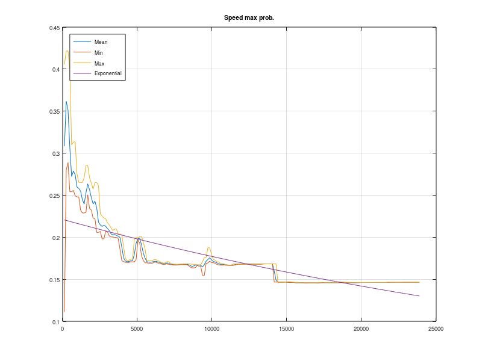

### Speed max prob. histogram

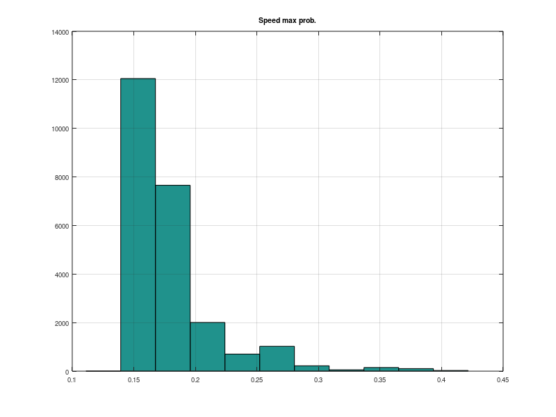
## Sensor direction max prob.

| KPI    |             |
|--------|------------:|
| Mean   |       0.625 |
| RMS    |       0.654 |
| Min    |       0.143 |
| Median |       0.492 |
| Max    |       0.891 |
| Trend  |      Linear |
| From   |       0.852 |
| To     |       0.397 |

|      0.177 |      0.245 |      0.313 |      0.381 |      0.449 |      0.517 |      0.585 |      0.653 |      0.721 |      0.789 |      0.857 |
|-----------:|-----------:|-----------:|-----------:|-----------:|-----------:|-----------:|-----------:|-----------:|-----------:|-----------:|
|         10 |         29 |        136 |        220 |       9318 |       5431 |        177 |        116 |         72 |         83 |       8408 |

### Sensor direction max prob. notes

[Notes]

### Sensor direction max prob. chart

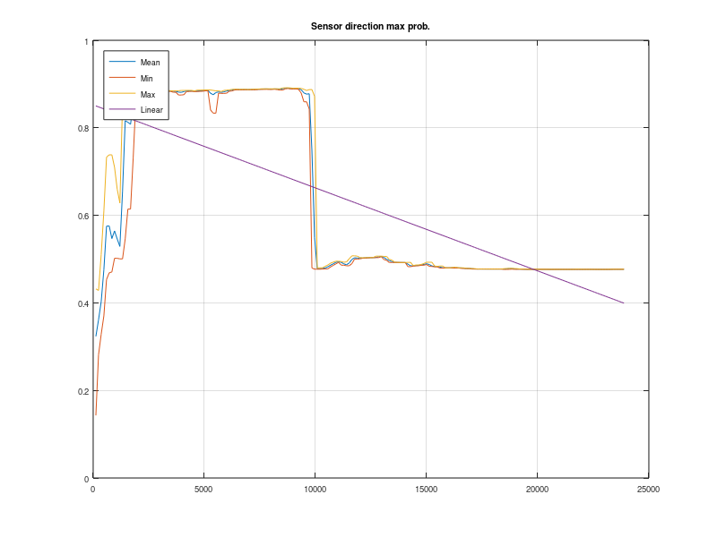

### Sensor direction max prob. histogram

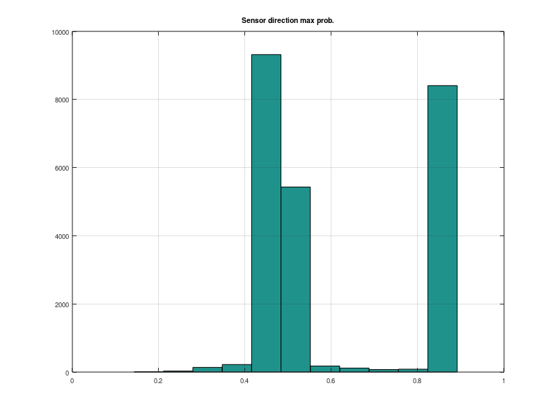
## Delta halt prob.

| KPI    |             |
|--------|------------:|
| Mean   |    0.000247 |
| RMS    |     0.00293 |
| Min    |           0 |
| Median |    4.44e-06 |
| Max    |       0.156 |
| Trend  |      Linear |
| From   |    0.000866 |
| To     |   -0.000373 |

|    0.00709 |     0.0213 |     0.0355 |     0.0497 |     0.0639 |      0.078 |     0.0922 |      0.106 |      0.121 |      0.135 |      0.149 |
|-----------:|-----------:|-----------:|-----------:|-----------:|-----------:|-----------:|-----------:|-----------:|-----------:|-----------:|
|      23941 |         29 |         11 |          5 |          1 |          2 |          5 |          2 |          1 |          0 |          3 |

### Delta halt prob. notes

[Notes]

### Delta halt prob. chart

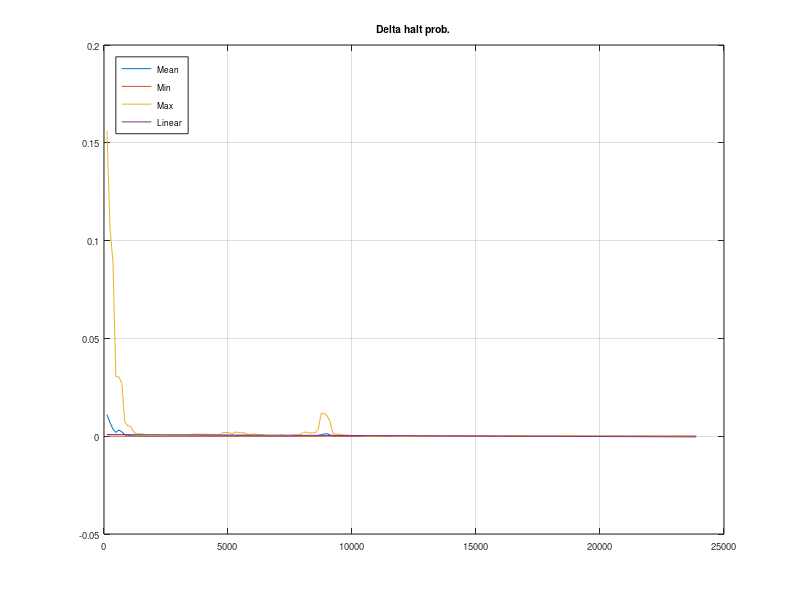

### Delta halt prob. histogram

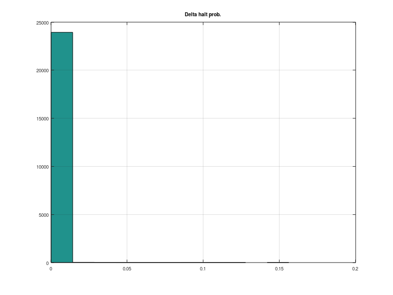
## Delta direction prob.

| KPI    |             |
|--------|------------:|
| Mean   |     0.00071 |
| RMS    |     0.00278 |
| Min    |           0 |
| Median |    2.99e-05 |
| Max    |      0.0818 |
| Trend  |      Linear |
| From   |     0.00222 |
| To     |   -0.000802 |

|    0.00372 |     0.0112 |     0.0186 |      0.026 |     0.0335 |     0.0409 |     0.0483 |     0.0558 |     0.0632 |     0.0706 |     0.0781 |
|-----------:|-----------:|-----------:|-----------:|-----------:|-----------:|-----------:|-----------:|-----------:|-----------:|-----------:|
|      23583 |        241 |         80 |         58 |         18 |          9 |          6 |          3 |          0 |          1 |          1 |

### Delta direction prob. notes

[Notes]

### Delta direction prob. chart

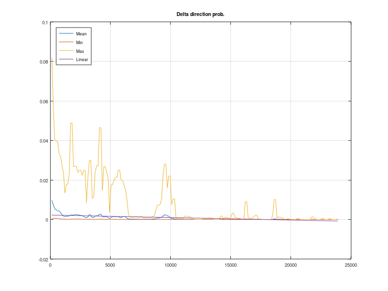

### Delta direction prob. histogram

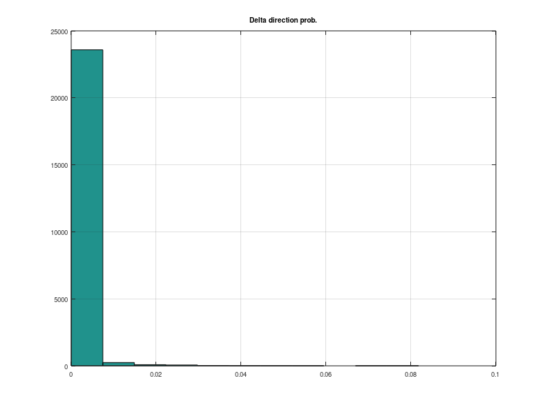
## Delta speed prob.

| KPI    |             |
|--------|------------:|
| Mean   |    0.000856 |
| RMS    |     0.00375 |
| Min    |           0 |
| Median |    2.99e-05 |
| Max    |       0.126 |
| Trend  |      Linear |
| From   |     0.00279 |
| To     |    -0.00108 |

|    0.00571 |     0.0171 |     0.0286 |       0.04 |     0.0514 |     0.0628 |     0.0743 |     0.0857 |     0.0971 |      0.109 |       0.12 |
|-----------:|-----------:|-----------:|-----------:|-----------:|-----------:|-----------:|-----------:|-----------:|-----------:|-----------:|
|      23699 |        181 |         65 |         25 |         11 |          8 |          6 |          1 |          2 |          1 |          1 |

### Delta speed prob. notes

[Notes]

### Delta speed prob. chart

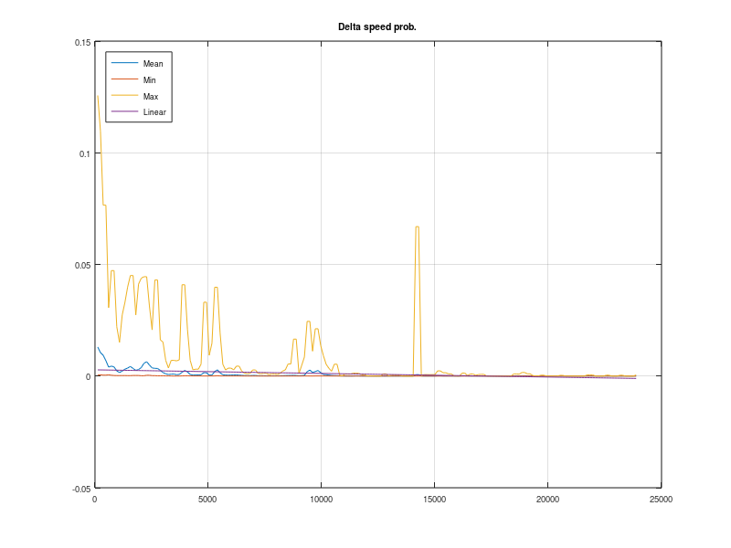

### Delta speed prob. histogram

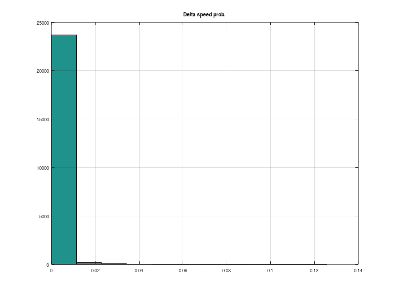
## Delta sensor direction prob.

| KPI    |             |
|--------|------------:|
| Mean   |    0.000679 |
| RMS    |     0.00469 |
| Min    |           0 |
| Median |    1.74e-05 |
| Max    |       0.224 |
| Trend  |      Linear |
| From   |     0.00237 |
| To     |    -0.00101 |

|     0.0102 |     0.0305 |     0.0508 |     0.0711 |     0.0914 |      0.112 |      0.132 |      0.152 |      0.173 |      0.193 |      0.213 |
|-----------:|-----------:|-----------:|-----------:|-----------:|-----------:|-----------:|-----------:|-----------:|-----------:|-----------:|
|      23828 |         86 |         54 |         20 |          7 |          3 |          0 |          1 |          0 |          0 |          1 |

### Delta sensor direction prob. notes

[Notes]

### Delta sensor direction prob. chart

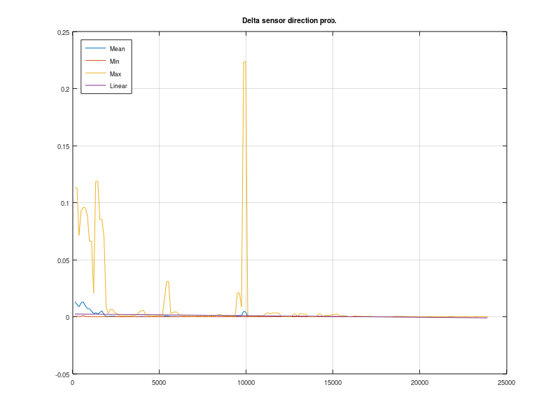

### Delta sensor direction prob. histogram

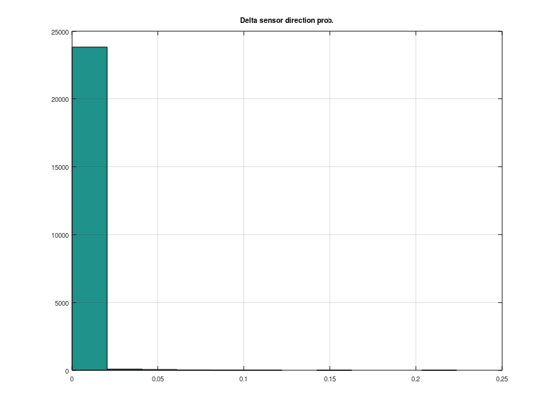
## Advantage residual estimation (critic)

| KPI    |             |
|--------|------------:|
| Mean   |      -0.994 |
| RMS    |       0.995 |
| Min    |      -0.998 |
| Median |      -0.998 |
| Max    |    2.09e-07 |
| Trend  |      Linear |
| From   |      -0.986 |
| To     |          -1 |

|     -0.953 |     -0.862 |     -0.772 |     -0.681 |      -0.59 |     -0.499 |     -0.408 |     -0.318 |     -0.227 |     -0.136 |    -0.0454 |
|-----------:|-----------:|-----------:|-----------:|-----------:|-----------:|-----------:|-----------:|-----------:|-----------:|-----------:|
|      23968 |         13 |          0 |          1 |          0 |          1 |          7 |          1 |          7 |          0 |          2 |

### Advantage residual estimation (critic) notes

[Notes]

### Advantage residual estimation (critic) chart

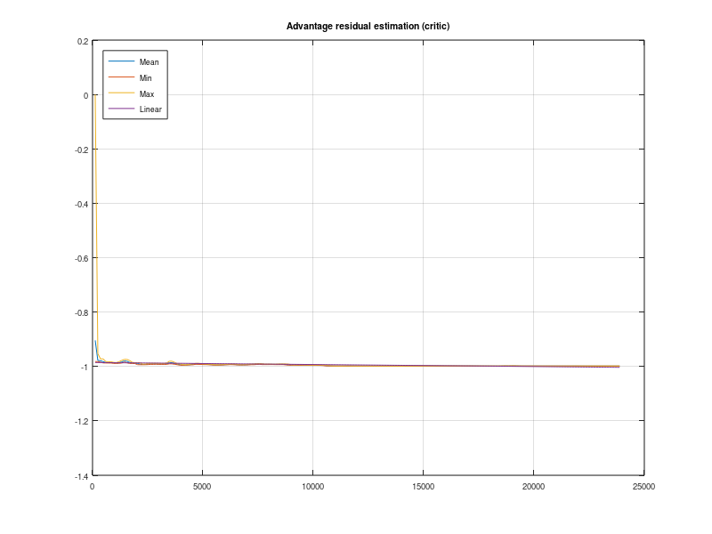

### Advantage residual estimation (critic) histogram

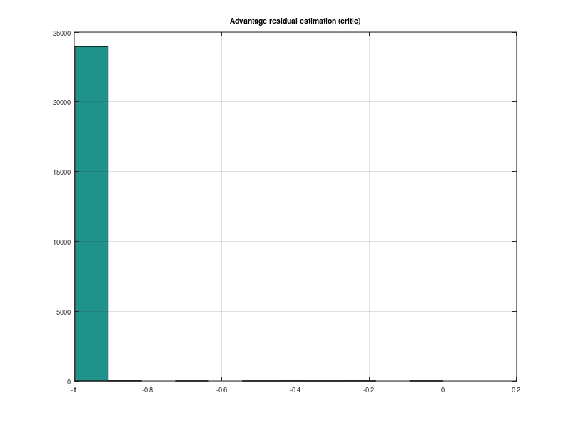
## Halt gradient

| KPI    |             |
|--------|------------:|
| Mean   |        2.02 |
| RMS    |        3.24 |
| Min    |        1.12 |
| Median |        1.12 |
| Max    |        9.65 |
| Trend  |      Linear |
| From   |        2.01 |
| To     |        2.03 |

|        1.5 |       2.28 |       3.05 |       3.83 |       4.61 |       5.38 |       6.16 |       6.93 |       7.71 |       8.48 |       9.26 |
|-----------:|-----------:|-----------:|-----------:|-----------:|-----------:|-----------:|-----------:|-----------:|-----------:|-----------:|
|      21259 |         37 |         18 |         20 |         20 |         24 |         29 |         49 |         61 |        334 |       2149 |

### Halt gradient notes

[Notes]

### Halt gradient chart

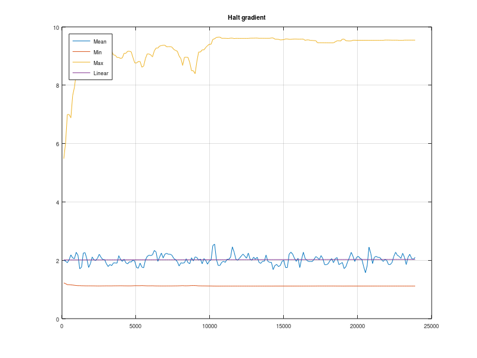

### Halt gradient histogram

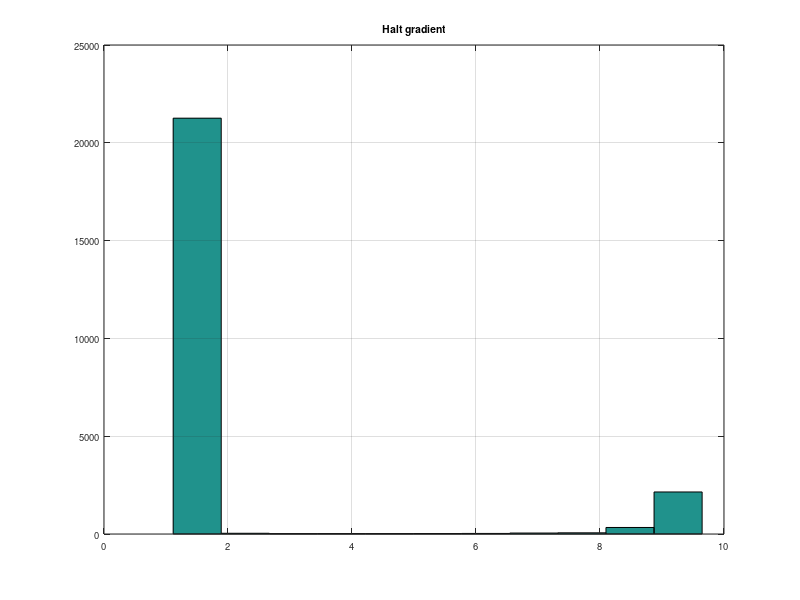
## Direction gradient

| KPI    |             |
|--------|------------:|
| Mean   |        25.9 |
| RMS    |         144 |
| Min    |        5.09 |
| Median |        8.07 |
| Max    |    1.61e+03 |
| Trend  |      Linear |
| From   |        26.9 |
| To     |        24.9 |

|         78 |        224 |        370 |        515 |        661 |        807 |        953 |    1.1e+03 |   1.24e+03 |   1.39e+03 |   1.54e+03 |
|-----------:|-----------:|-----------:|-----------:|-----------:|-----------:|-----------:|-----------:|-----------:|-----------:|-----------:|
|      23598 |         29 |         20 |         20 |         27 |         31 |         32 |         32 |         82 |        102 |         27 |

### Direction gradient notes

[Notes]

### Direction gradient chart

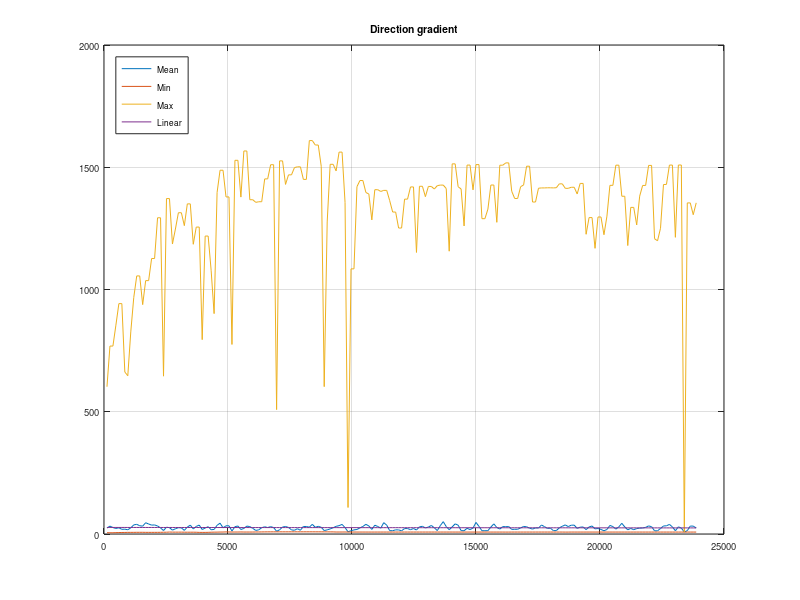

### Direction gradient histogram

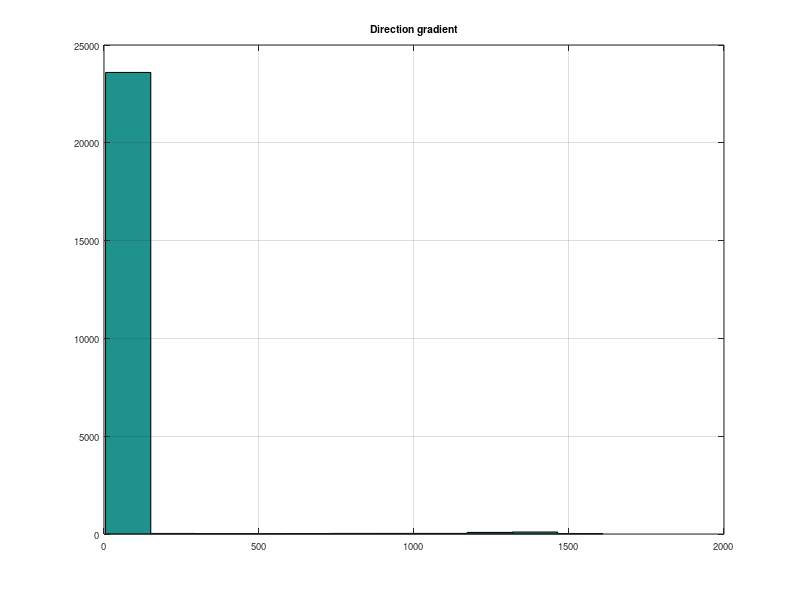
## Speed gradient

| KPI    |             |
|--------|------------:|
| Mean   |        8.87 |
| RMS    |        29.5 |
| Min    |        2.38 |
| Median |         6.2 |
| Max    |         447 |
| Trend  |      Linear |
| From   |        9.03 |
| To     |        8.72 |

|       22.6 |         63 |        103 |        144 |        184 |        225 |        265 |        306 |        346 |        386 |        427 |
|-----------:|-----------:|-----------:|-----------:|-----------:|-----------:|-----------:|-----------:|-----------:|-----------:|-----------:|
|      23729 |         51 |         30 |         24 |         21 |         20 |         19 |         22 |         13 |         34 |         37 |

### Speed gradient notes

[Notes]

### Speed gradient chart

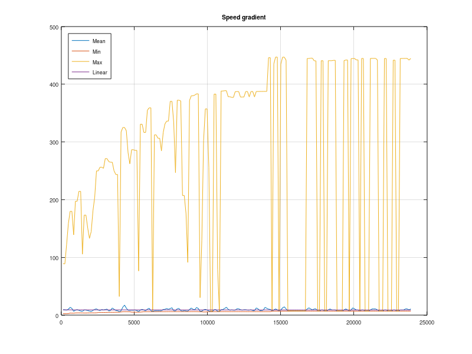

### Speed gradient histogram

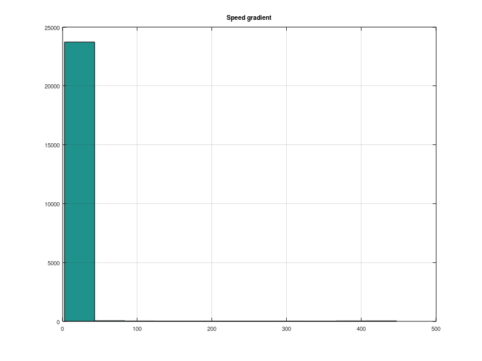
## Sensor direction gradient

| KPI    |             |
|--------|------------:|
| Mean   |           7 |
| RMS    |          21 |
| Min    |        1.12 |
| Median |         2.1 |
| Max    |         109 |
| Trend  |      Linear |
| From   |        6.95 |
| To     |        7.06 |

|          6 |       15.8 |       25.5 |       35.3 |       45.1 |       54.8 |       64.6 |       74.3 |       84.1 |       93.9 |        104 |
|-----------:|-----------:|-----------:|-----------:|-----------:|-----------:|-----------:|-----------:|-----------:|-----------:|-----------:|
|      22203 |         45 |         33 |         57 |        184 |        734 |         23 |          7 |         13 |         20 |        681 |

### Sensor direction gradient notes

[Notes]

### Sensor direction gradient chart

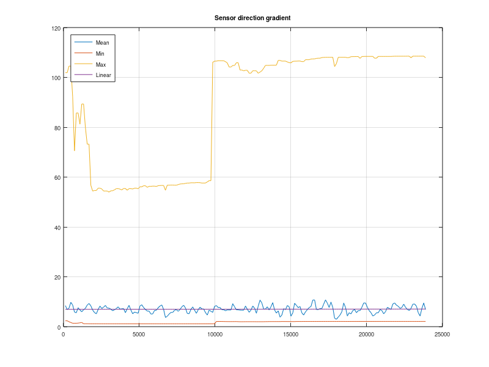

### Sensor direction gradient histogram

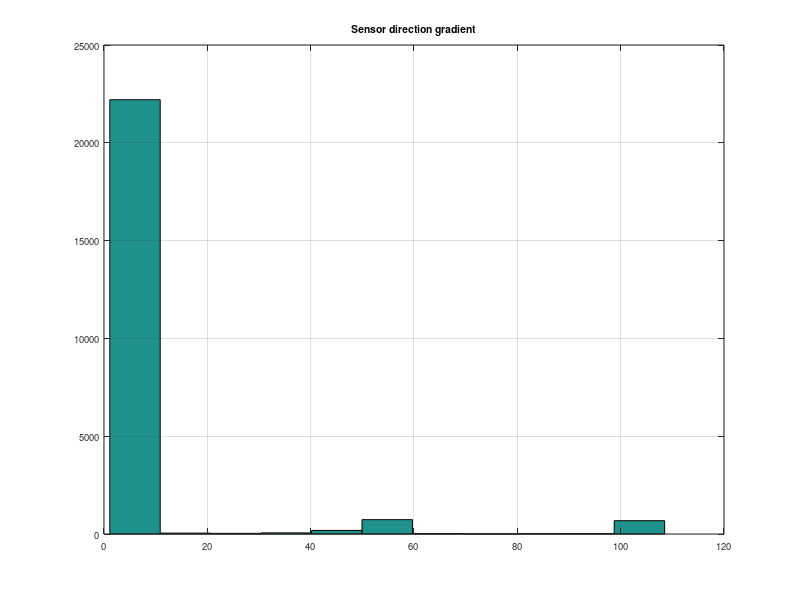
