# Report

30 October 2022, 21:32

[TOC]

Data folder: `C:\Users\marco\Desktop\wheellyj\data\agent-30e-3\`

## Rewards

| KPI    |             |
|--------|------------:|
| Mean   |      -0.327 |
| RMS    |       0.686 |
| Min    |          -1 |
| Median |           0 |
| Max    |           1 |
| Trend  |      Linear |
| From   |      -0.195 |
| To     |       -0.46 |

|     -0.909 |     -0.727 |     -0.545 |     -0.364 |     -0.182 |          0 |      0.182 |      0.364 |      0.545 |      0.727 |      0.909 |
|-----------:|-----------:|-----------:|-----------:|-----------:|-----------:|-----------:|-----------:|-----------:|-----------:|-----------:|
|       9950 |          0 |          0 |          0 |          0 |       9679 |        925 |       1873 |        187 |        621 |        765 |

### Rewards notes

[Notes]

### Rewards chart

### Rewards histogram

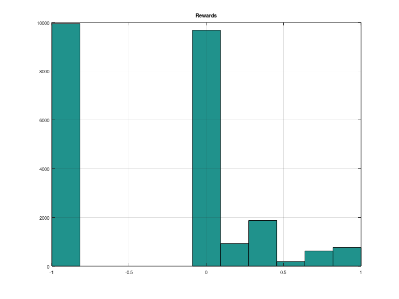
## Delta

| KPI    |             |
|--------|------------:|
| Mean   |    -0.00287 |
| RMS    |       0.582 |
| Min    |       -1.08 |
| Median |       0.144 |
| Max    |        1.78 |
| Trend  |      Linear |
| From   |     -0.0105 |
| To     |     0.00475 |

|     -0.946 |     -0.687 |     -0.427 |     -0.168 |     0.0912 |       0.35 |       0.61 |      0.869 |       1.13 |       1.39 |       1.65 |
|-----------:|-----------:|-----------:|-----------:|-----------:|-----------:|-----------:|-----------:|-----------:|-----------:|-----------:|
|       1089 |       5804 |       2632 |        459 |       3320 |       6626 |       2215 |        607 |        755 |        388 |        105 |

### Delta notes

[Notes]

### Delta chart

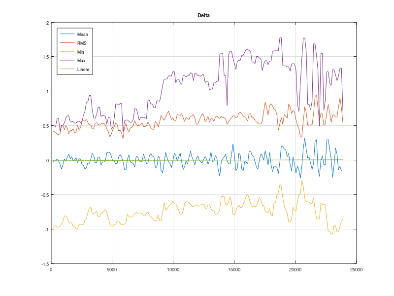

### Delta histogram

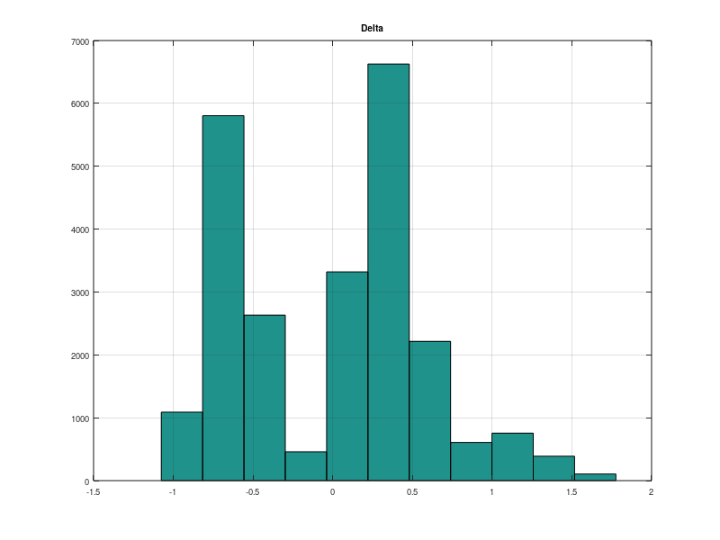
## Discount 0.999 rewards

| KPI    |             |
|--------|------------:|
| Mean   |       -0.33 |
| RMS    |       0.349 |
| Min    |      -0.578 |
| Median |      -0.359 |
| Max    |      -0.119 |
| Trend  |      Linear |
| From   |      -0.188 |
| To     |      -0.472 |

|     -0.557 |     -0.516 |     -0.474 |     -0.432 |      -0.39 |     -0.349 |     -0.307 |     -0.265 |     -0.223 |     -0.182 |      -0.14 |
|-----------:|-----------:|-----------:|-----------:|-----------:|-----------:|-----------:|-----------:|-----------:|-----------:|-----------:|
|        486 |        941 |       1398 |       4226 |       4189 |       1740 |        926 |       2604 |       3705 |       2479 |       1306 |

### Discount 0.999 rewards notes

[Notes]

### Discount 0.999 rewards chart

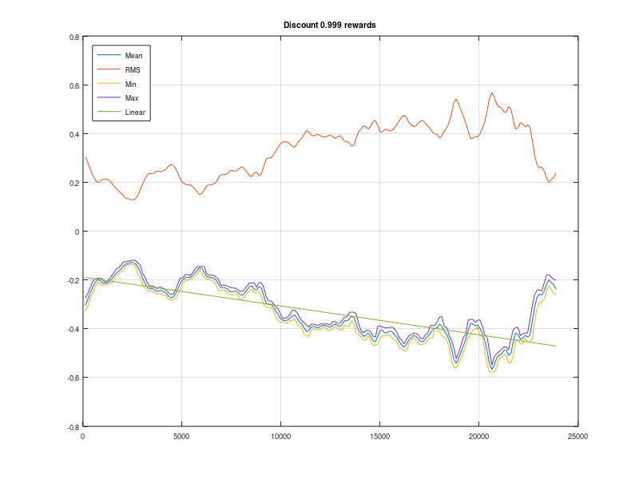

### Discount 0.999 rewards histogram

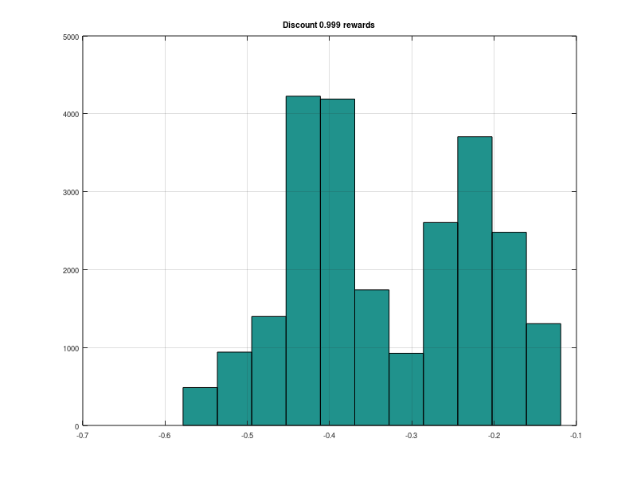
## Halt max prob.

| KPI    |             |
|--------|------------:|
| Mean   |       0.815 |
| RMS    |       0.819 |
| Min    |         0.5 |
| Median |       0.847 |
| Max    |        0.88 |
| Trend  |      Linear |
| From   |       0.712 |
| To     |       0.918 |

|      0.517 |      0.552 |      0.586 |      0.621 |      0.655 |       0.69 |      0.724 |      0.759 |      0.793 |      0.828 |      0.862 |
|-----------:|-----------:|-----------:|-----------:|-----------:|-----------:|-----------:|-----------:|-----------:|-----------:|-----------:|
|        141 |        177 |        288 |        667 |        598 |        566 |        888 |       2339 |       2519 |       3636 |      12181 |

### Halt max prob. notes

[Notes]

### Halt max prob. chart

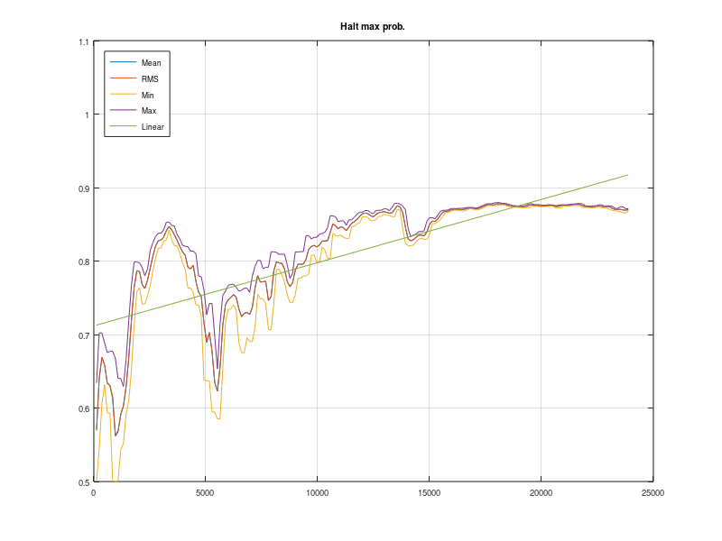

### Halt max prob. histogram

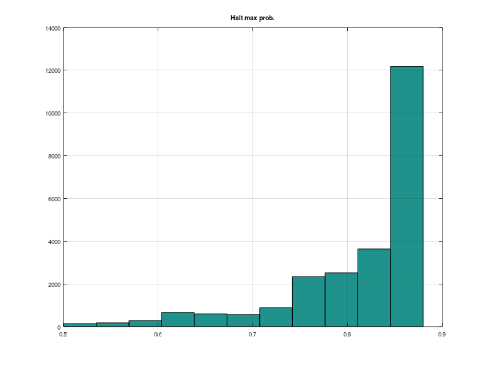
## Direction max prob.

| KPI    |             |
|--------|------------:|
| Mean   |       0.193 |
| RMS    |       0.196 |
| Min    |        0.04 |
| Median |         0.2 |
| Max    |       0.271 |
| Trend  |      Linear |
| From   |       0.211 |
| To     |       0.176 |

|     0.0505 |     0.0715 |     0.0924 |      0.113 |      0.134 |      0.155 |      0.176 |      0.197 |      0.218 |      0.239 |       0.26 |
|-----------:|-----------:|-----------:|-----------:|-----------:|-----------:|-----------:|-----------:|-----------:|-----------:|-----------:|
|        140 |        286 |        296 |        166 |        145 |       3376 |       3333 |       7891 |       6081 |       1681 |        605 |

### Direction max prob. notes

[Notes]

### Direction max prob. chart

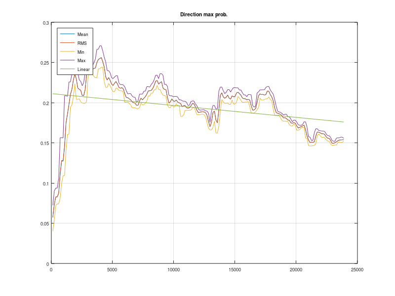

### Direction max prob. histogram

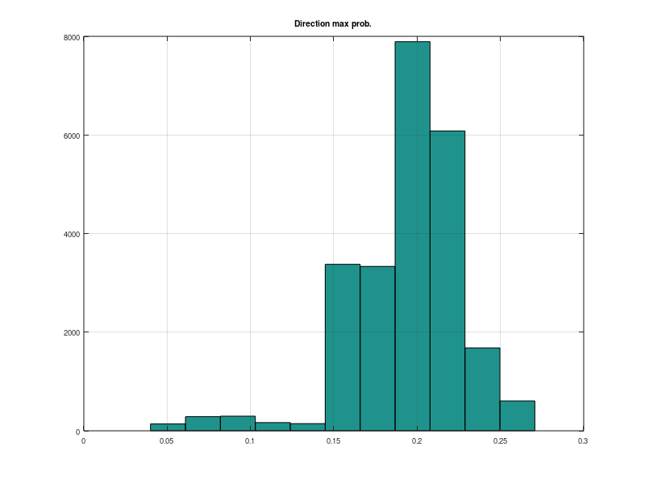
## Speed max prob.

| KPI    |             |
|--------|------------:|
| Mean   |       0.406 |
| RMS    |       0.414 |
| Min    |       0.111 |
| Median |       0.404 |
| Max    |       0.604 |
| Trend  |      Linear |
| From   |       0.419 |
| To     |       0.393 |

|      0.133 |      0.178 |      0.223 |      0.268 |      0.313 |      0.357 |      0.402 |      0.447 |      0.492 |      0.536 |      0.581 |
|-----------:|-----------:|-----------:|-----------:|-----------:|-----------:|-----------:|-----------:|-----------:|-----------:|-----------:|
|         90 |        335 |        208 |        460 |       3437 |       4588 |       5090 |       4728 |       2677 |       1826 |        561 |

### Speed max prob. notes

[Notes]

### Speed max prob. chart

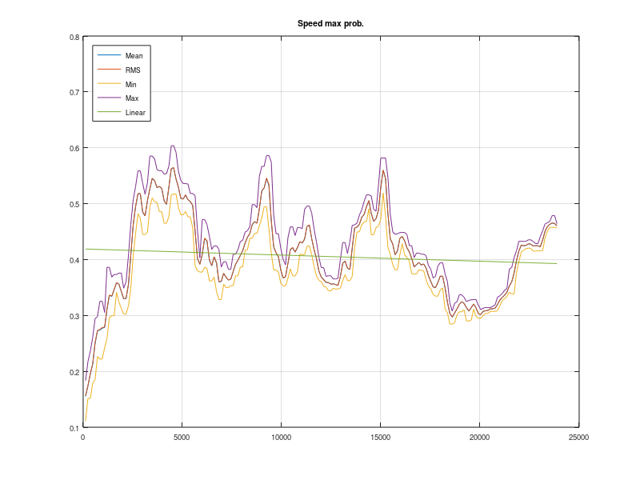

### Speed max prob. histogram

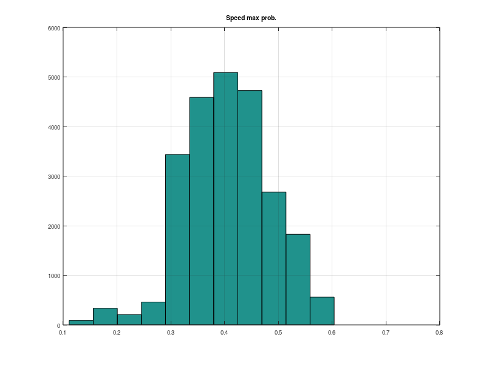
## Sensor direction max prob.

| KPI    |             |
|--------|------------:|
| Mean   |       0.493 |
| RMS    |       0.511 |
| Min    |       0.143 |
| Median |        0.47 |
| Max    |       0.856 |
| Trend  | Exponential |
| From   |       0.362 |
| To     |       0.624 |

|      0.175 |       0.24 |      0.305 |       0.37 |      0.435 |        0.5 |      0.564 |      0.629 |      0.694 |      0.759 |      0.824 |
|-----------:|-----------:|-----------:|-----------:|-----------:|-----------:|-----------:|-----------:|-----------:|-----------:|-----------:|
|        261 |        161 |       1287 |       4080 |       5974 |       5206 |       2587 |       1746 |        605 |        574 |       1519 |

### Sensor direction max prob. notes

[Notes]

### Sensor direction max prob. chart

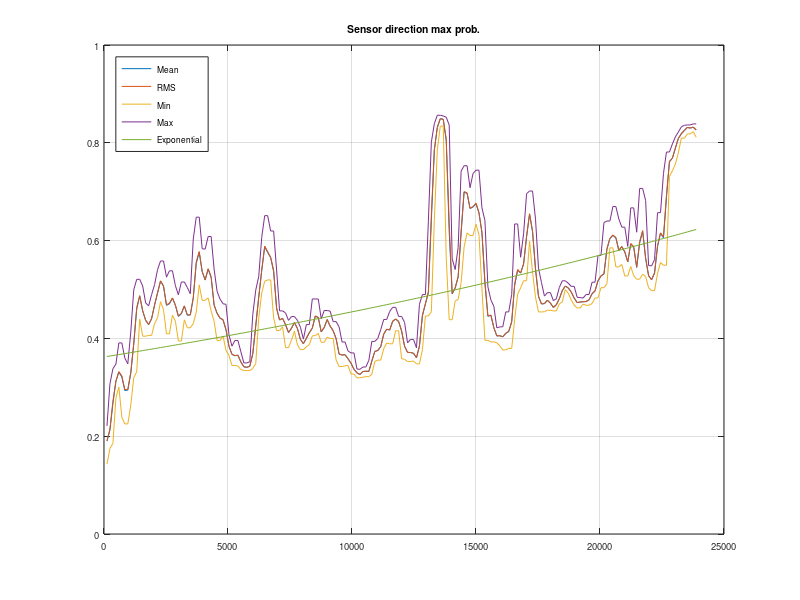

### Sensor direction max prob. histogram

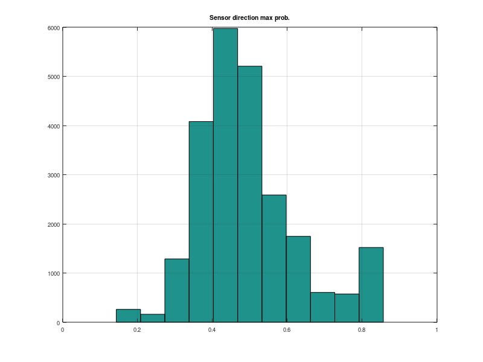
## Delta halt prob.

| KPI    |             |
|--------|------------:|
| Mean   |    0.000794 |
| RMS    |     0.00172 |
| Min    |           0 |
| Median |    0.000241 |
| Max    |      0.0204 |
| Trend  |      Linear |
| From   |     0.00193 |
| To     |   -0.000342 |

|   0.000927 |    0.00278 |    0.00464 |    0.00649 |    0.00834 |     0.0102 |     0.0121 |     0.0139 |     0.0158 |     0.0176 |     0.0195 |
|-----------:|-----------:|-----------:|-----------:|-----------:|-----------:|-----------:|-----------:|-----------:|-----------:|-----------:|
|      21241 |       1715 |        541 |        221 |        125 |         77 |         37 |         23 |         12 |          5 |          3 |

### Delta halt prob. notes

[Notes]

### Delta halt prob. chart

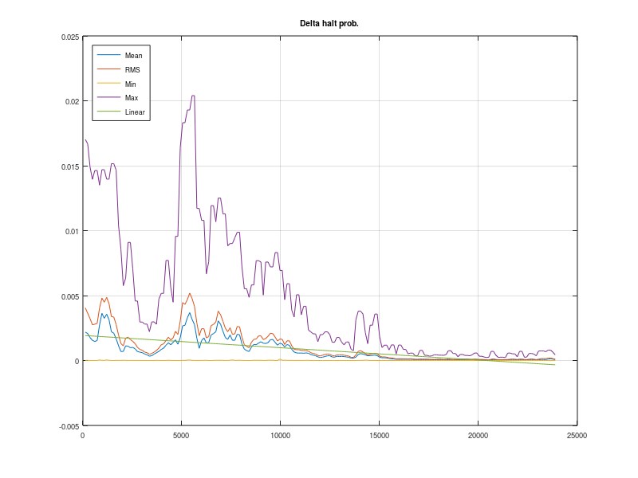

### Delta halt prob. histogram

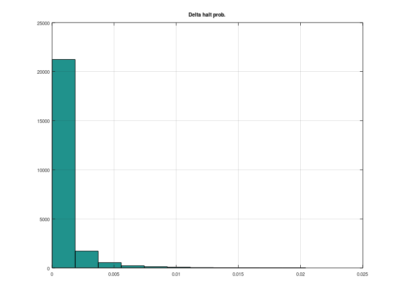
## Delta direction prob.

| KPI    |             |
|--------|------------:|
| Mean   |     0.00173 |
| RMS    |     0.00249 |
| Min    |     6.5e-07 |
| Median |     0.00112 |
| Max    |      0.0218 |
| Trend  |      Linear |
| From   |     0.00265 |
| To     |    0.000814 |

|   0.000989 |    0.00297 |    0.00494 |    0.00692 |     0.0089 |     0.0109 |     0.0129 |     0.0148 |     0.0168 |     0.0188 |     0.0208 |
|-----------:|-----------:|-----------:|-----------:|-----------:|-----------:|-----------:|-----------:|-----------:|-----------:|-----------:|
|      17506 |       4274 |       1183 |        614 |        302 |         79 |         27 |         11 |          3 |          0 |          1 |

### Delta direction prob. notes

[Notes]

### Delta direction prob. chart

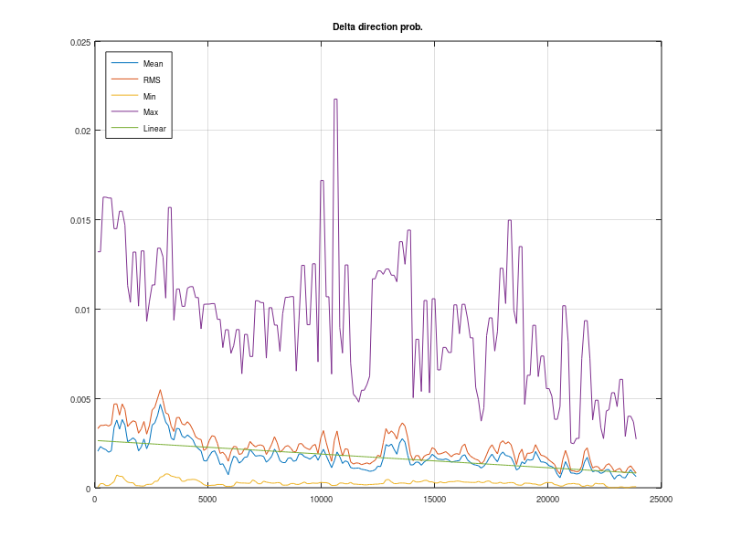

### Delta direction prob. histogram

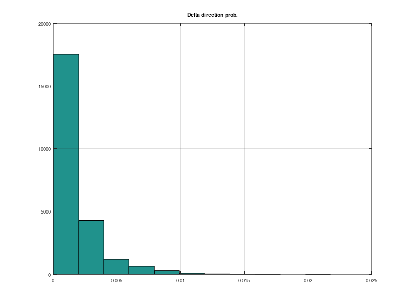
## Delta speed prob.

| KPI    |             |
|--------|------------:|
| Mean   |     0.00269 |
| RMS    |     0.00386 |
| Min    |     3.9e-07 |
| Median |     0.00178 |
| Max    |      0.0317 |
| Trend  |      Linear |
| From   |     0.00422 |
| To     |     0.00115 |

|    0.00144 |    0.00432 |    0.00721 |     0.0101 |      0.013 |     0.0159 |     0.0187 |     0.0216 |     0.0245 |     0.0274 |     0.0303 |
|-----------:|-----------:|-----------:|-----------:|-----------:|-----------:|-----------:|-----------:|-----------:|-----------:|-----------:|
|      16429 |       5053 |       1458 |        603 |        265 |        112 |         47 |         16 |         16 |          0 |          1 |

### Delta speed prob. notes

[Notes]

### Delta speed prob. chart

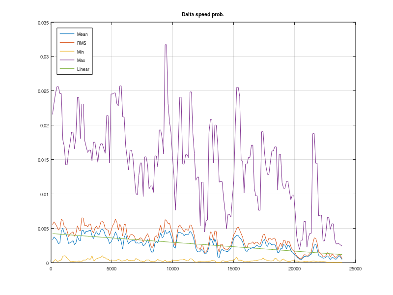

### Delta speed prob. histogram

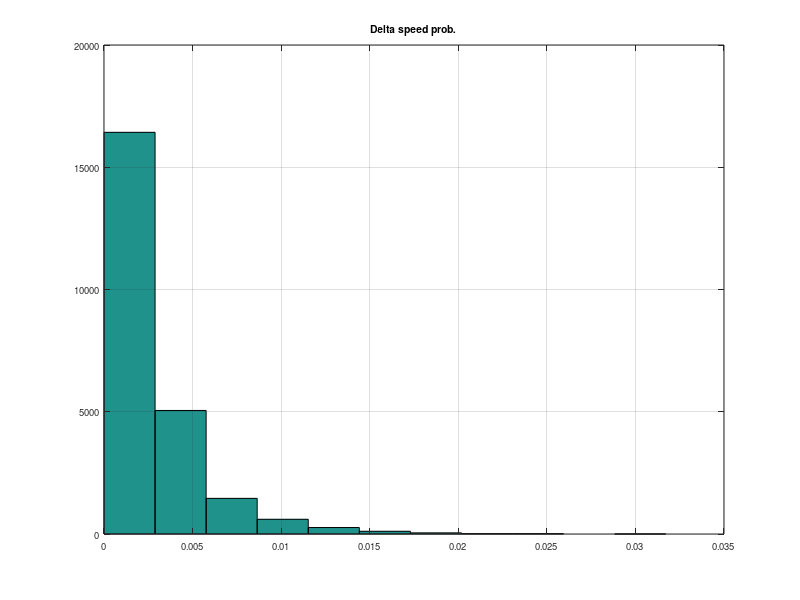
## Delta sensor direction prob.

| KPI    |             |
|--------|------------:|
| Mean   |      0.0021 |
| RMS    |     0.00323 |
| Min    |    7.32e-07 |
| Median |     0.00134 |
| Max    |      0.0367 |
| Trend  |      Linear |
| From   |     0.00294 |
| To     |     0.00127 |

|    0.00167 |    0.00501 |    0.00835 |     0.0117 |      0.015 |     0.0184 |     0.0217 |      0.025 |     0.0284 |     0.0317 |     0.0351 |
|-----------:|-----------:|-----------:|-----------:|-----------:|-----------:|-----------:|-----------:|-----------:|-----------:|-----------:|
|      19759 |       2978 |        808 |        284 |        102 |         42 |         17 |          5 |          3 |          1 |          1 |

### Delta sensor direction prob. notes

[Notes]

### Delta sensor direction prob. chart

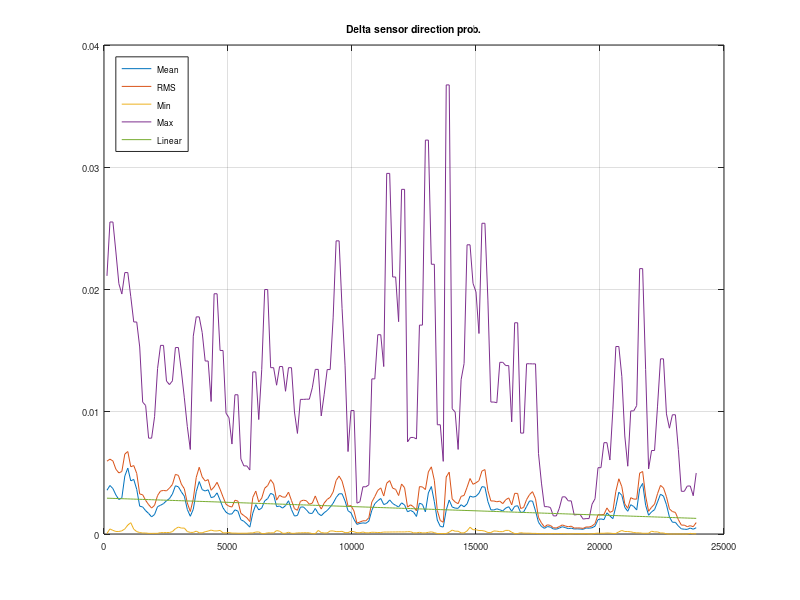

### Delta sensor direction prob. histogram

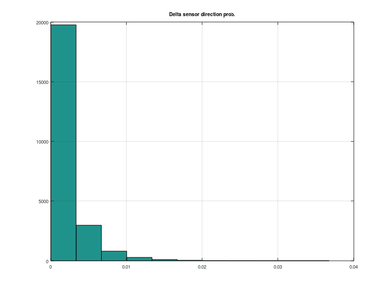
## Advantage residual estimation (critic)

| KPI    |             |
|--------|------------:|
| Mean   |      -0.926 |
| RMS    |        0.93 |
| Min    |      -0.981 |
| Median |      -0.956 |
| Max    |    2.09e-07 |
| Trend  |      Linear |
| From   |      -0.841 |
| To     |       -1.01 |

|     -0.937 |     -0.847 |     -0.758 |     -0.669 |      -0.58 |     -0.491 |     -0.401 |     -0.312 |     -0.223 |     -0.134 |    -0.0446 |
|-----------:|-----------:|-----------:|-----------:|-----------:|-----------:|-----------:|-----------:|-----------:|-----------:|-----------:|
|      20431 |       2151 |        558 |        269 |        342 |        132 |         71 |         27 |          3 |          4 |         12 |

### Advantage residual estimation (critic) notes

[Notes]

### Advantage residual estimation (critic) chart

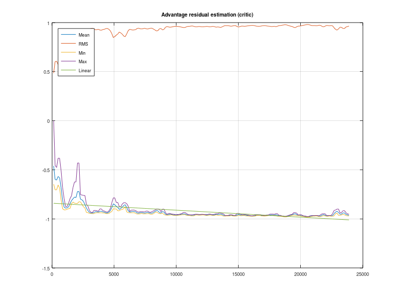

### Advantage residual estimation (critic) histogram

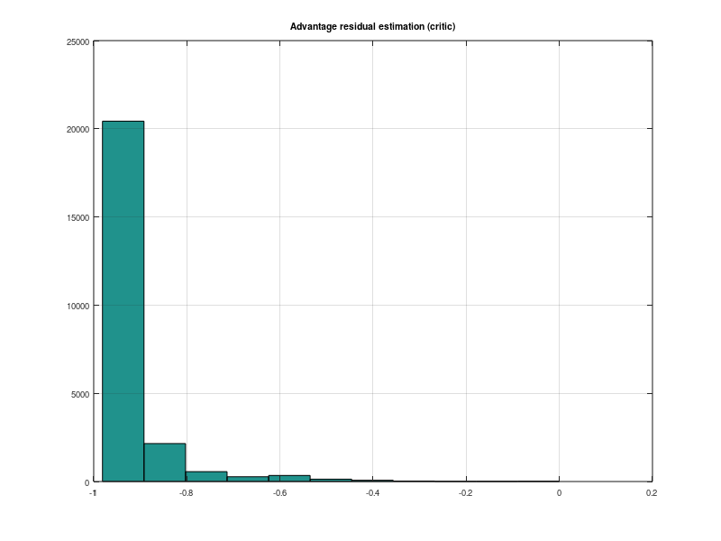
## Halt gradient

| KPI    |             |
|--------|------------:|
| Mean   |        2.01 |
| RMS    |        2.73 |
| Min    |        1.14 |
| Median |         1.2 |
| Max    |        8.27 |
| Trend  |      Linear |
| From   |        2.01 |
| To     |        2.01 |

|       1.46 |       2.11 |       2.76 |       3.41 |       4.06 |        4.7 |       5.35 |          6 |       6.65 |        7.3 |       7.95 |
|-----------:|-----------:|-----------:|-----------:|-----------:|-----------:|-----------:|-----------:|-----------:|-----------:|-----------:|
|      19373 |        360 |        545 |        341 |        573 |        437 |        309 |        391 |        258 |        339 |       1074 |

### Halt gradient notes

[Notes]

### Halt gradient chart

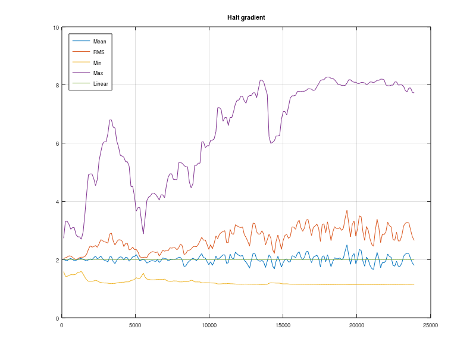

### Halt gradient histogram

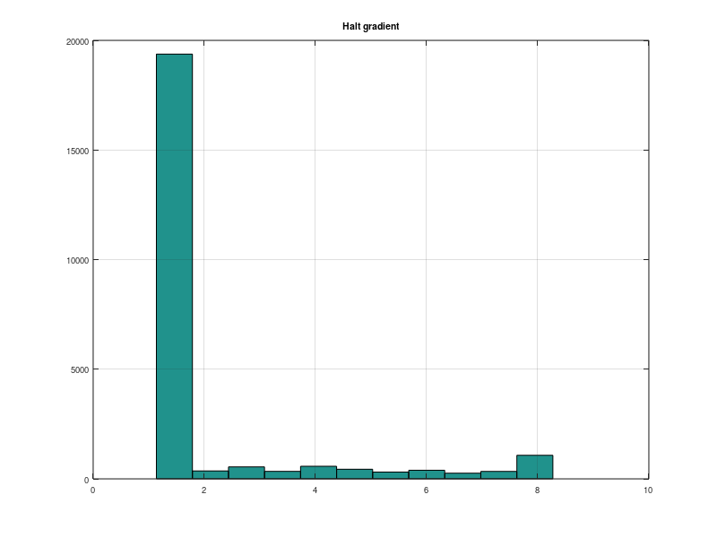
## Direction gradient

| KPI    |             |
|--------|------------:|
| Mean   |        25.1 |
| RMS    |        64.1 |
| Min    |        3.69 |
| Median |        6.66 |
| Max    |         777 |
| Trend  |      Linear |
| From   |          25 |
| To     |        25.3 |

|       38.9 |        109 |        180 |        250 |        320 |        391 |        461 |        531 |        602 |        672 |        742 |
|-----------:|-----------:|-----------:|-----------:|-----------:|-----------:|-----------:|-----------:|-----------:|-----------:|-----------:|
|      22028 |        958 |        450 |        230 |        161 |         73 |         48 |         35 |         11 |          4 |          2 |

### Direction gradient notes

[Notes]

### Direction gradient chart

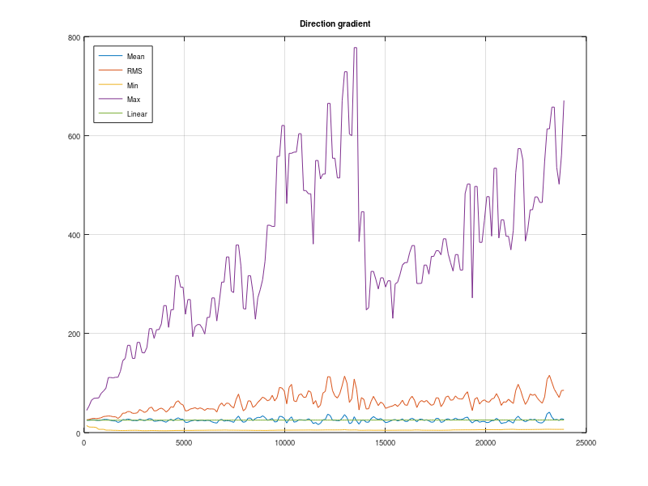

### Direction gradient histogram

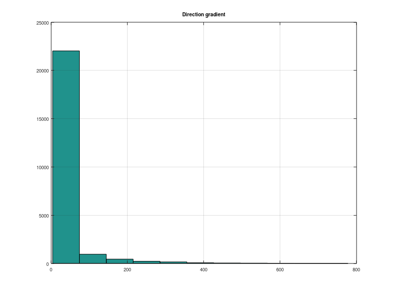
## Speed gradient

| KPI    |             |
|--------|------------:|
| Mean   |        9.01 |
| RMS    |        19.3 |
| Min    |        1.66 |
| Median |        3.16 |
| Max    |         149 |
| Trend  |      Linear |
| From   |        9.24 |
| To     |        8.79 |

|       8.37 |       21.8 |       35.2 |       48.6 |       62.1 |       75.5 |       88.9 |        102 |        116 |        129 |        143 |
|-----------:|-----------:|-----------:|-----------:|-----------:|-----------:|-----------:|-----------:|-----------:|-----------:|-----------:|
|      21043 |       1066 |        498 |        435 |        366 |        273 |        120 |         90 |         73 |         21 |         15 |

### Speed gradient notes

[Notes]

### Speed gradient chart

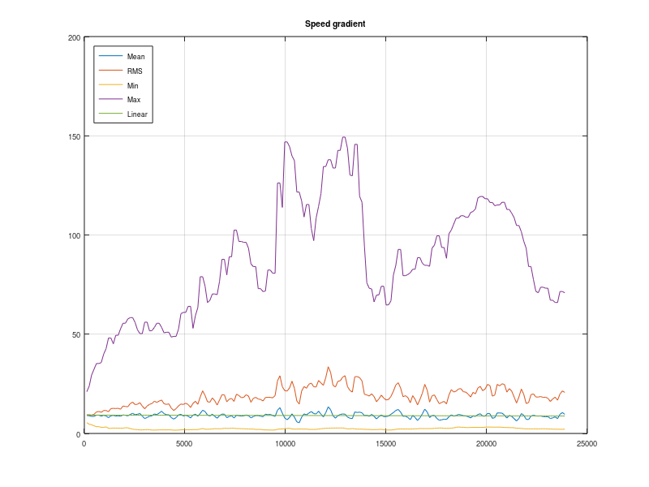

### Speed gradient histogram

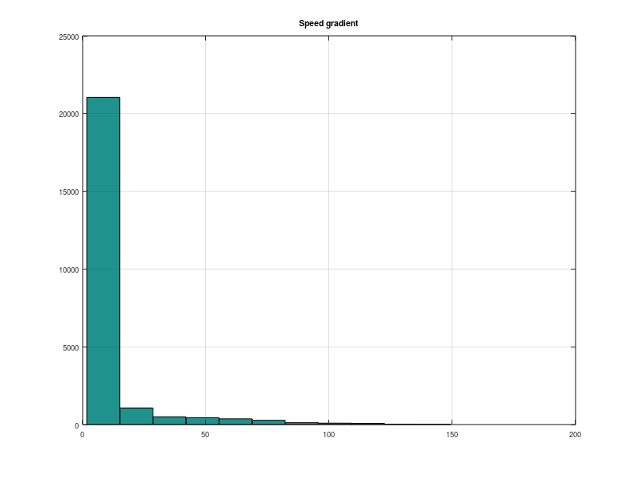
## Sensor direction gradient

| KPI    |             |
|--------|------------:|
| Mean   |        6.86 |
| RMS    |        15.3 |
| Min    |        1.17 |
| Median |        2.52 |
| Max    |         117 |
| Trend  |      Linear |
| From   |        6.66 |
| To     |        7.07 |

|       6.44 |         17 |       27.5 |       38.1 |       48.6 |       59.2 |       69.7 |       80.3 |       90.8 |        101 |        112 |
|-----------:|-----------:|-----------:|-----------:|-----------:|-----------:|-----------:|-----------:|-----------:|-----------:|-----------:|
|      21435 |        726 |        298 |        382 |        465 |        335 |        189 |        117 |         33 |         15 |          5 |

### Sensor direction gradient notes

[Notes]

### Sensor direction gradient chart

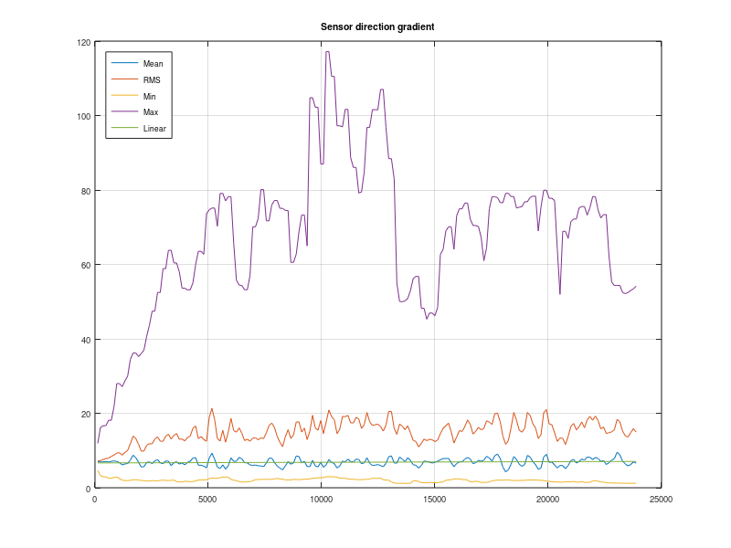

### Sensor direction gradient histogram

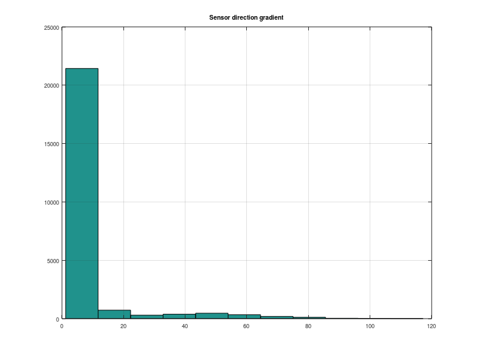
