# Report

30 October 2022, 22:29

[TOC]

Data folder: `C:\Users\marco\Desktop\wheellyj\data\agent-3e-3\`

## Rewards

| KPI    |             |
|--------|------------:|
| Mean   |      -0.213 |
| RMS    |       0.619 |
| Min    |          -1 |
| Median |           0 |
| Max    |           1 |
| Trend  |      Linear |
| From   |      -0.277 |
| To     |      -0.148 |

|     -0.909 |     -0.727 |     -0.545 |     -0.364 |     -0.182 |          0 |      0.182 |      0.364 |      0.545 |      0.727 |      0.909 |
|-----------:|-----------:|-----------:|-----------:|-----------:|-----------:|-----------:|-----------:|-----------:|-----------:|-----------:|
|       7786 |          0 |          0 |          0 |          0 |       9830 |       1876 |       2210 |        777 |       1200 |        321 |

### Rewards notes

[Notes]

### Rewards chart

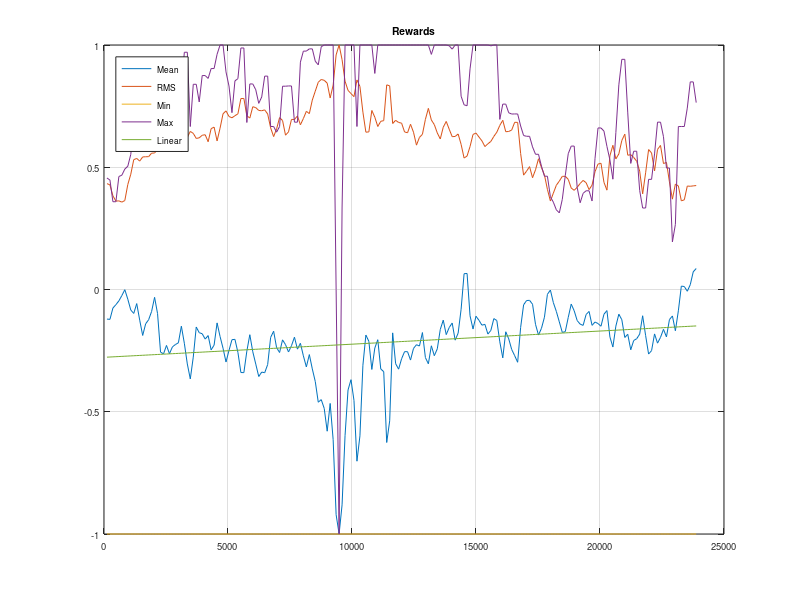

### Rewards histogram

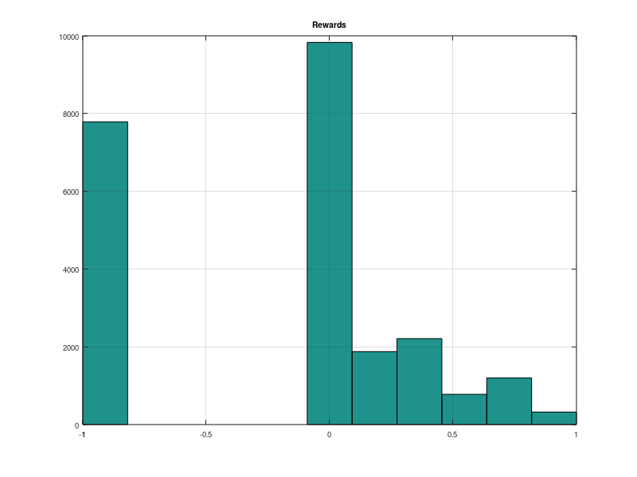
## Delta

| KPI    |             |
|--------|------------:|
| Mean   |    0.000479 |
| RMS    |       0.564 |
| Min    |        -1.1 |
| Median |       0.153 |
| Max    |        1.82 |
| Trend  |      Linear |
| From   |     -0.0116 |
| To     |      0.0126 |

|     -0.964 |     -0.699 |     -0.434 |     -0.169 |     0.0963 |      0.361 |      0.626 |      0.891 |       1.16 |       1.42 |       1.69 |
|-----------:|-----------:|-----------:|-----------:|-----------:|-----------:|-----------:|-----------:|-----------:|-----------:|-----------:|
|       1975 |       4582 |        885 |        429 |       7389 |       4579 |       2359 |       1344 |        343 |        100 |         15 |

### Delta notes

[Notes]

### Delta chart

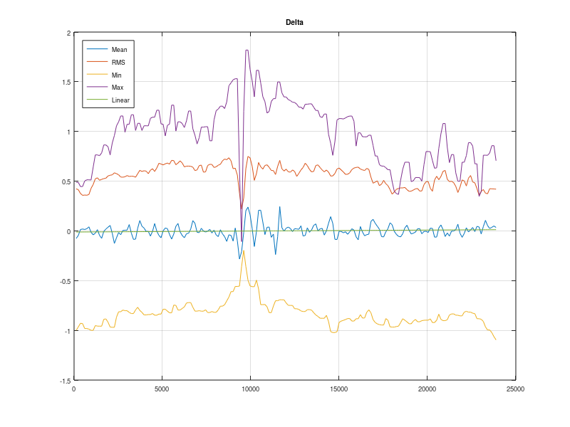

### Delta histogram

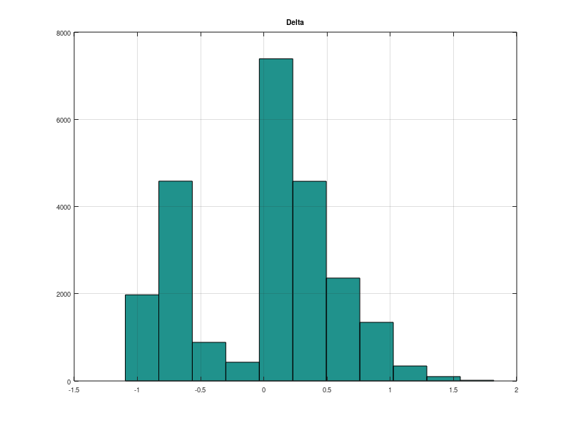
## Discount 0.999 rewards

| KPI    |             |
|--------|------------:|
| Mean   |       -0.22 |
| RMS    |       0.246 |
| Min    |      -0.574 |
| Median |      -0.187 |
| Max    |     -0.0488 |
| Trend  |      Linear |
| From   |      -0.262 |
| To     |      -0.177 |

|      -0.55 |     -0.502 |     -0.455 |     -0.407 |     -0.359 |     -0.311 |     -0.264 |     -0.216 |     -0.168 |      -0.12 |    -0.0727 |
|-----------:|-----------:|-----------:|-----------:|-----------:|-----------:|-----------:|-----------:|-----------:|-----------:|-----------:|
|        740 |        430 |        438 |        781 |       1135 |        894 |       3549 |       3637 |       5345 |       6639 |        412 |

### Discount 0.999 rewards notes

[Notes]

### Discount 0.999 rewards chart

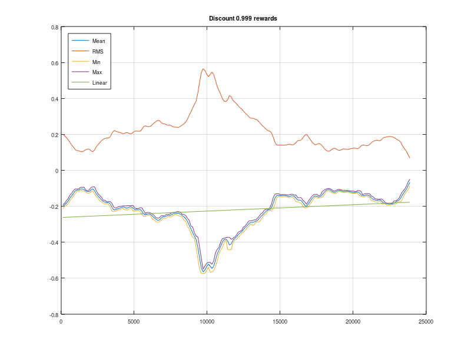

### Discount 0.999 rewards histogram

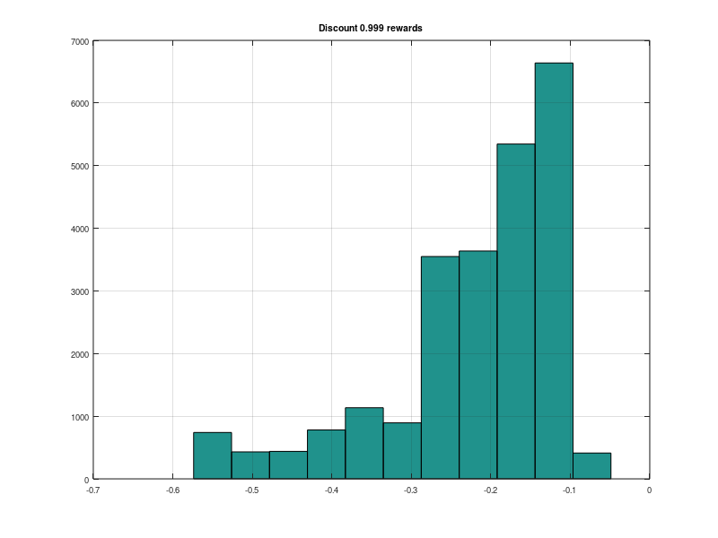
## Halt max prob.

| KPI    |             |
|--------|------------:|
| Mean   |       0.622 |
| RMS    |       0.625 |
| Min    |         0.5 |
| Median |       0.648 |
| Max    |       0.695 |
| Trend  |      Linear |
| From   |       0.523 |
| To     |       0.722 |

|      0.509 |      0.527 |      0.544 |      0.562 |       0.58 |      0.597 |      0.615 |      0.633 |       0.65 |      0.668 |      0.686 |
|-----------:|-----------:|-----------:|-----------:|-----------:|-----------:|-----------:|-----------:|-----------:|-----------:|-----------:|
|       2742 |        524 |        252 |        866 |       3953 |       1348 |        453 |       1047 |       2305 |       5116 |       5394 |

### Halt max prob. notes

[Notes]

### Halt max prob. chart

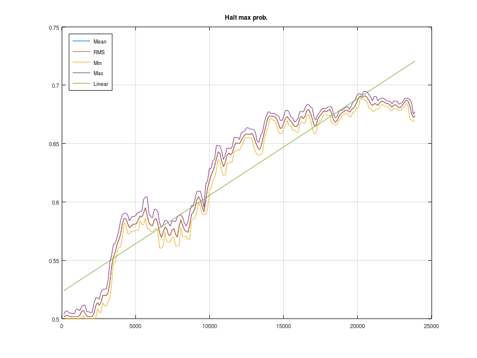

### Halt max prob. histogram

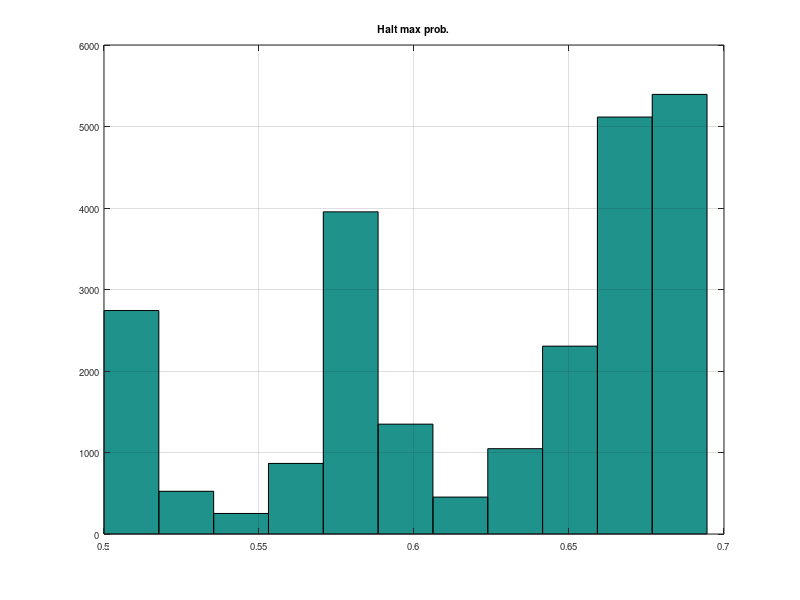
## Direction max prob.

| KPI    |             |
|--------|------------:|
| Mean   |      0.0774 |
| RMS    |      0.0791 |
| Min    |        0.04 |
| Median |      0.0791 |
| Max    |       0.108 |
| Trend  |      Linear |
| From   |      0.0576 |
| To     |      0.0972 |

|     0.0431 |     0.0493 |     0.0555 |     0.0617 |     0.0679 |     0.0741 |     0.0803 |     0.0865 |     0.0927 |     0.0989 |      0.105 |
|-----------:|-----------:|-----------:|-----------:|-----------:|-----------:|-----------:|-----------:|-----------:|-----------:|-----------:|
|       1383 |       1190 |       1134 |       2249 |       1599 |       2770 |       3764 |       2545 |       4768 |       2305 |        293 |

### Direction max prob. notes

[Notes]

### Direction max prob. chart

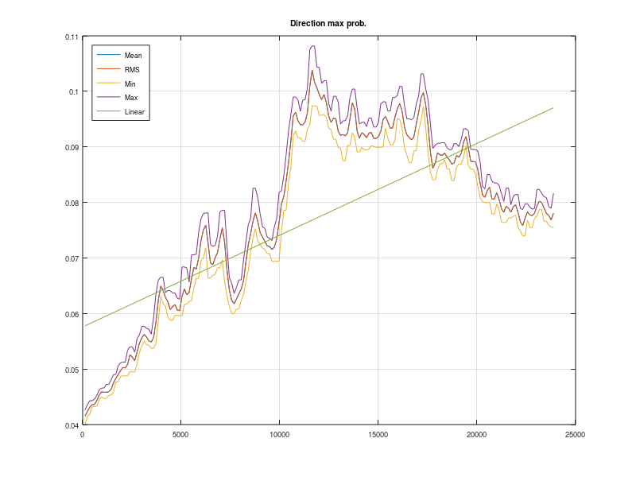

### Direction max prob. histogram

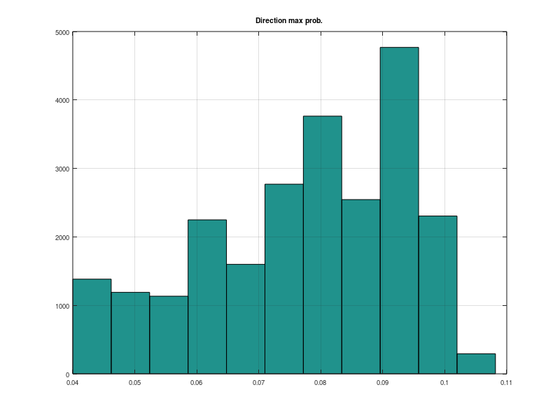
## Speed max prob.

| KPI    |             |
|--------|------------:|
| Mean   |       0.226 |
| RMS    |       0.234 |
| Min    |       0.111 |
| Median |       0.227 |
| Max    |       0.351 |
| Trend  |      Linear |
| From   |       0.118 |
| To     |       0.334 |

|      0.122 |      0.144 |      0.166 |      0.188 |      0.209 |      0.231 |      0.253 |      0.275 |      0.297 |      0.319 |       0.34 |
|-----------:|-----------:|-----------:|-----------:|-----------:|-----------:|-----------:|-----------:|-----------:|-----------:|-----------:|
|       2416 |       2020 |       1283 |       2389 |       3412 |       3571 |       1799 |       2613 |       1180 |       1668 |       1649 |

### Speed max prob. notes

[Notes]

### Speed max prob. chart

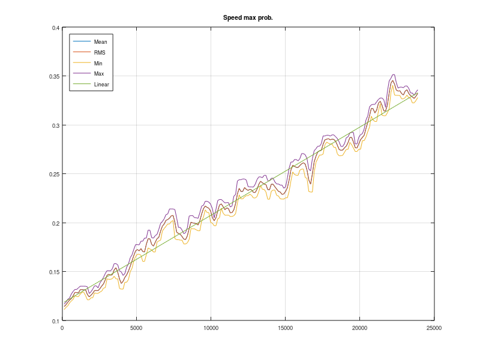

### Speed max prob. histogram

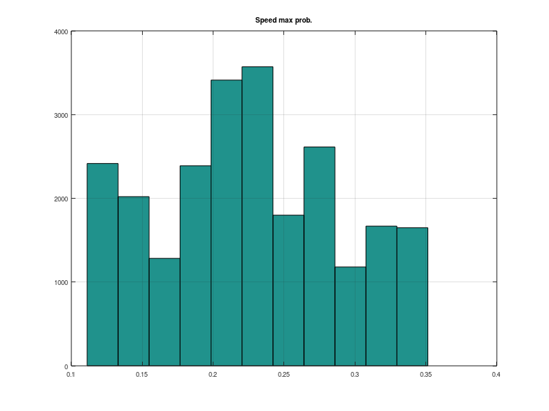
## Sensor direction max prob.

| KPI    |             |
|--------|------------:|
| Mean   |        0.31 |
| RMS    |       0.317 |
| Min    |       0.143 |
| Median |       0.346 |
| Max    |       0.392 |
| Trend  |      Linear |
| From   |       0.207 |
| To     |       0.413 |

|      0.154 |      0.177 |      0.199 |      0.222 |      0.245 |      0.267 |       0.29 |      0.313 |      0.335 |      0.358 |       0.38 |
|-----------:|-----------:|-----------:|-----------:|-----------:|-----------:|-----------:|-----------:|-----------:|-----------:|-----------:|
|       1316 |        307 |        317 |        738 |       2697 |       2291 |       2844 |       1116 |        445 |       7525 |       4404 |

### Sensor direction max prob. notes

[Notes]

### Sensor direction max prob. chart

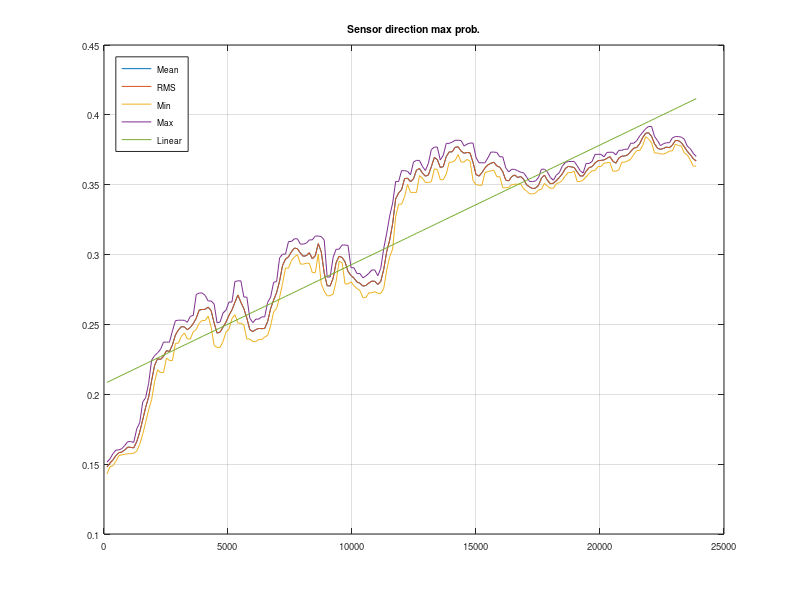

### Sensor direction max prob. histogram

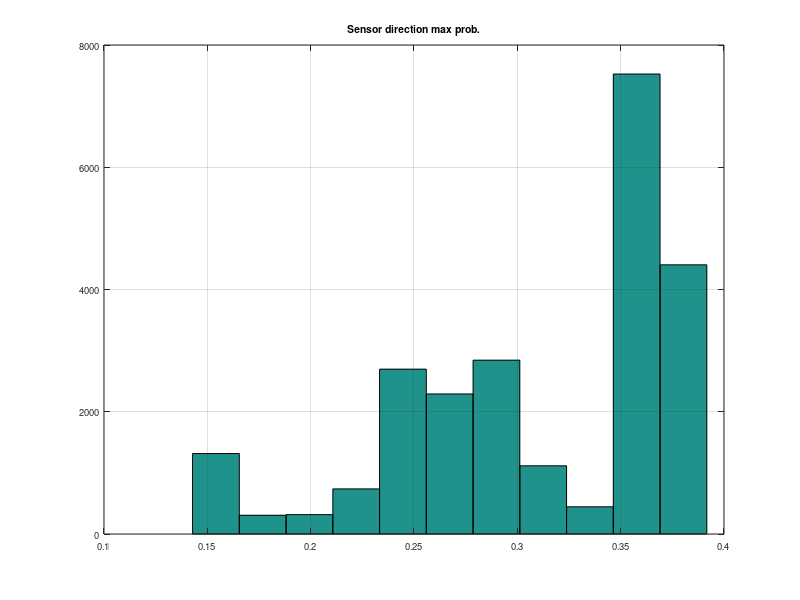
## Delta halt prob.

| KPI    |             |
|--------|------------:|
| Mean   |    0.000343 |
| RMS    |     0.00048 |
| Min    |           0 |
| Median |    0.000227 |
| Max    |     0.00259 |
| Trend  |      Linear |
| From   |    0.000494 |
| To     |    0.000191 |

|   0.000118 |   0.000353 |   0.000588 |   0.000823 |    0.00106 |    0.00129 |    0.00153 |    0.00176 |      0.002 |    0.00223 |    0.00247 |
|-----------:|-----------:|-----------:|-----------:|-----------:|-----------:|-----------:|-----------:|-----------:|-----------:|-----------:|
|      12249 |       5212 |       3091 |       1697 |       1016 |        505 |        166 |         45 |         12 |          5 |          2 |

### Delta halt prob. notes

[Notes]

### Delta halt prob. chart

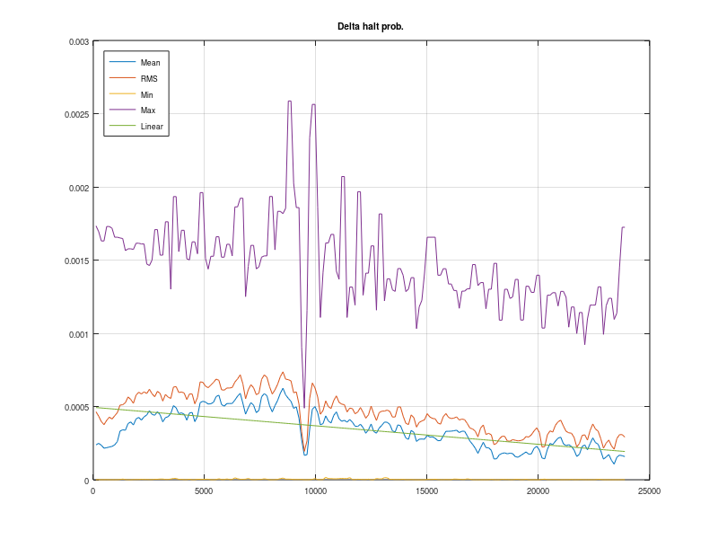

### Delta halt prob. histogram

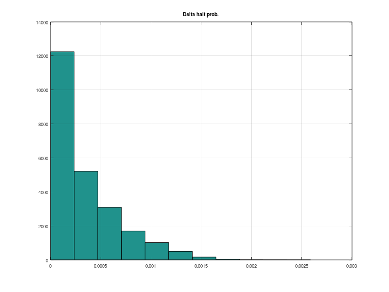
## Delta direction prob.

| KPI    |             |
|--------|------------:|
| Mean   |    0.000418 |
| RMS    |    0.000521 |
| Min    |       9e-08 |
| Median |    0.000351 |
| Max    |     0.00306 |
| Trend  |      Linear |
| From   |    0.000471 |
| To     |    0.000365 |

|   0.000139 |   0.000417 |   0.000695 |   0.000973 |    0.00125 |    0.00153 |    0.00181 |    0.00208 |    0.00236 |    0.00264 |    0.00292 |
|-----------:|-----------:|-----------:|-----------:|-----------:|-----------:|-----------:|-----------:|-----------:|-----------:|-----------:|
|      10302 |       6242 |       5092 |       1742 |        434 |        130 |         41 |         12 |          2 |          2 |          1 |

### Delta direction prob. notes

[Notes]

### Delta direction prob. chart

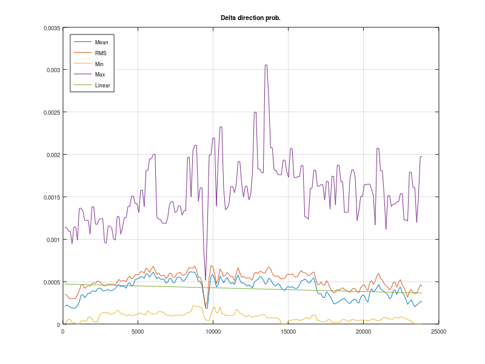

### Delta direction prob. histogram

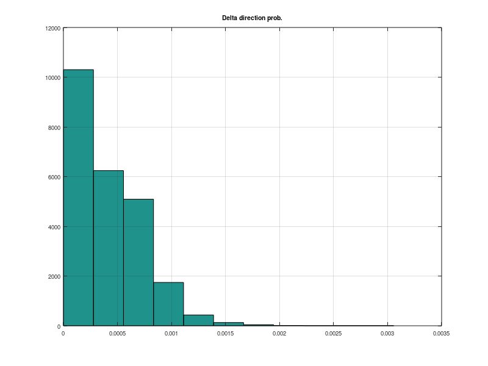
## Delta speed prob.

| KPI    |             |
|--------|------------:|
| Mean   |     0.00062 |
| RMS    |     0.00078 |
| Min    |     2.6e-07 |
| Median |    0.000512 |
| Max    |     0.00457 |
| Trend  |      Linear |
| From   |    0.000769 |
| To     |    0.000471 |

|   0.000208 |   0.000624 |    0.00104 |    0.00146 |    0.00187 |    0.00229 |     0.0027 |    0.00312 |    0.00353 |    0.00395 |    0.00436 |
|-----------:|-----------:|-----------:|-----------:|-----------:|-----------:|-----------:|-----------:|-----------:|-----------:|-----------:|
|      10473 |       6160 |       5112 |       1446 |        573 |        161 |         52 |         17 |          4 |          1 |          1 |

### Delta speed prob. notes

[Notes]

### Delta speed prob. chart

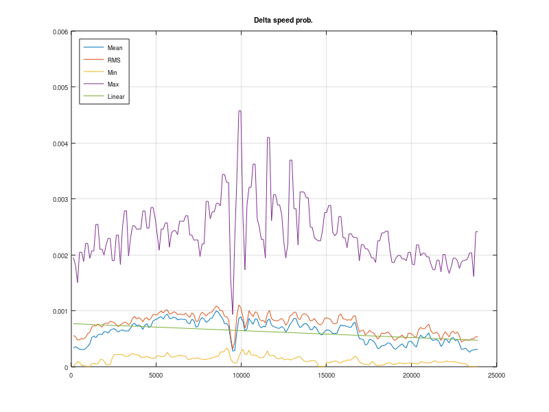

### Delta speed prob. histogram

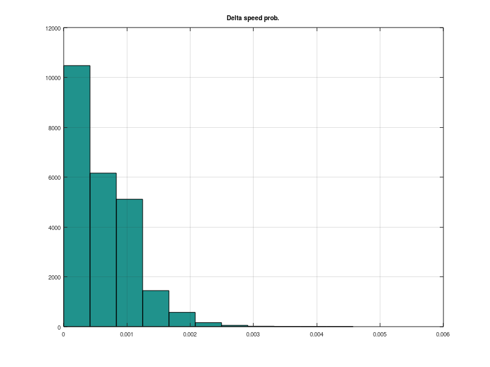
## Delta sensor direction prob.

| KPI    |             |
|--------|------------:|
| Mean   |    0.000565 |
| RMS    |     0.00074 |
| Min    |     2.1e-07 |
| Median |    0.000445 |
| Max    |     0.00398 |
| Trend  |      Linear |
| From   |    0.000839 |
| To     |    0.000292 |

|   0.000181 |   0.000544 |   0.000906 |    0.00127 |    0.00163 |    0.00199 |    0.00235 |    0.00272 |    0.00308 |    0.00344 |     0.0038 |
|-----------:|-----------:|-----------:|-----------:|-----------:|-----------:|-----------:|-----------:|-----------:|-----------:|-----------:|
|      10662 |       5649 |       4545 |       1879 |        760 |        306 |        132 |         36 |         18 |          9 |          4 |

### Delta sensor direction prob. notes

[Notes]

### Delta sensor direction prob. chart

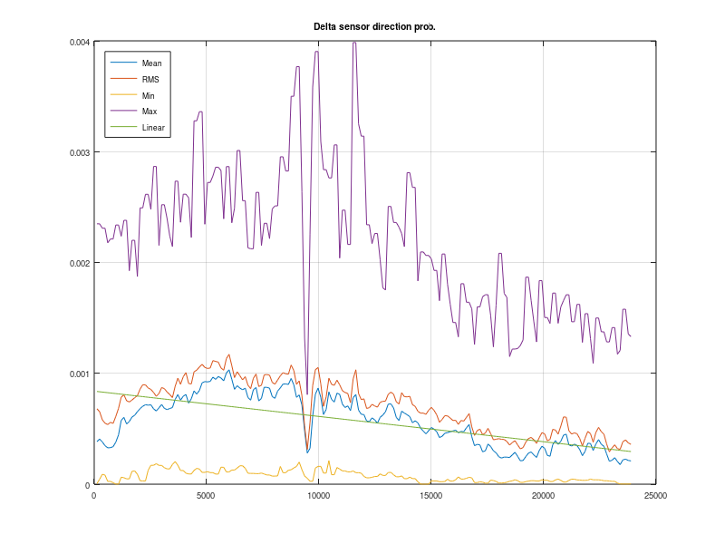

### Delta sensor direction prob. histogram

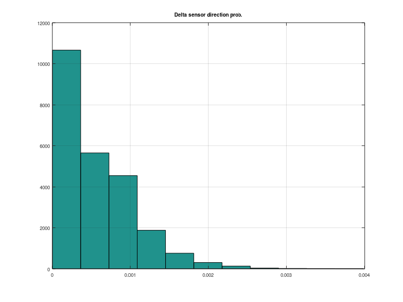
## Advantage residual estimation (critic)

| KPI    |             |
|--------|------------:|
| Mean   |      -0.271 |
| RMS    |       0.298 |
| Min    |      -0.703 |
| Median |      -0.264 |
| Max    |      0.0325 |
| Trend  |      Linear |
| From   |      -0.275 |
| To     |      -0.268 |

|      -0.67 |     -0.603 |     -0.536 |     -0.469 |     -0.402 |     -0.335 |     -0.268 |     -0.202 |     -0.135 |    -0.0678 |  -0.000891 |
|-----------:|-----------:|-----------:|-----------:|-----------:|-----------:|-----------:|-----------:|-----------:|-----------:|-----------:|
|        360 |        355 |        680 |        683 |       1346 |       4609 |       7377 |       4616 |       1910 |       1657 |        407 |

### Advantage residual estimation (critic) notes

[Notes]

### Advantage residual estimation (critic) chart

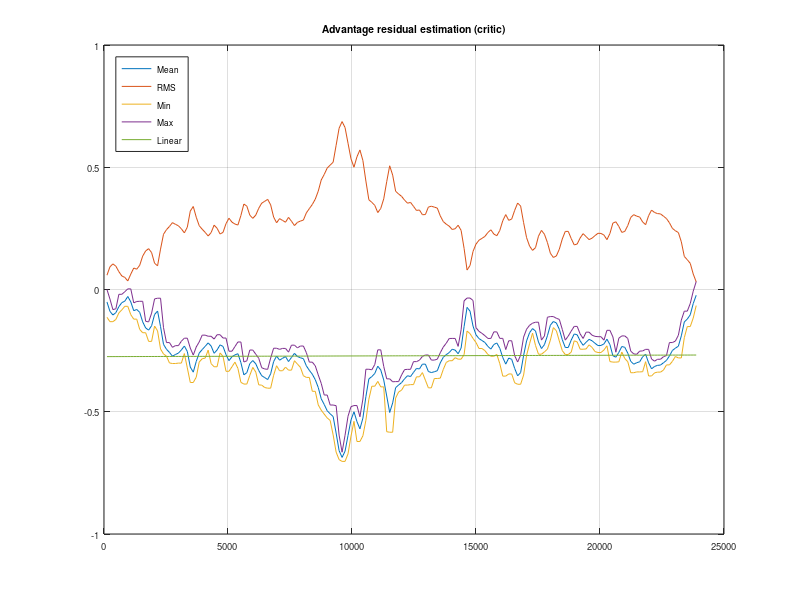

### Advantage residual estimation (critic) histogram

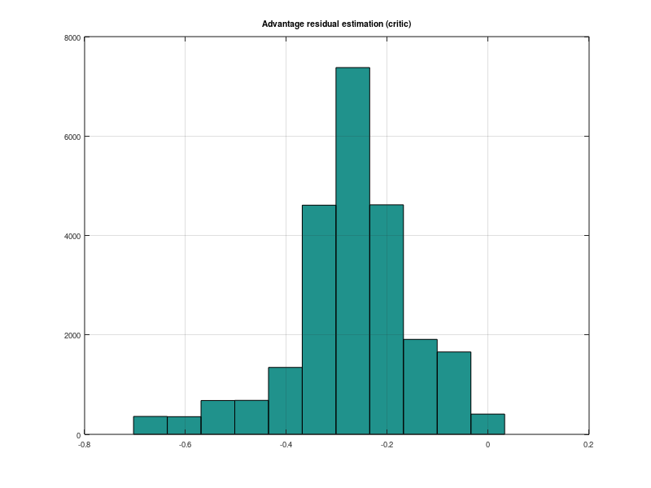
## Halt gradient

| KPI    |             |
|--------|------------:|
| Mean   |           2 |
| RMS    |        2.08 |
| Min    |        1.44 |
| Median |        1.73 |
| Max    |        3.27 |
| Trend  |      Linear |
| From   |        1.99 |
| To     |        2.01 |

|       1.52 |       1.69 |       1.86 |       2.02 |       2.19 |       2.36 |       2.52 |       2.69 |       2.86 |       3.02 |       3.19 |
|-----------:|-----------:|-----------:|-----------:|-----------:|-----------:|-----------:|-----------:|-----------:|-----------:|-----------:|
|       9301 |       3696 |        596 |       2944 |        188 |       2095 |        516 |        392 |        862 |       1861 |       1549 |

### Halt gradient notes

[Notes]

### Halt gradient chart

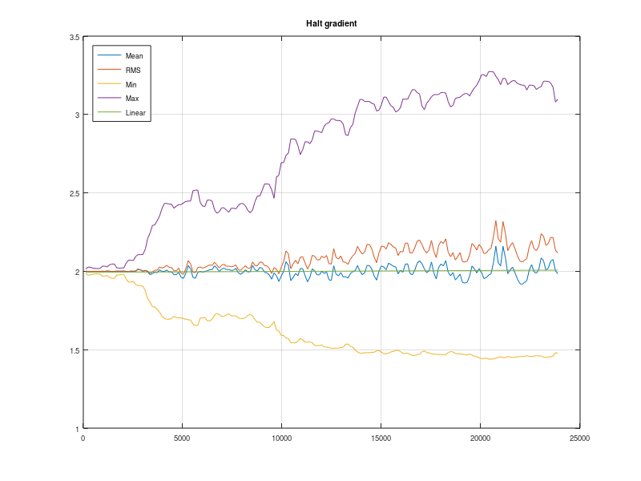

### Halt gradient histogram

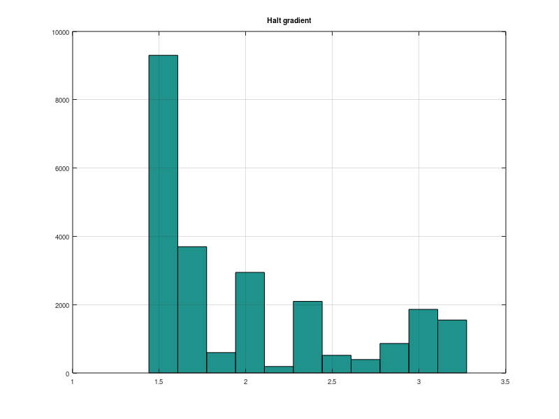
## Direction gradient

| KPI    |             |
|--------|------------:|
| Mean   |          25 |
| RMS    |        26.6 |
| Min    |        9.24 |
| Median |          24 |
| Max    |        68.1 |
| Trend  |      Linear |
| From   |          25 |
| To     |          25 |

|       11.9 |       17.3 |       22.6 |         28 |       33.3 |       38.7 |         44 |       49.4 |       54.7 |       60.1 |       65.4 |
|-----------:|-----------:|-----------:|-----------:|-----------:|-----------:|-----------:|-----------:|-----------:|-----------:|-----------:|
|       3157 |       3647 |       7083 |       4691 |       2476 |       1846 |        457 |        357 |        171 |         73 |         42 |

### Direction gradient notes

[Notes]

### Direction gradient chart

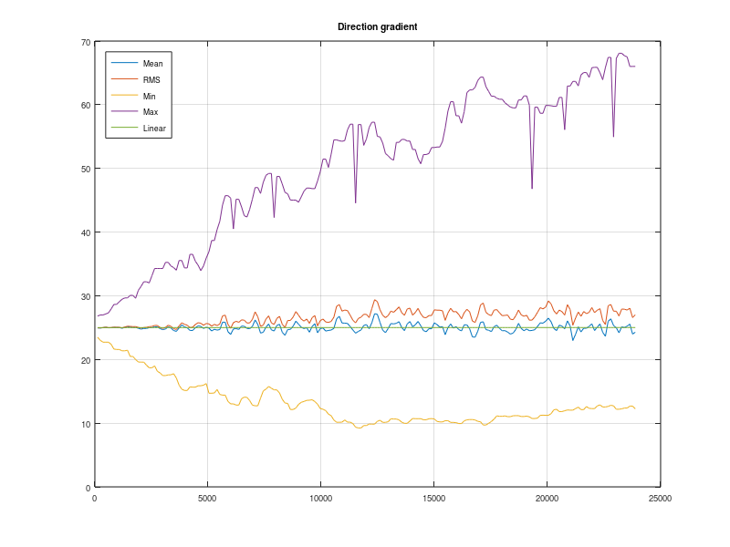

### Direction gradient histogram

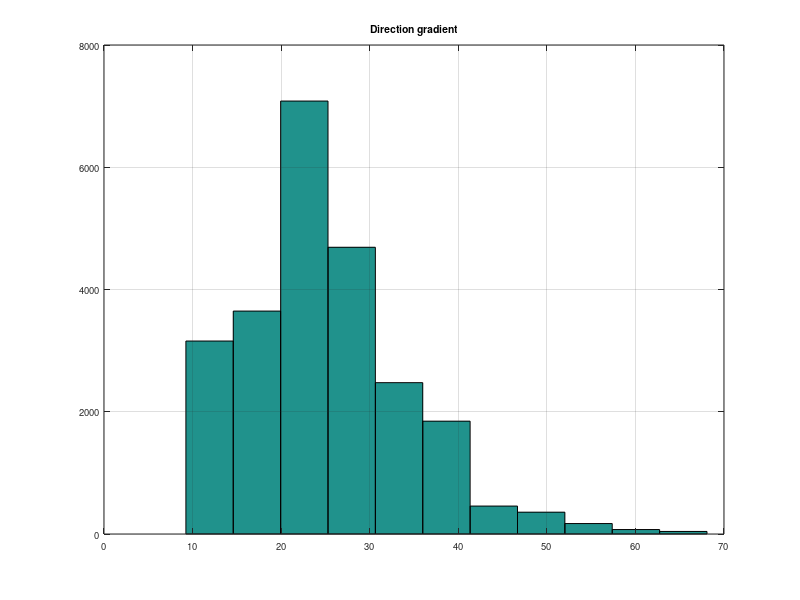
## Speed gradient

| KPI    |             |
|--------|------------:|
| Mean   |        9.06 |
| RMS    |        9.92 |
| Min    |        2.85 |
| Median |        8.61 |
| Max    |        24.6 |
| Trend  |      Linear |
| From   |        8.99 |
| To     |        9.12 |

|       3.84 |       5.82 |        7.8 |       9.78 |       11.8 |       13.7 |       15.7 |       17.7 |       19.7 |       21.7 |       23.6 |
|-----------:|-----------:|-----------:|-----------:|-----------:|-----------:|-----------:|-----------:|-----------:|-----------:|-----------:|
|       3829 |       3326 |       5459 |       4802 |       1867 |       2415 |       1212 |        600 |        274 |        103 |        113 |

### Speed gradient notes

[Notes]

### Speed gradient chart

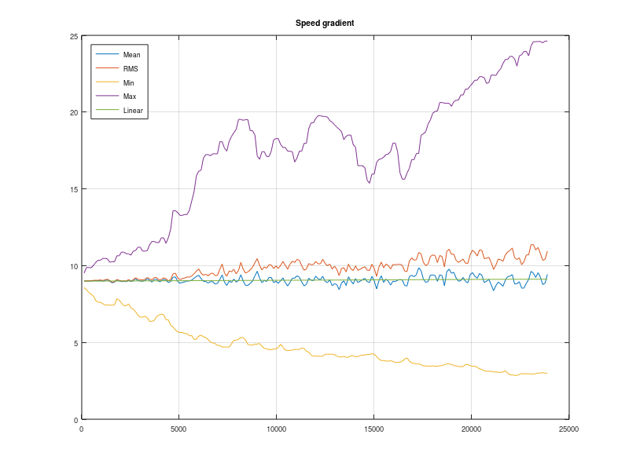

### Speed gradient histogram

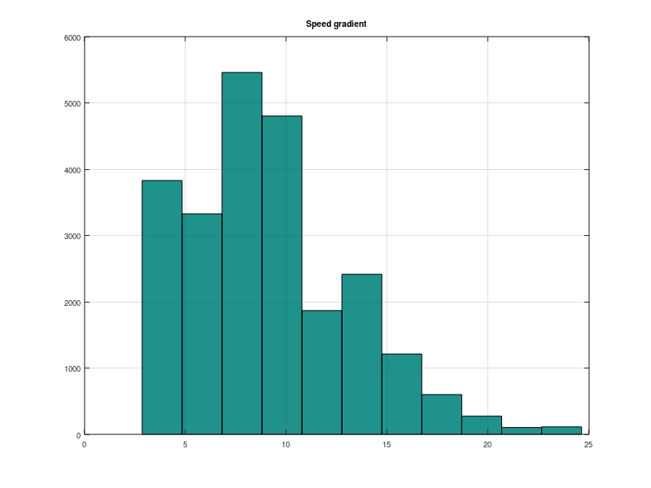
## Sensor direction gradient

| KPI    |             |
|--------|------------:|
| Mean   |           7 |
| RMS    |        9.47 |
| Min    |        2.55 |
| Median |         4.4 |
| Max    |        41.2 |
| Trend  |      Linear |
| From   |        6.93 |
| To     |        7.08 |

|       4.31 |       7.82 |       11.3 |       14.9 |       18.4 |       21.9 |       25.4 |       28.9 |       32.4 |       35.9 |       39.5 |
|-----------:|-----------:|-----------:|-----------:|-----------:|-----------:|-----------:|-----------:|-----------:|-----------:|-----------:|
|      13020 |       7458 |        948 |        647 |        821 |        243 |        187 |        152 |        284 |         41 |        199 |

### Sensor direction gradient notes

[Notes]

### Sensor direction gradient chart

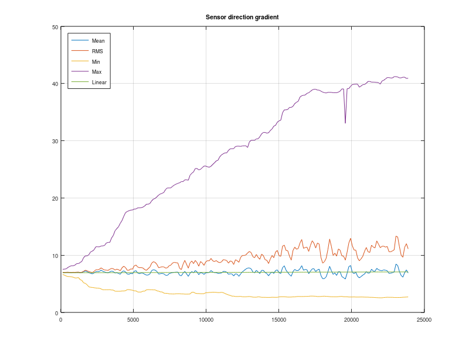

### Sensor direction gradient histogram

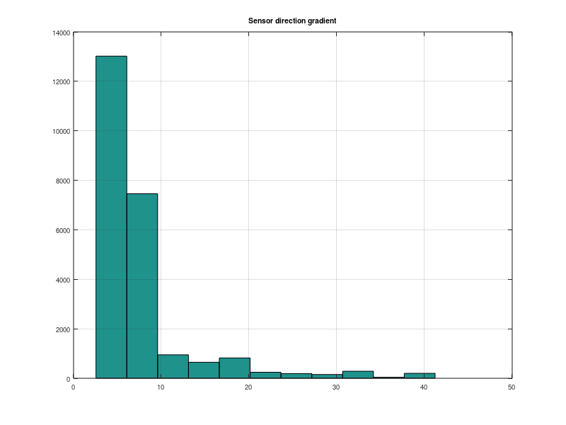
