# Report

17 November 2022, 12:27
Data folder `C:\Users\marco\Desktop\wheellyj\data\agent-10e-3\`

[TOC]

## Rewards

| KPI    |             |
|--------|------------:|
| Mean   |      0.0167 |
| Sigma  |        0.68 |
| RMS    |        0.68 |
| Min    |          -1 |
| Median |           0 |
| Max    |           1 |
| Trend  |      Linear |
| From   |     -0.0288 |
| To     |      0.0621 |

|     -0.909 |     -0.727 |     -0.545 |     -0.364 |     -0.182 |          0 |      0.182 |      0.364 |      0.545 |      0.727 |      0.909 |
|-----------:|-----------:|-----------:|-----------:|-----------:|-----------:|-----------:|-----------:|-----------:|-----------:|-----------:|
|      25340 |          0 |          0 |          0 |          0 |      26558 |       2964 |       9510 |      13012 |       7758 |      10858 |

### Rewards notes

[Notes]

### Rewards chart

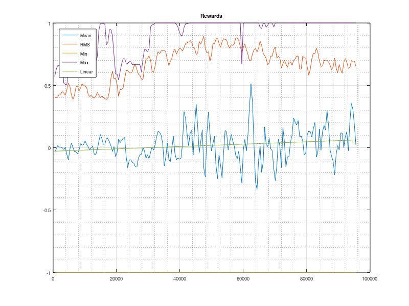

### Rewards histogram

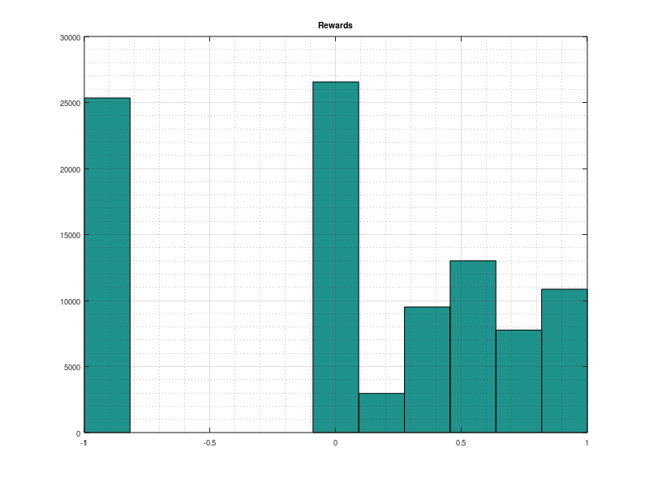
## Delta

| KPI    |             |
|--------|------------:|
| Mean   |    0.000685 |
| Sigma  |       0.667 |
| RMS    |       0.667 |
| Min    |       -1.57 |
| Median |      0.0822 |
| Max    |        1.32 |
| Trend  |      Linear |
| From   |   -0.000971 |
| To     |     0.00234 |

|      -1.44 |      -1.18 |     -0.914 |     -0.651 |     -0.389 |     -0.126 |      0.136 |      0.398 |      0.661 |      0.923 |       1.19 |
|-----------:|-----------:|-----------:|-----------:|-----------:|-----------:|-----------:|-----------:|-----------:|-----------:|-----------:|
|        336 |       7338 |      15762 |       1920 |        966 |      14010 |      16124 |      15104 |      15162 |       8028 |       1250 |

### Delta notes

[Notes]

### Delta chart

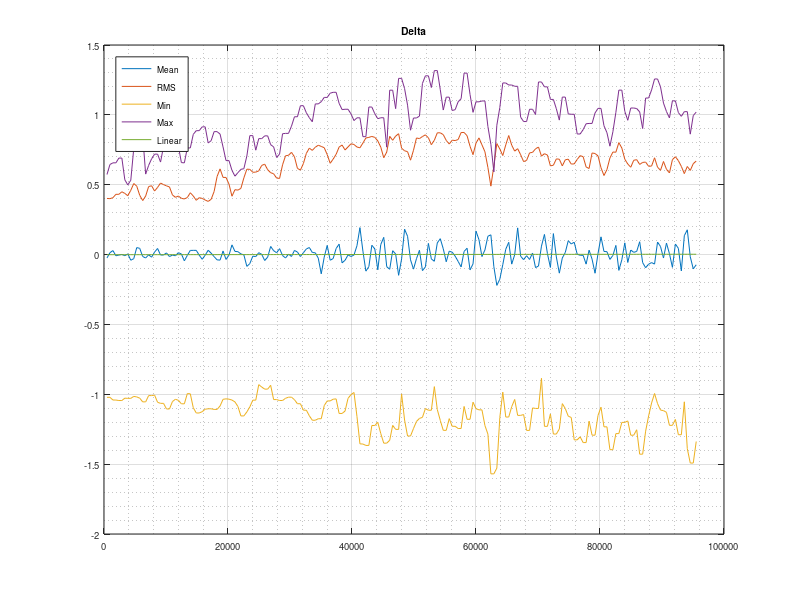

### Delta histogram

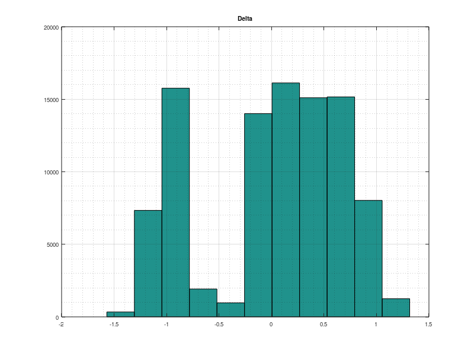
## Discount 0.999 rewards

| KPI    |             |
|--------|------------:|
| Mean   |      0.0153 |
| Sigma  |       0.092 |
| RMS    |      0.0932 |
| Min    |      -0.241 |
| Median |     0.00618 |
| Max    |       0.385 |
| Trend  |      Linear |
| From   |     -0.0259 |
| To     |      0.0564 |

|     -0.213 |     -0.156 |    -0.0988 |    -0.0419 |      0.015 |     0.0718 |      0.129 |      0.186 |      0.242 |      0.299 |      0.356 |
|-----------:|-----------:|-----------:|-----------:|-----------:|-----------:|-----------:|-----------:|-----------:|-----------:|-----------:|
|        581 |       4384 |      10679 |      20934 |      27316 |      16351 |       8789 |       4451 |       1314 |        646 |        555 |

### Discount 0.999 rewards notes

[Notes]

### Discount 0.999 rewards chart

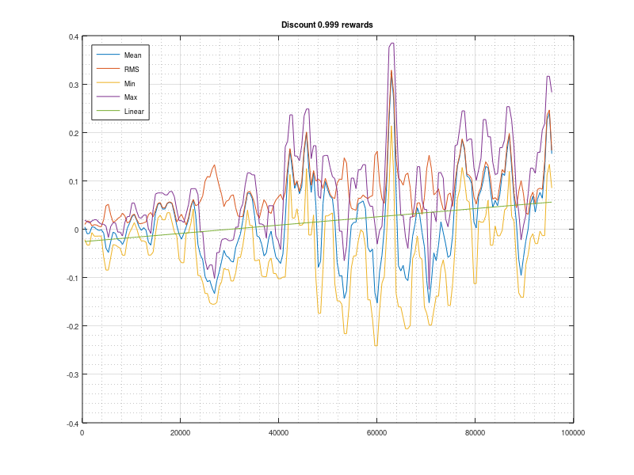

### Discount 0.999 rewards histogram

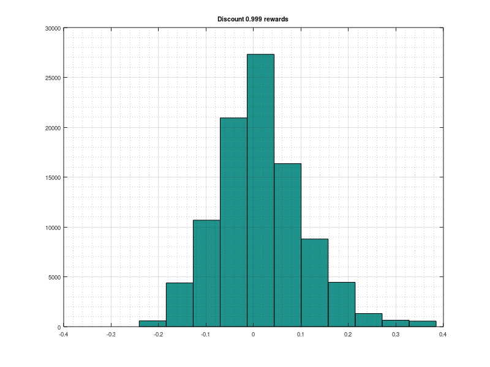
## Halt max prob.

| KPI    |             |
|--------|------------:|
| Mean   |       0.725 |
| Sigma  |       0.134 |
| RMS    |       0.737 |
| Min    |         0.5 |
| Median |       0.776 |
| Max    |       0.869 |
| Trend  |      Linear |
| From   |        0.51 |
| To     |       0.941 |

|      0.517 |       0.55 |      0.584 |      0.617 |      0.651 |      0.685 |      0.718 |      0.752 |      0.785 |      0.819 |      0.852 |
|-----------:|-----------:|-----------:|-----------:|-----------:|-----------:|-----------:|-----------:|-----------:|-----------:|-----------:|
|      11206 |      10914 |       8304 |       1650 |       1284 |       3040 |       4730 |       5290 |       5278 |       9008 |      35296 |

### Halt max prob. notes

[Notes]

### Halt max prob. chart

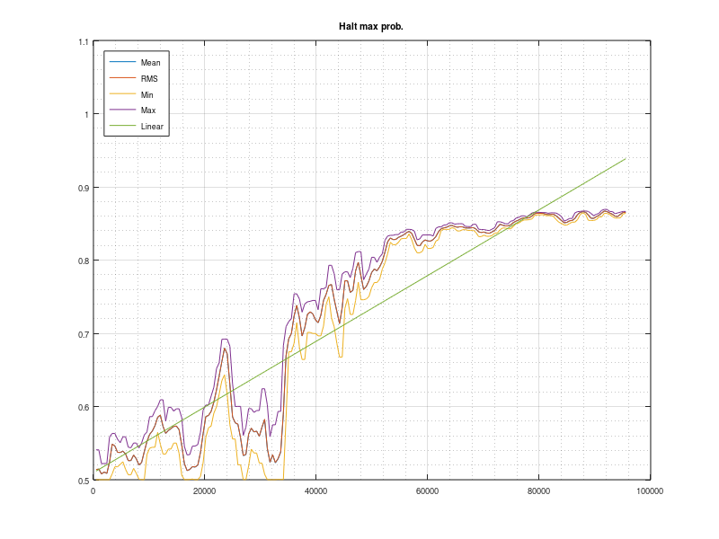

### Halt max prob. histogram

## Direction max prob.

| KPI    |             |
|--------|------------:|
| Mean   |       0.155 |
| Sigma  |       0.036 |
| RMS    |       0.159 |
| Min    |        0.04 |
| Median |       0.164 |
| Max    |       0.235 |
| Trend  |      Linear |
| From   |       0.113 |
| To     |       0.197 |

|     0.0488 |     0.0665 |     0.0842 |      0.102 |       0.12 |      0.137 |      0.155 |      0.173 |       0.19 |      0.208 |      0.226 |
|-----------:|-----------:|-----------:|-----------:|-----------:|-----------:|-----------:|-----------:|-----------:|-----------:|-----------:|
|       1974 |       3808 |       1864 |       3452 |       6194 |       9320 |      21774 |      25100 |      19260 |       1914 |       1340 |

### Direction max prob. notes

[Notes]

### Direction max prob. chart

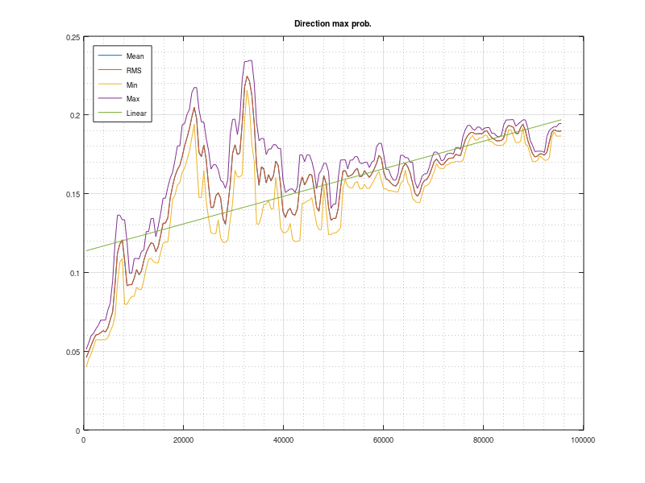

### Direction max prob. histogram

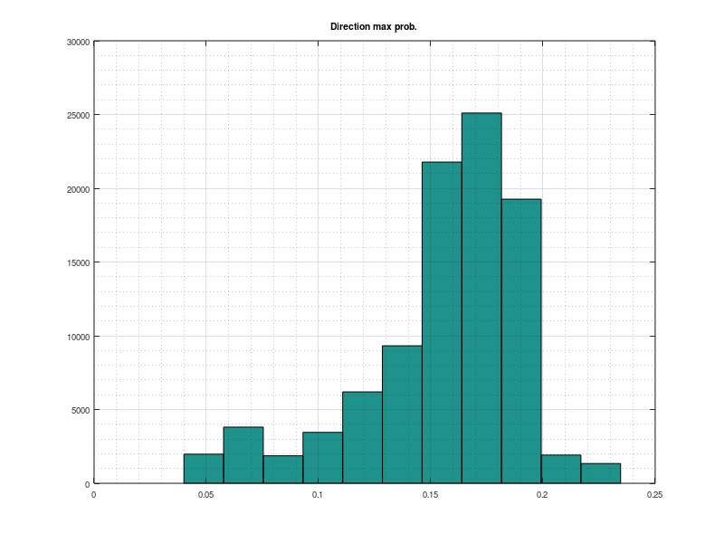
## Speed max prob.

| KPI    |             |
|--------|------------:|
| Mean   |       0.284 |
| Sigma  |      0.0839 |
| RMS    |       0.296 |
| Min    |       0.111 |
| Median |       0.278 |
| Max    |       0.518 |
| Trend  |      Linear |
| From   |        0.24 |
| To     |       0.327 |

|       0.13 |      0.167 |      0.204 |       0.24 |      0.277 |      0.314 |      0.351 |      0.388 |      0.425 |      0.462 |      0.499 |
|-----------:|-----------:|-----------:|-----------:|-----------:|-----------:|-----------:|-----------:|-----------:|-----------:|-----------:|
|       7098 |       6210 |       5000 |      17106 |      19268 |      23326 |       5978 |       2920 |       3590 |       2482 |       3022 |

### Speed max prob. notes

[Notes]

### Speed max prob. chart

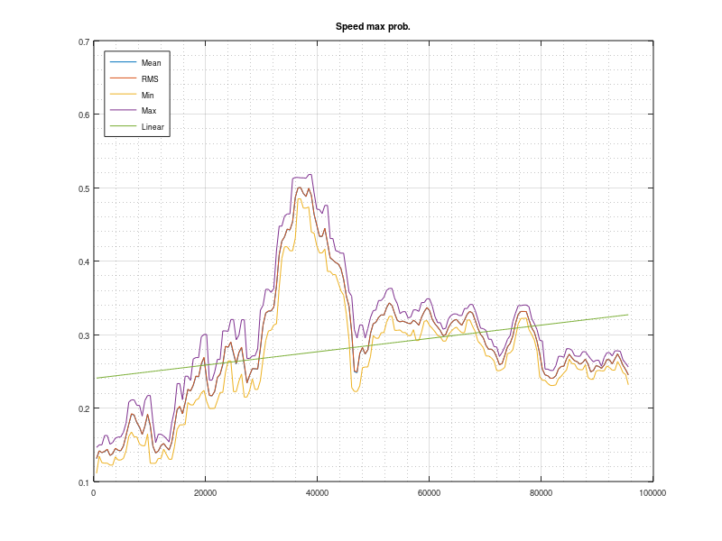

### Speed max prob. histogram

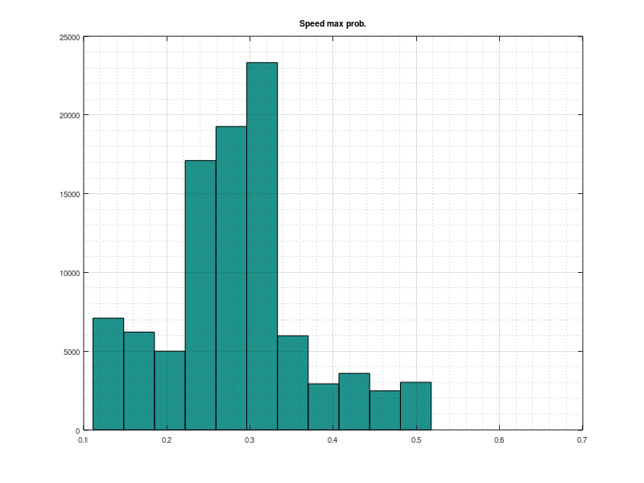
## Sensor direction max prob.

| KPI    |             |
|--------|------------:|
| Mean   |       0.651 |
| Sigma  |       0.228 |
| RMS    |        0.69 |
| Min    |       0.143 |
| Median |       0.801 |
| Max    |       0.879 |
| Trend  |      Linear |
| From   |       0.289 |
| To     |        1.01 |

|      0.176 |      0.243 |       0.31 |      0.377 |      0.444 |      0.511 |      0.578 |      0.645 |      0.711 |      0.778 |      0.845 |
|-----------:|-----------:|-----------:|-----------:|-----------:|-----------:|-----------:|-----------:|-----------:|-----------:|-----------:|
|       1740 |       1146 |       5918 |      15142 |      11864 |       3454 |       1640 |        580 |       2560 |       5252 |      46704 |

### Sensor direction max prob. notes

[Notes]

### Sensor direction max prob. chart

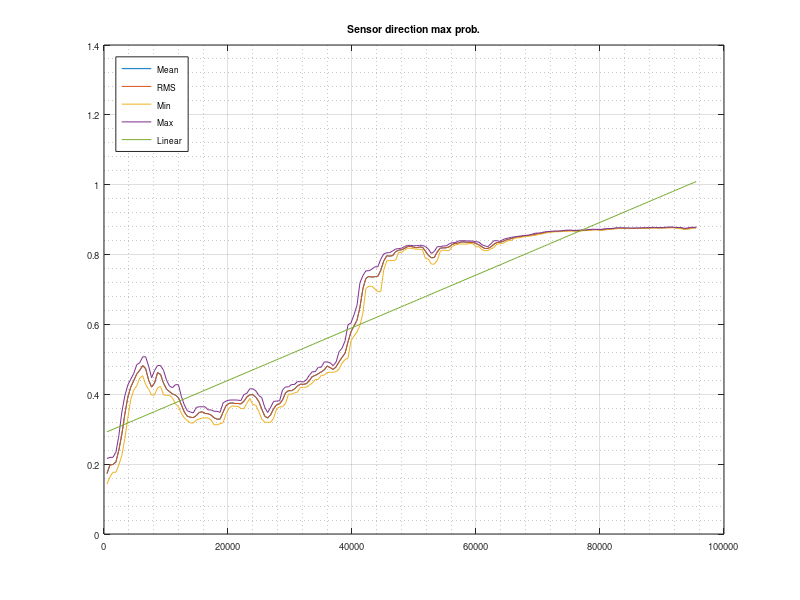

### Sensor direction max prob. histogram

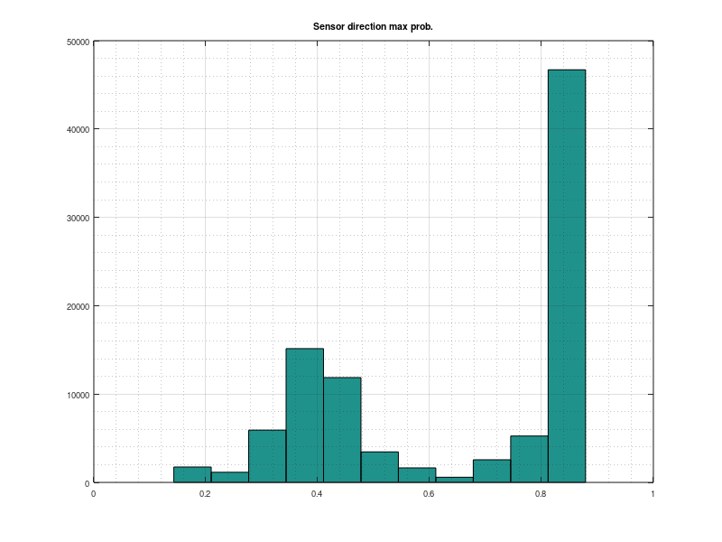
## Delta halt prob.

| KPI    |             |
|--------|------------:|
| Mean   |   -1.84e-06 |
| Sigma  |     0.00113 |
| RMS    |     0.00113 |
| Min    |    -0.00714 |
| Median |      -3e-08 |
| Max    |     0.00684 |
| Trend  |      Linear |
| From   |   -3.19e-06 |
| To     |   -4.97e-07 |

|   -0.00651 |   -0.00524 |   -0.00397 |    -0.0027 |   -0.00142 |  -0.000154 |    0.00112 |    0.00239 |    0.00366 |    0.00493 |     0.0062 |
|-----------:|-----------:|-----------:|-----------:|-----------:|-----------:|-----------:|-----------:|-----------:|-----------:|-----------:|
|         76 |        372 |       1062 |       2426 |       7148 |      70450 |       9642 |       2872 |       1246 |        522 |        184 |

### Delta halt prob. notes

[Notes]

### Delta halt prob. chart

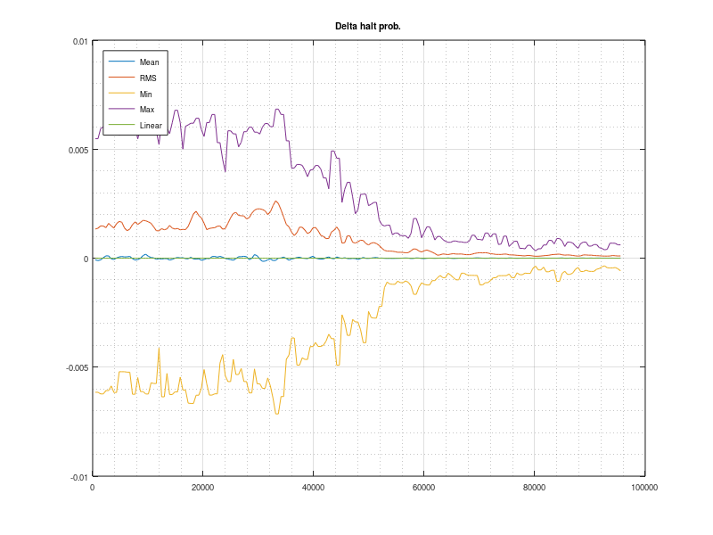

### Delta halt prob. histogram

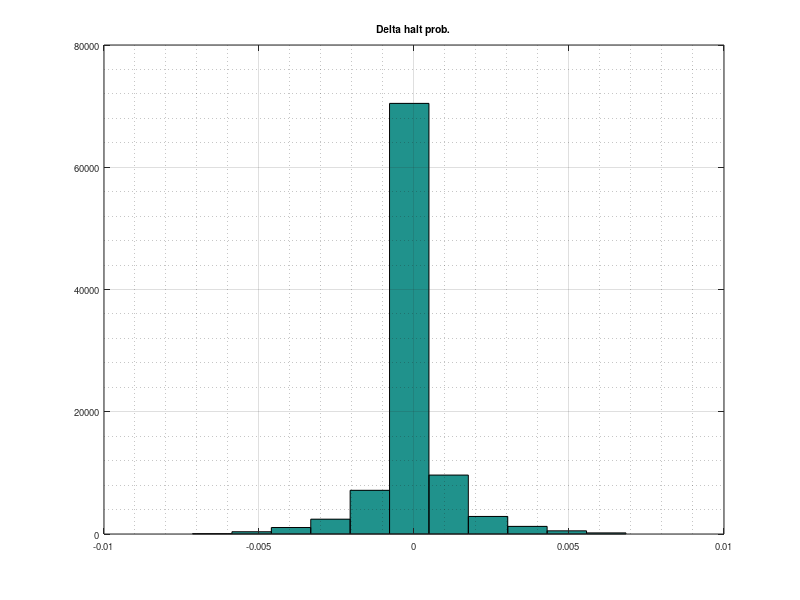
## Delta direction prob.

| KPI    |             |
|--------|------------:|
| Mean   |    9.71e-06 |
| Sigma  |     0.00138 |
| RMS    |     0.00138 |
| Min    |     -0.0073 |
| Median |    0.000126 |
| Max    |     0.00613 |
| Trend  |      Linear |
| From   |     1.7e-05 |
| To     |     2.4e-06 |

|   -0.00669 |   -0.00547 |   -0.00425 |   -0.00302 |    -0.0018 |  -0.000582 |   0.000639 |    0.00186 |    0.00308 |     0.0043 |    0.00552 |
|-----------:|-----------:|-----------:|-----------:|-----------:|-----------:|-----------:|-----------:|-----------:|-----------:|-----------:|
|         38 |        188 |       1204 |       5802 |       8522 |      26452 |      39210 |      12630 |       1748 |        180 |         26 |

### Delta direction prob. notes

[Notes]

### Delta direction prob. chart

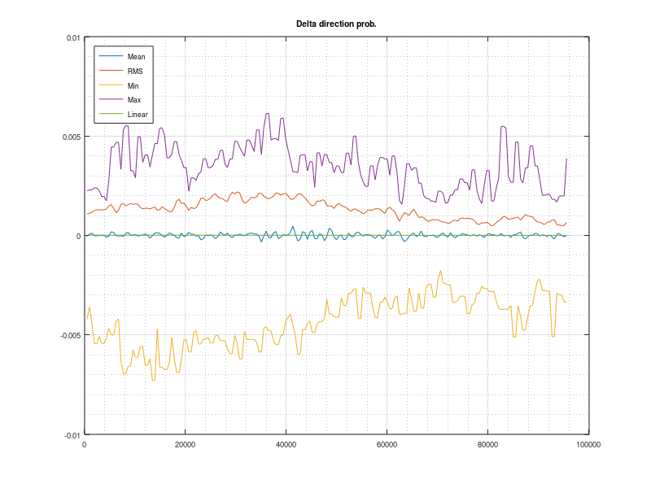

### Delta direction prob. histogram

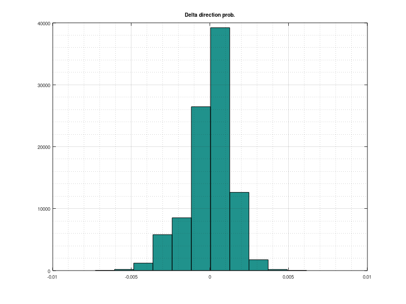
## Delta speed prob.

| KPI    |             |
|--------|------------:|
| Mean   |    1.25e-05 |
| Sigma  |     0.00194 |
| RMS    |     0.00194 |
| Min    |    -0.00974 |
| Median |    0.000165 |
| Max    |     0.00813 |
| Trend  |      Linear |
| From   |     6.3e-06 |
| To     |    1.87e-05 |

|   -0.00893 |    -0.0073 |   -0.00568 |   -0.00405 |   -0.00243 |  -0.000805 |   0.000819 |    0.00244 |    0.00407 |    0.00569 |    0.00732 |
|-----------:|-----------:|-----------:|-----------:|-----------:|-----------:|-----------:|-----------:|-----------:|-----------:|-----------:|
|         74 |        354 |       1318 |       5736 |       9120 |      24752 |      38058 |      14112 |       2180 |        260 |         36 |

### Delta speed prob. notes

[Notes]

### Delta speed prob. chart

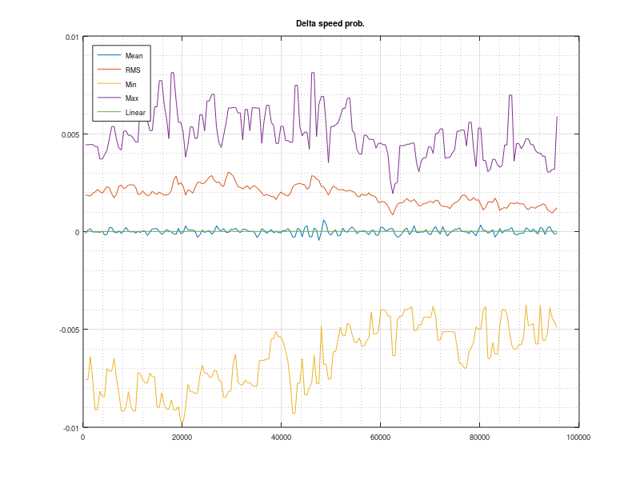

### Delta speed prob. histogram

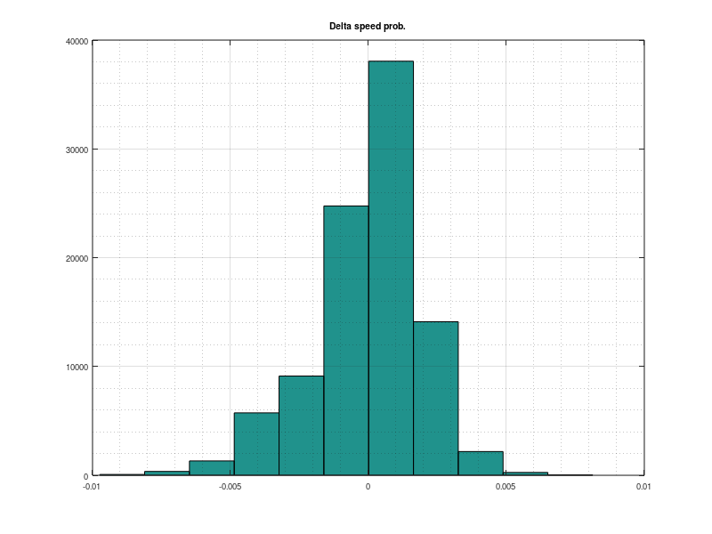
## Delta sensor direction prob.

| KPI    |             |
|--------|------------:|
| Mean   |    3.29e-06 |
| Sigma  |    0.000944 |
| RMS    |    0.000944 |
| Min    |    -0.00989 |
| Median |    6.96e-06 |
| Max    |     0.00675 |
| Trend  |      Linear |
| From   |    2.23e-05 |
| To     |   -1.57e-05 |

|   -0.00914 |   -0.00762 |   -0.00611 |    -0.0046 |   -0.00308 |   -0.00157 |  -5.77e-05 |    0.00146 |    0.00297 |    0.00448 |    0.00599 |
|-----------:|-----------:|-----------:|-----------:|-----------:|-----------:|-----------:|-----------:|-----------:|-----------:|-----------:|
|         14 |         44 |        150 |        732 |       1862 |       5534 |      75524 |      10788 |       1212 |        132 |          8 |

### Delta sensor direction prob. notes

[Notes]

### Delta sensor direction prob. chart

### Delta sensor direction prob. histogram

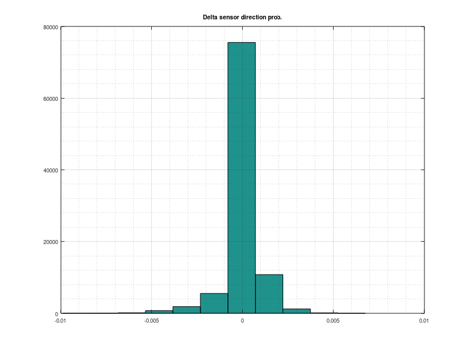
## Advantage residual estimation (critic)

| KPI    |             |
|--------|------------:|
| Mean   |     0.00566 |
| Sigma  |       0.049 |
| RMS    |      0.0493 |
| Min    |      -0.156 |
| Median |     0.00299 |
| Max    |       0.204 |
| Trend  |      Linear |
| From   |     -0.0101 |
| To     |      0.0214 |

|      -0.14 |     -0.107 |    -0.0742 |    -0.0415 |   -0.00869 |     0.0241 |     0.0569 |     0.0896 |      0.122 |      0.155 |      0.188 |
|-----------:|-----------:|-----------:|-----------:|-----------:|-----------:|-----------:|-----------:|-----------:|-----------:|-----------:|
|        524 |       2086 |       4996 |      14560 |      31538 |      23852 |       9780 |       5626 |       1772 |        726 |        540 |

### Advantage residual estimation (critic) notes

[Notes]

### Advantage residual estimation (critic) chart

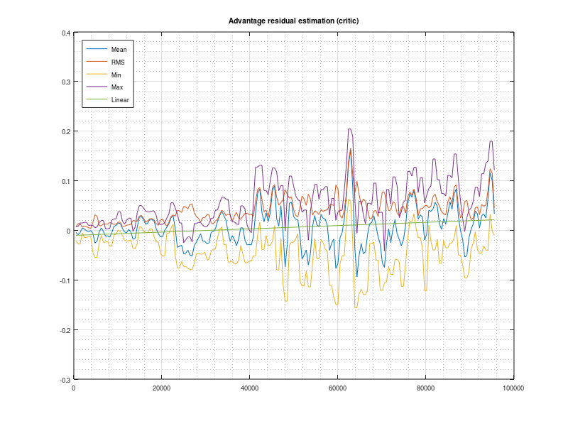

### Advantage residual estimation (critic) histogram

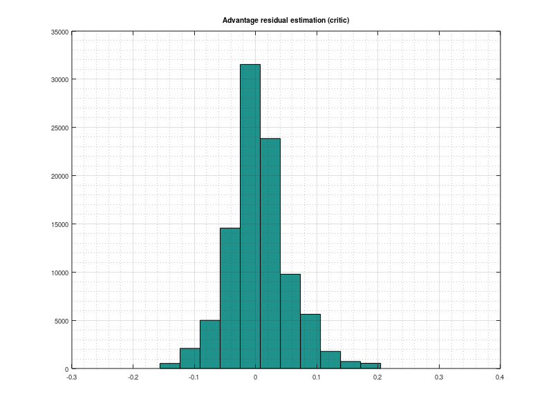
## Delta Advantage residual estimation (critic)

| KPI    |             |
|--------|------------:|
| Mean   |    1.23e-06 |
| Sigma  |      0.0012 |
| RMS    |      0.0012 |
| Min    |     -0.0028 |
| Median |    0.000148 |
| Max    |     0.00236 |
| Trend  |      Linear |
| From   |   -1.76e-06 |
| To     |    4.23e-06 |

|   -0.00256 |    -0.0021 |   -0.00163 |   -0.00116 |  -0.000687 |  -0.000218 |   0.000251 |   0.000721 |    0.00119 |    0.00166 |    0.00213 |
|-----------:|-----------:|-----------:|-----------:|-----------:|-----------:|-----------:|-----------:|-----------:|-----------:|-----------:|
|        378 |       8116 |      15082 |       1786 |       1048 |      14600 |      15574 |      15084 |      15068 |       7996 |       1268 |

### Delta Advantage residual estimation (critic) notes

[Notes]

### Delta Advantage residual estimation (critic) chart

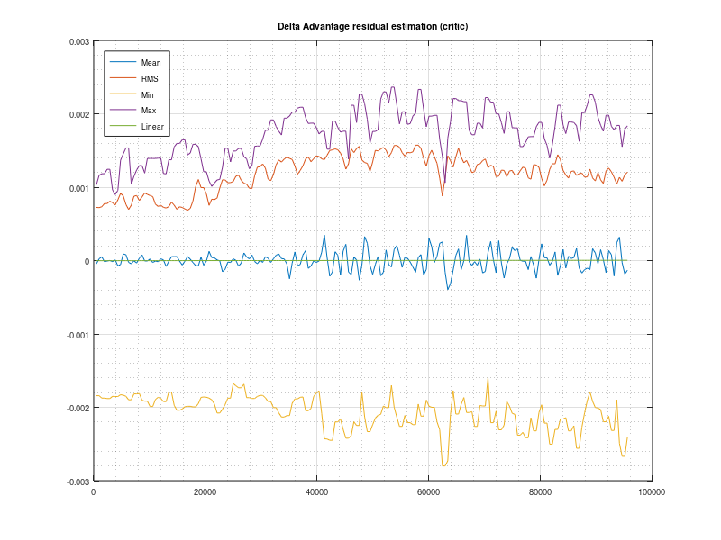

### Delta Advantage residual estimation (critic) histogram

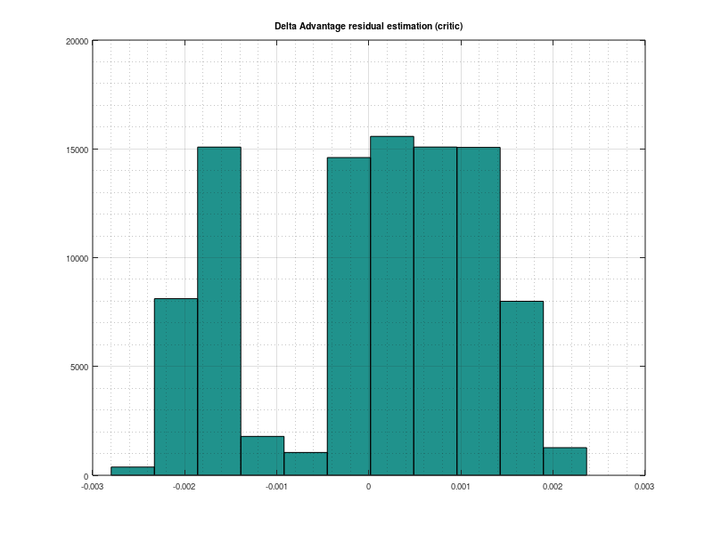
## Avg Rewards

| KPI    |             |
|--------|------------:|
| Mean   |       0.016 |
| Sigma  |       0.136 |
| RMS    |       0.137 |
| Min    |      -0.434 |
| Median |     0.00857 |
| Max    |        0.57 |
| Trend  |      Linear |
| From   |     -0.0278 |
| To     |      0.0598 |

|     -0.389 |     -0.297 |     -0.206 |     -0.115 |    -0.0237 |     0.0676 |      0.159 |       0.25 |      0.341 |      0.433 |      0.524 |
|-----------:|-----------:|-----------:|-----------:|-----------:|-----------:|-----------:|-----------:|-----------:|-----------:|-----------:|
|        522 |       2084 |       4978 |      14614 |      31640 |      23792 |       9780 |       5586 |       1750 |        718 |        536 |

### Avg Rewards notes

[Notes]

### Avg Rewards chart

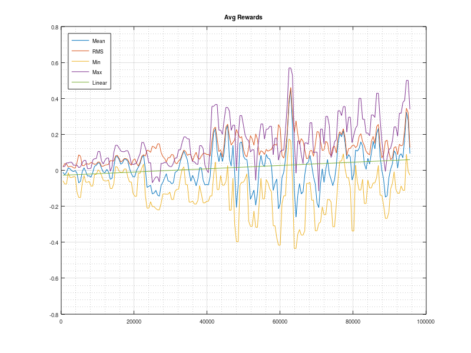

### Avg Rewards histogram

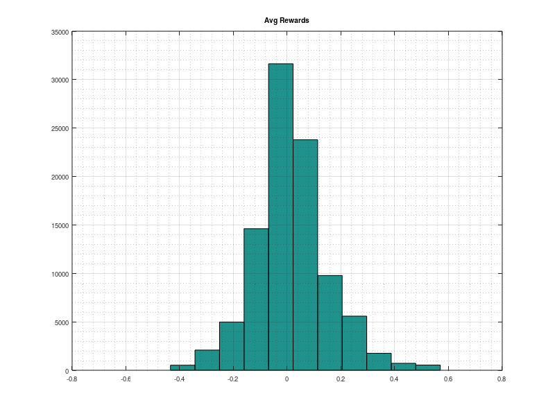
## Halt gradient

| KPI    |             |
|--------|------------:|
| Mean   |           2 |
| Sigma  |        1.42 |
| RMS    |        2.45 |
| Min    |        1.15 |
| Median |         1.4 |
| Max    |        7.62 |
| Trend  |      Linear |
| From   |        2.01 |
| To     |        1.99 |

|       1.44 |       2.03 |       2.62 |       3.21 |        3.8 |       4.39 |       4.97 |       5.56 |       6.15 |       6.74 |       7.33 |
|-----------:|-----------:|-----------:|-----------:|-----------:|-----------:|-----------:|-----------:|-----------:|-----------:|-----------:|
|      56542 |      23670 |       4228 |       1522 |       1664 |       1192 |        556 |        806 |       2172 |       1744 |       1904 |

### Halt gradient notes

[Notes]

### Halt gradient chart

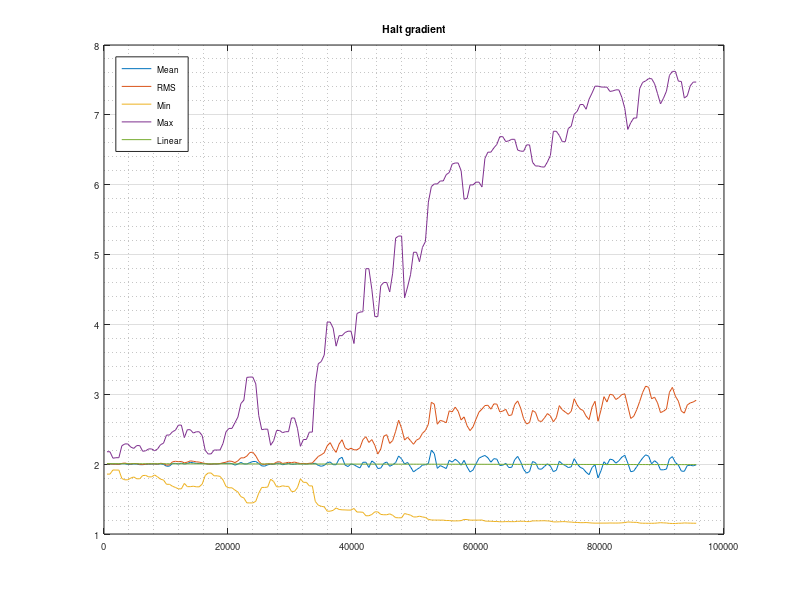

### Halt gradient histogram

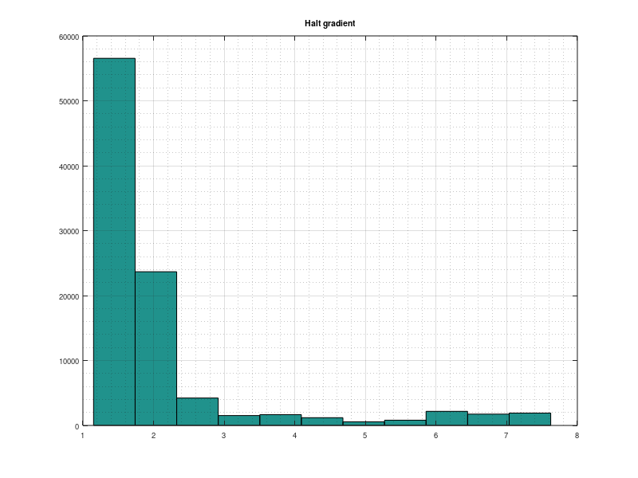
## Direction gradient

| KPI    |             |
|--------|------------:|
| Mean   |        25.2 |
| Sigma  |        41.8 |
| RMS    |        48.8 |
| Min    |        4.28 |
| Median |        9.82 |
| Max    |         541 |
| Trend  |      Linear |
| From   |        24.8 |
| To     |        25.5 |

|       28.7 |       77.5 |        126 |        175 |        224 |        273 |        322 |        371 |        419 |        468 |        517 |
|-----------:|-----------:|-----------:|-----------:|-----------:|-----------:|-----------:|-----------:|-----------:|-----------:|-----------:|
|      86022 |       5430 |       2026 |       1198 |        606 |        316 |        194 |        126 |         64 |         12 |          6 |

### Direction gradient notes

[Notes]

### Direction gradient chart

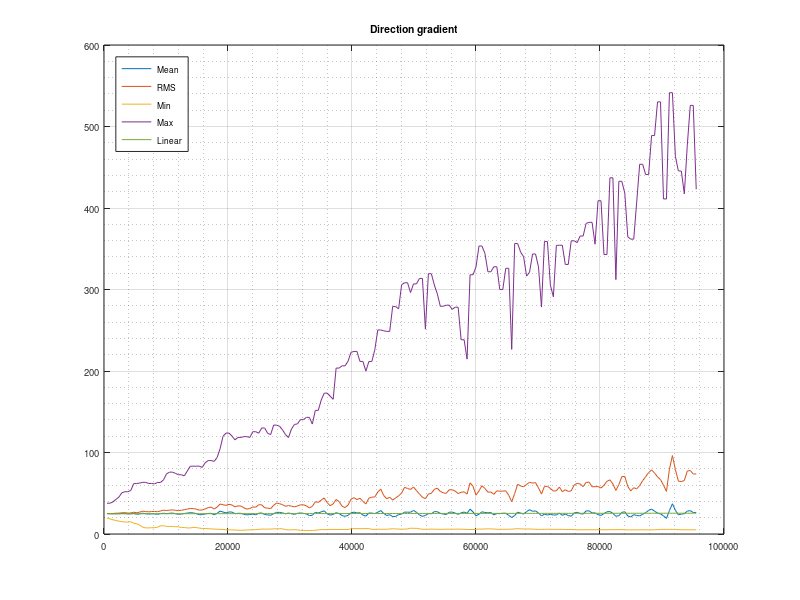

### Direction gradient histogram

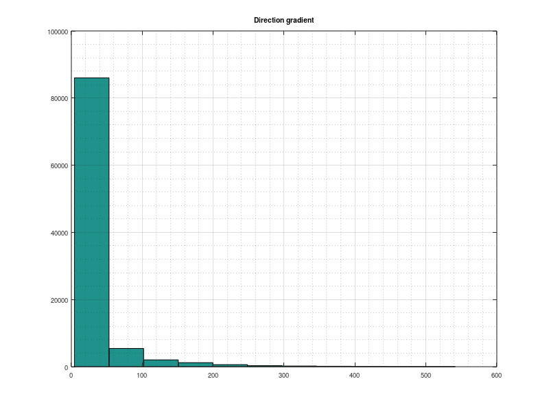
## Speed gradient

| KPI    |             |
|--------|------------:|
| Mean   |        8.99 |
| Sigma  |        12.4 |
| RMS    |        15.3 |
| Min    |        1.93 |
| Median |        5.38 |
| Max    |         168 |
| Trend  |      Linear |
| From   |        9.06 |
| To     |        8.91 |

|       9.46 |       24.5 |       39.6 |       54.6 |       69.7 |       84.7 |       99.8 |        115 |        130 |        145 |        160 |
|-----------:|-----------:|-----------:|-----------:|-----------:|-----------:|-----------:|-----------:|-----------:|-----------:|-----------:|
|      87760 |       4382 |       1576 |        910 |        594 |        400 |        182 |         54 |         60 |         56 |         26 |

### Speed gradient notes

[Notes]

### Speed gradient chart

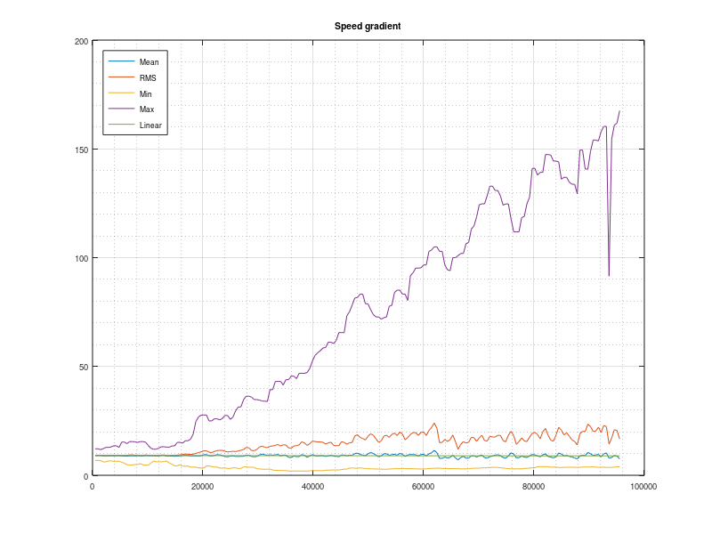

### Speed gradient histogram

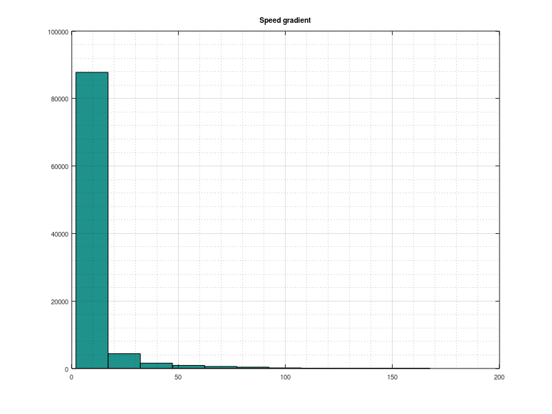
## Sensor direction gradient

| KPI    |             |
|--------|------------:|
| Mean   |        7.03 |
| Sigma  |        12.9 |
| RMS    |        14.7 |
| Min    |        1.14 |
| Median |           2 |
| Max    |        72.4 |
| Trend  |      Linear |
| From   |        7.06 |
| To     |           7 |

|       4.38 |       10.9 |       17.3 |       23.8 |       30.3 |       36.8 |       43.2 |       49.7 |       56.2 |       62.7 |       69.1 |
|-----------:|-----------:|-----------:|-----------:|-----------:|-----------:|-----------:|-----------:|-----------:|-----------:|-----------:|
|      78260 |       5478 |       1840 |       2060 |       1102 |       1692 |       1528 |       1874 |       1626 |        256 |        284 |

### Sensor direction gradient notes

[Notes]

### Sensor direction gradient chart

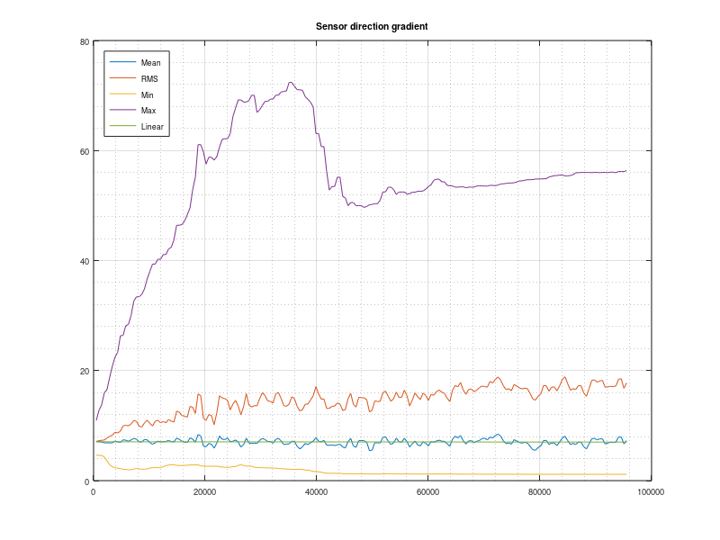

### Sensor direction gradient histogram

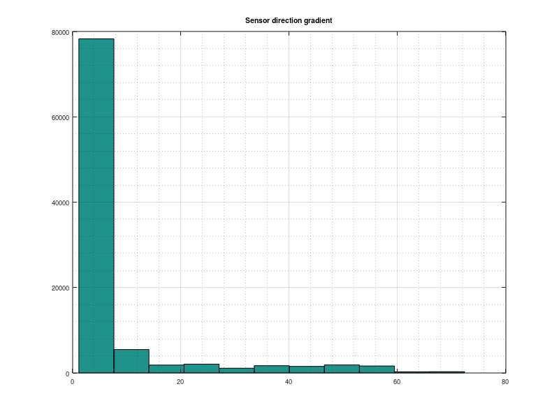
